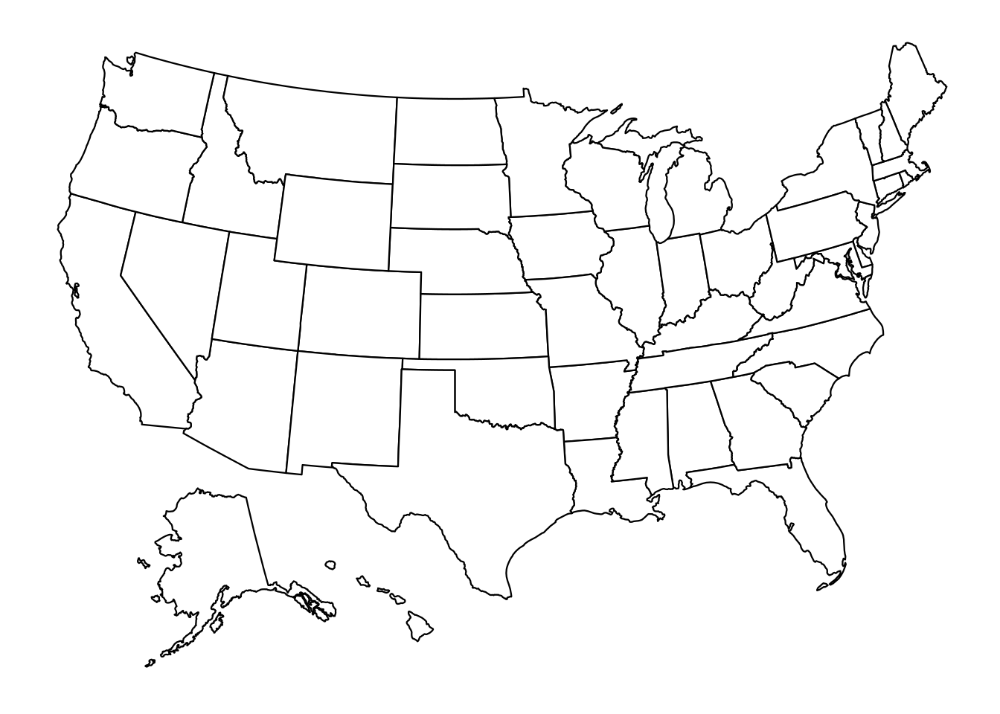
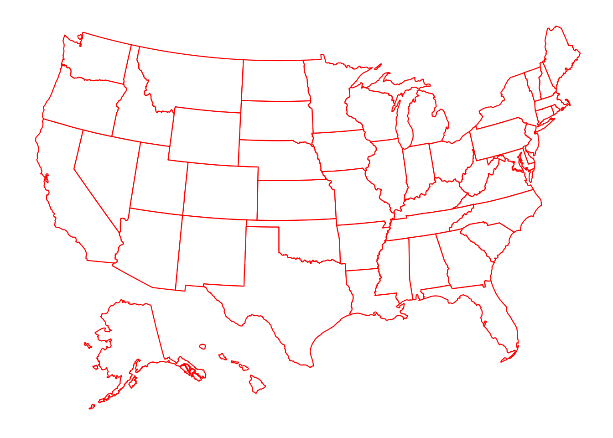
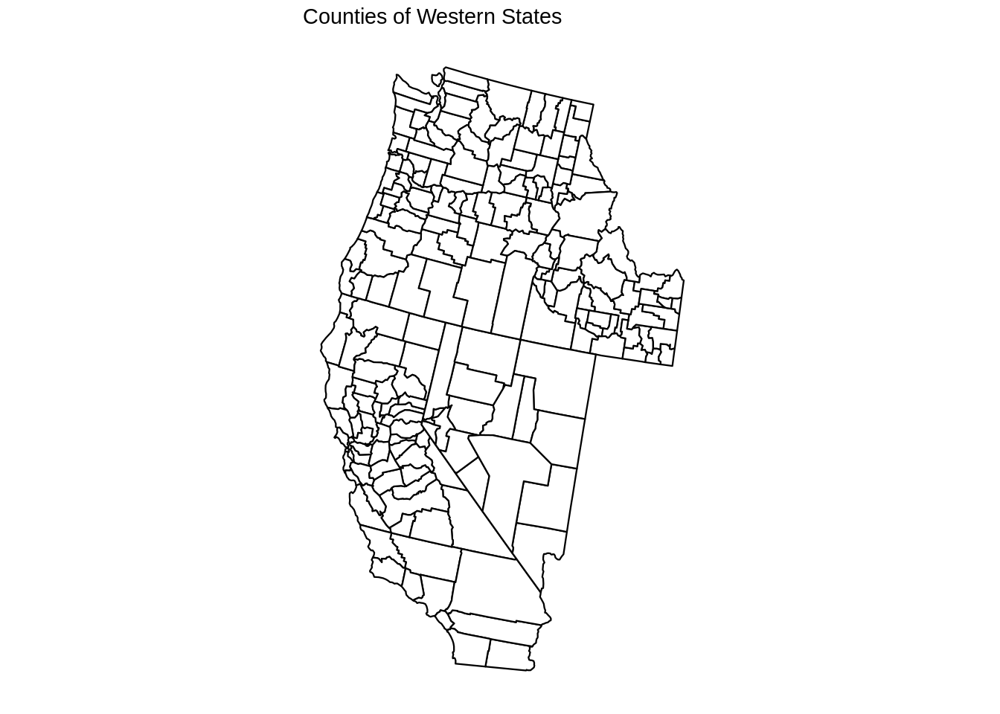
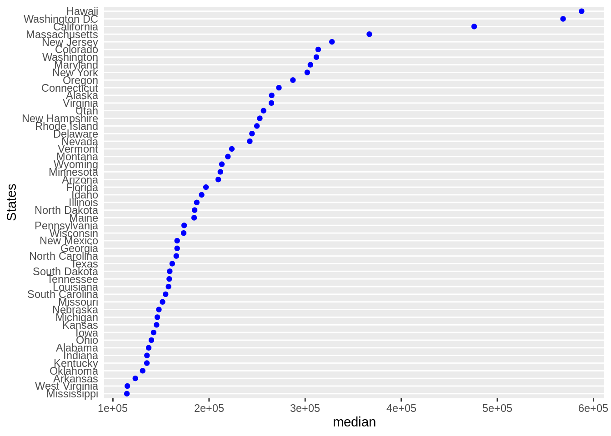
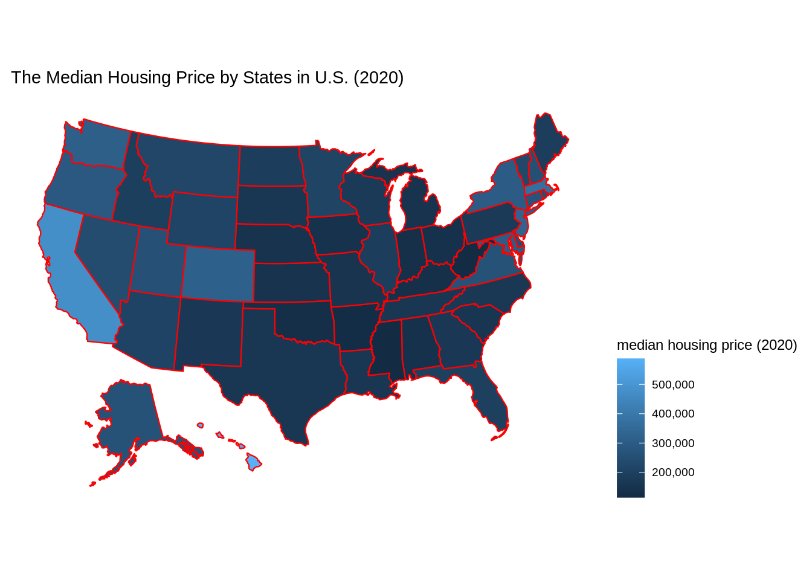

# A simple way to visualize geographic data

Haoyu Liu and Zhiheng Jiang

## Overview

During lectures and class projects, we encountered several cases that we need to analyze and visualize the data based on states or counties in United States. However, we noticed that, with the methods that we have learned, there exists a limitation that the underlying geometric influence are often ignored. Taking the Cleveland Dot plot as an example, although it is a common way to visualize categorical data, it is hard to reflect the factors that regions contribute when we deal with data associated with states or counties. Facet by region can, of course, show some geometric factors. However, the real scenarios maybe more complex than categorization can reveal. For instance, east and west coast may share some similarities due to their similarities in geometry, while a states and its neighbor states may have some correlation. These geometric factors may play a significant part in the data we collect, but it's hard to discover these factors without looking into the map. Therefore, we think it is important to implement map into visualizing geometric data, and we will discuss a simple and useful method to achieve this goal.

## Introduction

### Load Packages

**plot_usmap**, a useful extension under **ggplot2**, can visualize the states and the counties of United States. **plot_usmap** and **ggplot2** are the two packages that we need.

```r
library(usmap)
library(ggplot2)
```

### Boarder Visualization

It can plot, as its name suggested, a U.S map with boarders of states and counties. This feature is very helpful in visualizing state or county based data. The following code demonstrates the basic functions of this package. As we can see, it plots the U.S. map with state boarders by default, and it also takes "regions" as an input parameter. "regions" can take a character string in c("states","counties","state","county"). When regions = "counties", plot_usmap will visualize map with state boarders and county boarders.

```r
plot_usmap()
```



```r
plot_usmap(regions = "states")
```


```r
plot_usmap(regions = "counties")
```


### Input data

The input dataframe or table must have a column named as "states" or "fips", and this column must be a column of strings, which can either be the full name of each state or the capital abbreviation of each state. If a dataframe contains name that is not a U.S. states, this row needs to be removed for this function to work. For example, Puerto Rico is not considered as a U.S. state. 

### Boarders

We can customize the color of boarders in **plot_usmap** by the parameter "color", for example:

```r
plot_usmap(regions = "states", color="red")
```


We can also label each state by its abbreviation. This can be achieved by simply put the parameter "labels" to TRUE

```r
usmap::plot_usmap("states", labels = TRUE)
```


### Parts of the Map

It can also plot part of the states with or without county boarders. The state selection is achieved by the parameter "include", which takes a list of character strings. The character strings need to be the capital abbreviation of each state. For example, here is a plot for the western states of the United States:

```r
plot_usmap(regions = "counties",include = c("CA", "NV", "ID", "OR", "WA")) +
  labs(title = "Counties of Western States")
```



## Application

Now we understand how to use this library, let us try an example to see how plot_usmap can help visualizing geometric data. In this part, we will use the "Median Housing Price" data of U.S. states in 2020. We found this data from https://worldpopulationreview.com/state-rankings/median-home-price-by-state. This website used the Cleveland Dot plot to visualize the median housing price. As we mentioned, Cleveland Dot plot overlooks any potential geometric factors. Although we can see each state's value relative to others, we cannot see how their locations effect their values.

### Data Collection


```r
library(forcats)
library(rvest)
url <- read_html(
  "https://worldpopulationreview.com/state-rankings/median-home-price-by-state"
)
tables <- url %>% html_nodes("table") %>% html_table()
df <- tables[[1]]
df <- setNames(df, c("state", "median"))
df <- df[-c(1),]
df$median <- as.numeric(gsub("[\\$,]","",df$median))
```

### Comparison

First we show the **Cleveland Dot Plot**.



Here we use **plot_usmap** for the same data


```r
plot_usmap(regions="states",data = df, values = "median", color = "red") + 
  scale_fill_continuous(name = "median housing price (2020)", label = scales::comma) + 
  theme(legend.position = "right") +
  ggtitle("The Median Housing Price by States in U.S. (2020)")
```



## Conclusion 

Based on the layers of **ggplot2**, **plot_usmap** can allow some unique and powerful visualization on U.S. map. From the example we demonstrated, we noticed the trend that the coastal states tend to have higher median housing price, and southern states have lower median housing price. Hawaii, an island state which is far away from U.S. continent has the highest median housing price, and this may due to it being one of the most popular touring destinations.
