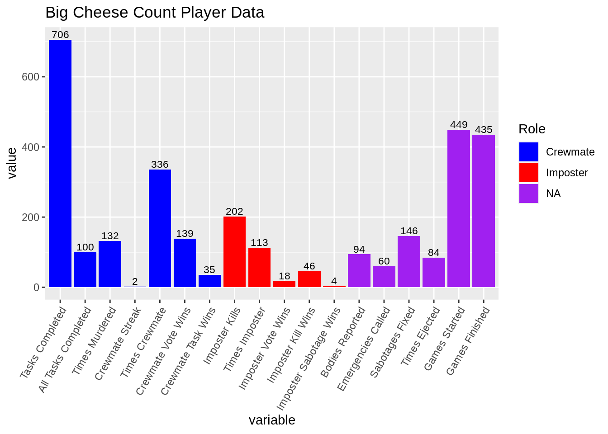
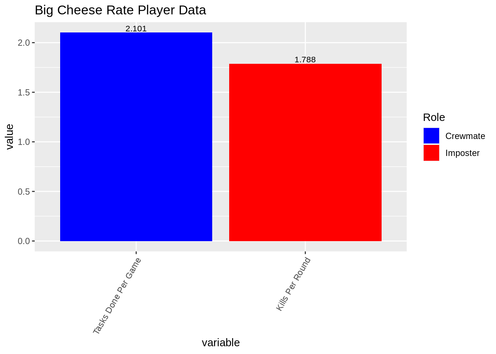
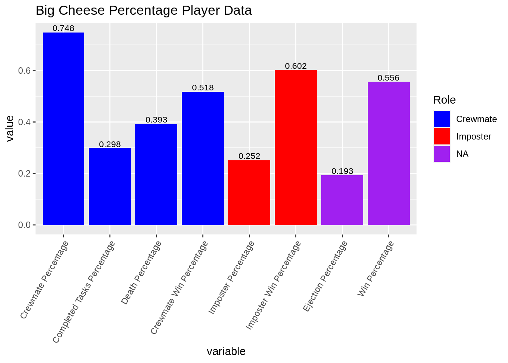
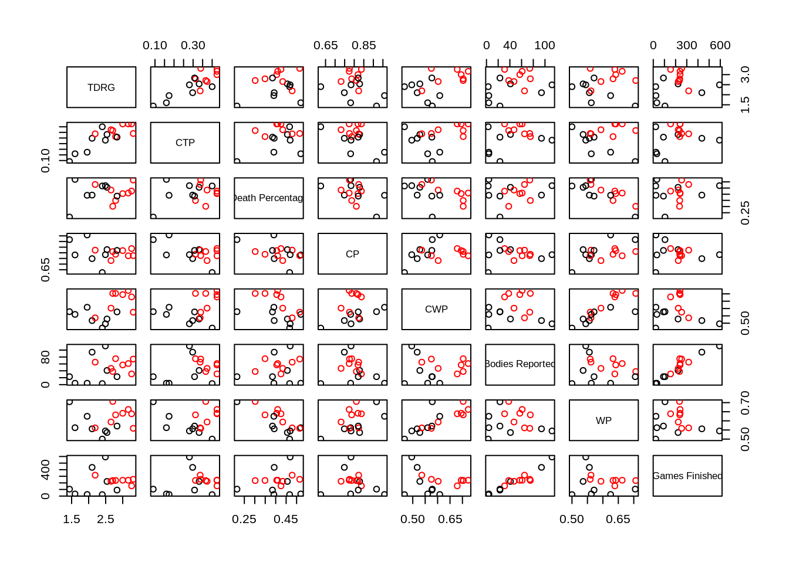
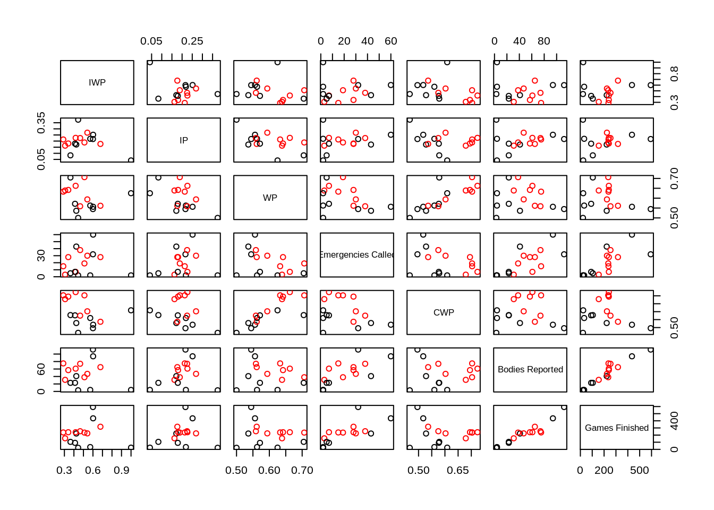
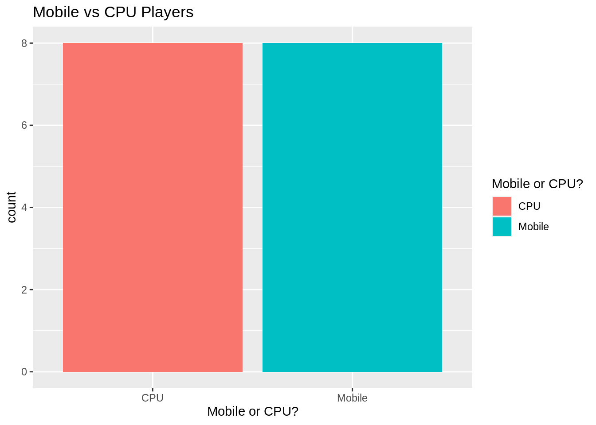
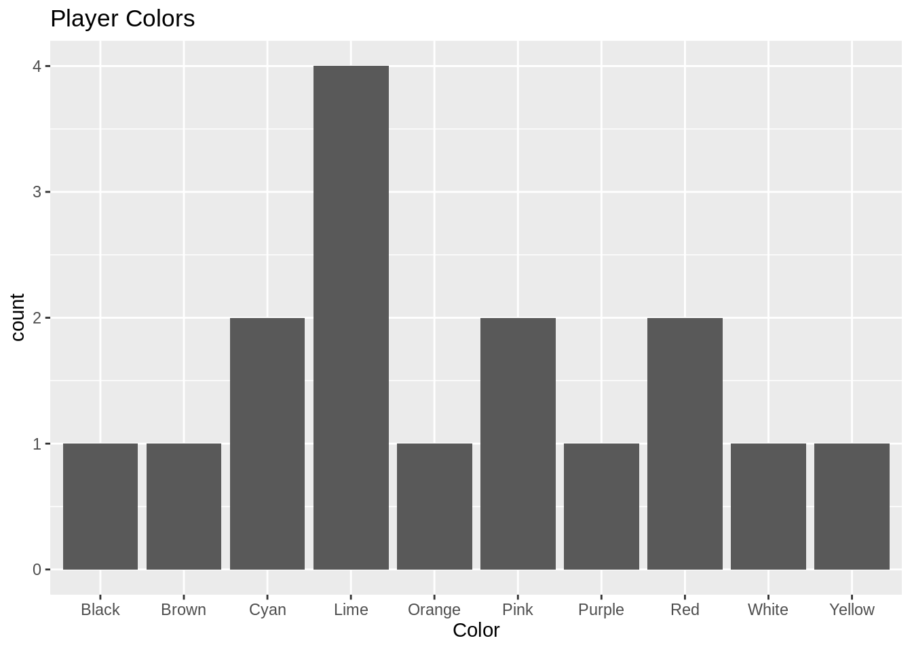

# Among Us Player Statistics

Myles Ingram


This R code runs player level and community level statistics on Among Us Player data (which can be found on the home page of the app). To use this script, add your name and a userid to the among_us_player_stats.csv along with your player stats. Then enter your username and userID into the code, run the script and take a look! This code will use my username as an example.

```r
plyr_stats <- read_csv("resources/among_us_stats/among_us_player_stats.csv")
Username = "Big Cheese"
UserID = "1"
```

The code calculates extra statistics from the base ones including win percentage as crewmate/imposter, how many tasks you complete per crew mate game, rate of kills per imposter game, etc.


The player level statistics are broken up into three separate different bar graphs for the sake of interpretability. Count data, Rate data, and Percentage data have been separated so that they can be viewed in the right perspective. In each graph, the data associated with imposter and crewmate have been color-coded while the other variables are labeled NA because they are applicable to both roles.

```r
ggplot(tidy_df_num) +
  geom_bar(aes(x = variable, y=value, fill=role), stat="identity")+
  geom_text(aes(variable, value, label=round(value, 3)), position=position_dodge(width=0.9), 
            vjust=-.25, size=3) +
  theme(axis.text.x = element_text(angle=60, hjust=1)) +
  scale_fill_manual(values=c("blue", "red"), na.value = "purple",
                  name="Role",
                  breaks=c("crw", "imp", NA),
                  labels=c("Crewmate", "Imposter", "NA")) +
  ggtitle(paste(user_df$Username,"Count Player Data"))
```



```r
ggplot(tidy_df_rate) +
  geom_bar(aes(x = variable, y=value, fill=role), stat="identity")+
  geom_text(aes(variable, value, label=round(value, 3)), position=position_dodge(width=0.9), 
            vjust=-.25, size=3) +
  theme(axis.text.x = element_text(angle=60, hjust=1)) +
  scale_fill_manual(values=c("blue", "red"), na.value = "purple",
                    name="Role",
                    breaks=c("crw", "imp", NA),
                    labels=c("Crewmate", "Imposter", "NA")) +
  ggtitle(paste(user_df$Username,"Rate Player Data"))
```




```r
ggplot(tidy_df_perc) +
  geom_bar(aes(x = variable, y=value, fill=role), stat="identity")+
  geom_text(aes(variable, value, label=round(value, 3)), position=position_dodge(width=0.9), 
            vjust=-.25, size=3) +
  theme(axis.text.x = element_text(angle=60, hjust=1)) +
  scale_fill_manual(values=c("blue", "red"), na.value = "purple",
                    name="Role",
                    breaks=c("crw", "imp", NA),
                    labels=c("Crewmate", "Imposter", "NA"))+
  ggtitle(paste(user_df$Username,"Percentage Player Data"))
```



The following graphs are for the population level data. The graphs in this section explore the relationship between the variables in the dataset on a population wide level through barcharts and scatterplots.

```r
# for population level statistics
plyr_stats_2 <- plyr_stats %>% mutate(`Mobile or CPU?`=recode(`Mobile or CPU?`,
                                              "Mobile"=1,
                                              "CPU" = 2))
plyr_stats_2 <- plyr_stats_2 %>% dplyr::rename(
                                        TDRG = `Tasks Done Per Game`,
                                        CTP = `Completed Tasks Percentage`,
                                        IWP = `Imposter Win Percentage`,
                                        CWP = `Crewmate Win Percentage`,
                                        CP = `Crewmate Percentage`,
                                        IP = `Imposter Percentage`,
                                        KPR = `Kills Per Round`,
                                        WP = `Win Percentage`
                                        )
crw_scatmat <- plyr_stats_2 %>% dplyr::select(`Mobile or CPU?`, `TDRG`, CTP, 
                                        `Death Percentage`, `CP`, `CWP`, `Bodies Reported`, `WP`, 
                                        `Games Finished`)
pairs(crw_scatmat[, 2:9], col=ifelse(crw_scatmat$`Mobile or CPU?`== 1, "black", "red"))
```



```r
#plot(crw_scatmat)
```

```r
imp_scatmat <- plyr_stats_2 %>% dplyr::select(`Mobile or CPU?`, `IWP`, `IP`, 
                                              `WP`, `Emergencies Called`, `CWP`, `Bodies Reported`, 
                                              `Games Finished`)
pairs(imp_scatmat[, 2:8], col=ifelse(imp_scatmat$`Mobile or CPU?`== 1, "black", "red"))
```



```r
#plot(imp_scatmat)
```
TDRG = Tasks Done Per Game, CTP = Completed Tasks Percentage, IWP = Imposter Win Percentage,
CWP = Crewmate Win Percentage, CP = Crewmate Percentage, IP = Imposter Percentage, 
KPR = Kills Per Round, WP = Win Percentage, Black = CPU, Red = Mobile

While more data is needed to draw strong conclusions about these scatterplots, a couple of interesting observations include:
  Players that play on mobile have a higher crewmate win percentage than CPU players
  Crewmate win percentage seems correlated with overall win percentage
  Bodies reported also seems to have a weak correlation with emergencies called
  Mobile players also have a higher tasks done per game and completed tasks per game
  CPU players and Mobile players are equally likely to be imposter/crewmate

  

```r
ggplot(data=plyr_stats, aes(`Mobile or CPU?`, fill=`Mobile or CPU?`))+
  geom_bar() +
  ggtitle("Mobile vs CPU Players")
```




```r
ggplot(data=plyr_stats, aes(Color))+
  geom_bar() +
  ggtitle("Player Colors")
```


More data to come for both of these graphs

Github for the project
https://github.com/Ingrammyles8/among_us_cc
