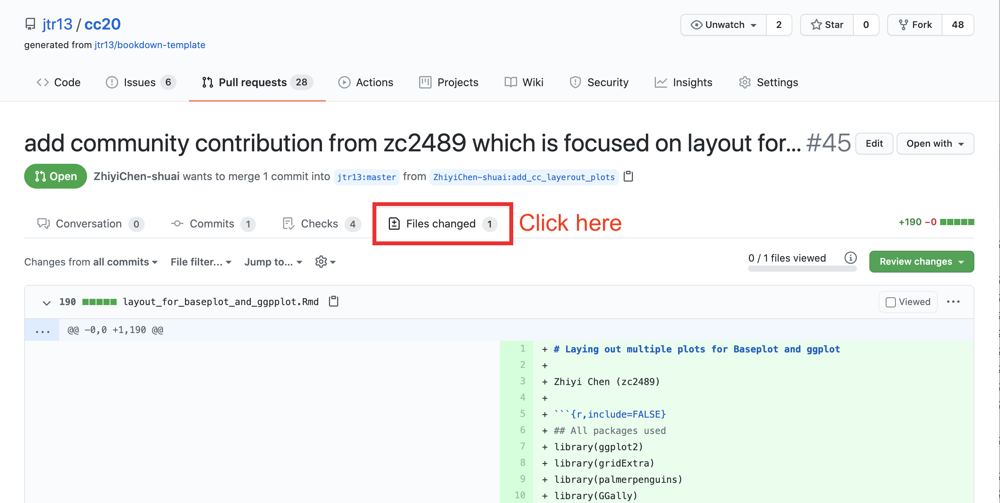
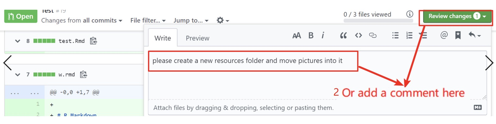
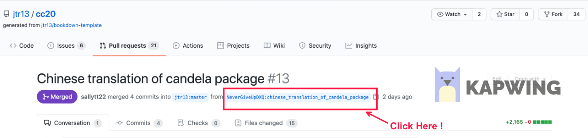
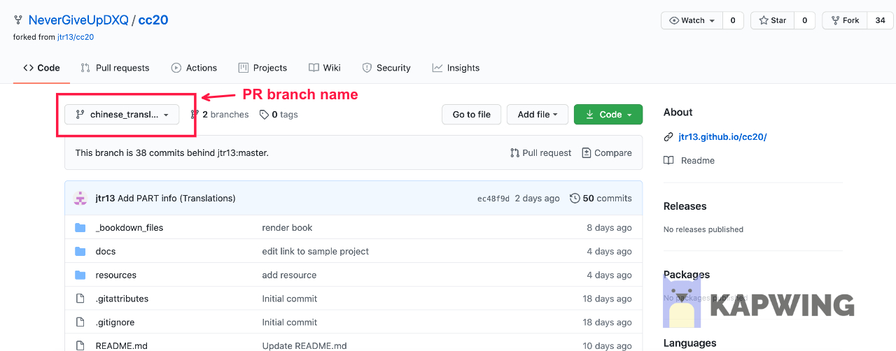
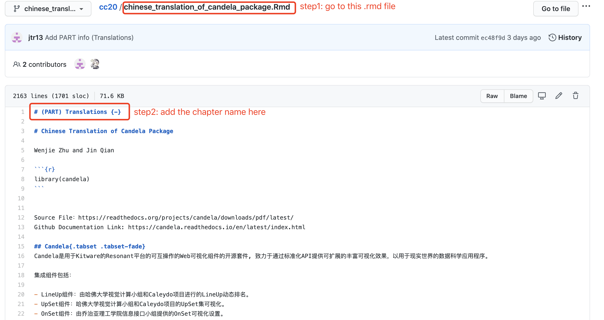

# Tutorial for Pull Request Mergers

## Check branch

PR should be submitted from a **non-master** branch.

 

If PR was submitted from the **master** branch, you can link to this explanation of what to do to fix it: 

https://edav.info/github#fixing-mistakes.

 

 

## Check `.Rmd` file

###  Examine files that were added or modified

  

### Check `.Rmd` filename format 
- Each group can only submit ONE `Rmd` file.
- The `.Rmd` file should be in the root directory on the branch. 
- Project name should be the same as the root directory name of the branch, and should be words only and joined with underscores, no white space.
- **All letters must be lowercase.**
- No YAML header including the --- line.
- The second line should be blank, followed by your name(s).
- The first line starts with a **single hashtag `#`**, followed by a **single whitespace**, and then the title.
- There should be no additional single hashtag headers in the chapter. (If there are, new chapters will be created.)
- If contributors have included a setup chunk in `.Rmd` file, please notify them to remove the label setup in the chunk.
 i.e. use `{r, include=FALSE}` instead of `{r setup, include=FALSE}`.
 [See sample `.Rmd`](https://github.com/jtr13/cc20/blob/master/sample_project.Rmd)

### Additional checks

- The `.Rmd` file should not contain any `write` functions, `setwd()`, or `getwd()`. 

- If there's anything else that looks odd but you're not sure, assign `jtr13` to review and explain the issue.

### Check additional resources
- All of the additional resources should be in the `resources/<project_name>/` folder.
- References to those files must contain `resources/<project_name>/` in the path, such as: ``

### Request a change if `.Rmd` file is invalid

If there is any requirement that a request does not meet, request a change and add reasons why the pull request cannot be merged.

Then, add a `changes requested` label to this pull request.

Your job for this pull request is done for now. Once contributors fix their requests, review again and either move forward with the merge or explain what changes still need to be made.

  

## Update `_bookdown.yml`

### Add files names to `_bookdown.yml` in PR's `branch`

- Access the PR branch:

- Make sure you are on the PR branch by checking that the PR branch name is shown (not `master`):

- Open the `_bookdown.yml` file.
- Add the names of `.Rmd` file after rmd_files.
 i.e. `rmd_files['file1.Rmd','file2.Rmd']`

  

- Save the edited version.

### Add chapter names to `.Rmd` for every first article in each chapter (Chapter Organization)

**If you are a PR pull request helper, you do not need to do this.**

For every first article of each part, add the chapter name on the top of the `.Rmd` file, then propose changes. The example is like this.

  

## Merge `branch` into `jtr13:master` and resolve conflicts
After you finish all the checks and get the qualified files, we can merge the `branch` to `jtr13:master`. 

There are two more things we need to do for merging the `branch`.

### Resolve conflicts
 When there are conflicts between files in `jtr13:master` and `branch`, conflicts will occur. The conflicts look like this.

  
 Figure source: https://docs.github.com/assets/images/help/pull_requests/view-merge-conflict-with-markers.png
 To resolve the conflicts, you just need to **delete** the lines with `<<<<<<< xxxx`, `=======` and `>>>>>>>> master`.

### Merge PR and leave a comment

Now comes the final step. We go back to the conversation tab of the pull requests page, for example: 

https://github.com/jtr13/cc20/pull/23#issuecomment-728506101

Leave comments for congratulations 🎉 (type `:tada:`) and then click on the green button for merge.
  

