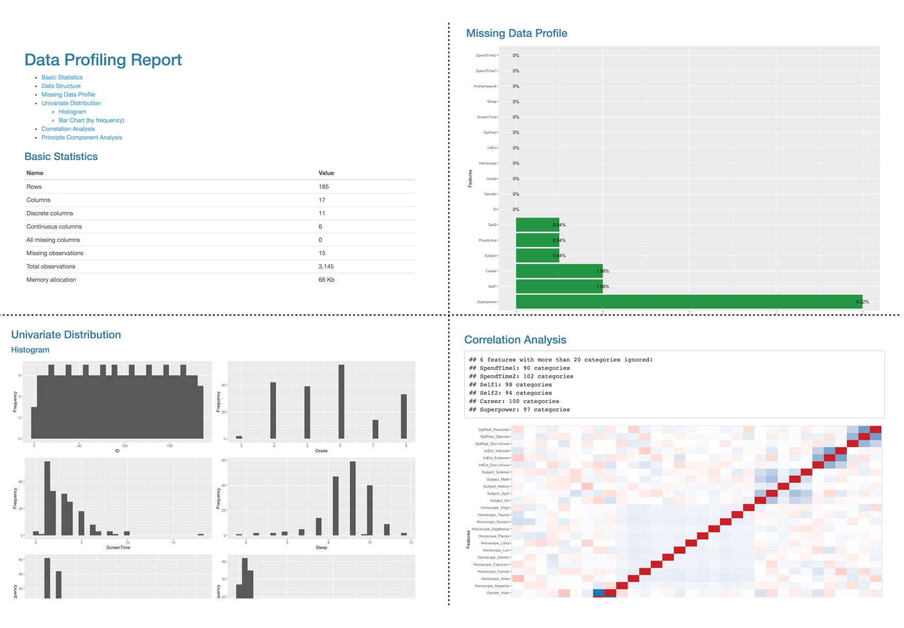

# automate eda with dataexplorer

Jing You

```{r, include=FALSE}
knitr::opts_chunk$set(echo = TRUE)
```

```{r}
# library("devtools")
# devtools::install_github("boxuancui/DataExplorer")
```

```{r}
library(alr4)
library(DataExplorer) 
```

## 1. Overview

* This section shows how to use package DataExplorer to automate Exploratory Data Analysis (EDA) and create Data Report.


## 2. DataExplorer


* DataExplorer attempts to automate exploratory data analysis (EDA) process and offer one-click report generation to show and visualize basics about a data set. It is a user-friendly and efficient tool for first-step analysis with visualization that can avoid time consuming manual coding. 


## 3. Installation 
```{r}
#devtools::install_github("boxuancui/DataExplorer")
#library(DataExplorer) 
```


* The dataset "sleep1" will be used for the following demonstration, which has both discrete and continuous variables.


```{r,message=FALSE}
data(sleep1)
```


## 4. Exploratory data analysis (EDA)


* DataExplorer is a great tool for exploratory data analysis that it can handle most visualization plots without the need to manipulate data formats and data types. Every visualization plots can be done in one line function call instead of using different packages and functions.

### 1 Overall Information

* There are many plots available in DataExplorer for preliminary data analysis to help us better understand the data set. For example,

* plot_str function can be used to visualizing the basic structure about the data set with names and types specified. We can see the sleep dataset has 62 observtations, 10 variables (7 discrete and 3 continuous)

```{r}
## View basic description for the data
plot_str(sleep1,type="diagonal")
```

* plot_intro function can be used to describe the basic info about the data set including number of rows/cols/data type/missing values. The plot show the percentage of the data types and the comple rows. It also specify if there are column where all values are missing. 

```{r}
## View basic description for the data
plot_intro(sleep1,title="Introduction of the sleep data")
```

* plot_missing function can further let us take a peek into the profile of the missing values. Specifically which variables has missing values and what is the corresponding proportion.

```{r}
## View data profie for the missing data
plot_missing(sleep1, title="Missing Data Profile")
```

### 2 Distribution

* DataExplorer provides bar chart, histogram, density plot, scatterplot and boxplot, etc for the exploration of the data distribution. Those function call on the whole dataset would only plot on the according discrete/continuous variables. Thus we do not need to specify the columns for plotting. Other than that, the arguments for the plot functions are mostly consistent with those in the ggplot functions that makes it easy to use. 


* For example, the plot_bar function plots the distribution only for the discrete variables.
```{r}
##`Life` distribution of all discrete variables
plot_bar(sleep1, with = "Life",title="Bar distribution in response to Life span")
```

* The plot_histogram function plots the distribution only for the continuous variables.


```{r}
plot_histogram(sleep1,title= "Histogram Distribution of sleep data")
```


* The plot_qq function plots the qq-plot only for the continuous variables.


````{r,message=FALSE}
##View quantile-quantile plot of all continuous variables by feature `Life`
plot_qq(sleep1,by='Life',title="QQ-plot in response to Life span")
```

### 3 Correlation Analysis

* DataExplorer provides correlation heatmap plot for all non-missing features. The heatmap can also be set to plot for continuous or discrete variables only.

````{r}
plot_correlation(na.omit(sleep1),title="Correlation heatmap of the sleep data")
```


````{r}
plot_correlation(na.omit(sleep1),type = "c",,title="Correlation heatmap of the sleep data, continuous only")
```
* For the discrete variable, the heatmap automatically done one hot encoding that provides further insights.
````{r}
plot_correlation(na.omit(sleep1),type = "d",,title="Correlation heatmap of the sleep data,discrete only")
```

## 5. Feature Engineering

* Feature engineering is often needed in the data analysis process to transform data into better representative features. DataExplorer provides mutiple functions for feature engineering including missing value filling, sparse categories grouping, one hot encoding and feature transformation.

* The set_missing function can fill both the discrete and continuous variable with designated values in one line of code.

### 1 Missing value
````{r}
final_sleep <- set_missing(sleep1, list(0L, "unknown"))
plot_missing(final_sleep)
```

* One hot encoding allows the categorical data to be more expressive. It can be done by the dummify function.

### 2 Dummy variable
````{r}
plot_str(
  list(
    "original" = final_sleep,
    "dummified" = dummify(final_sleep)
  )
)
```

## 5. Data Report

* All the summary statistic and visualization plots of the data set can be organized into a data report in 1 step. The report automatically generates most visualization plots above. It is indeed a rough data profile but very useful for initial analysis and user-friendly for beginners 

````{r}
#create_report(final_sleep)
````




* This function is very powerful that it provides user the ability to configure based on the needs. Each section and the arguments can be rendered, reponse variable can also be added. For example, we can add boxplot and scatterplot to the report, set number of sampled row in the qq-plot, and set response variable to Life.


````{r}
config <-configure_report(
  add_plot_boxplot = TRUE,
  add_plot_scatterplot = TRUE,
  "plot_qq" = list(sampled_rows = 1000L)
)

#create_report(final_sleep,y ="Life",config=config)
````

## 6. External Resources

https://boxuancui.github.io/DataExplorer/index.html : DataExplorer Github Page

https://rpubs.com/mark_sch7/DataExplorerPackage :  package reflection
