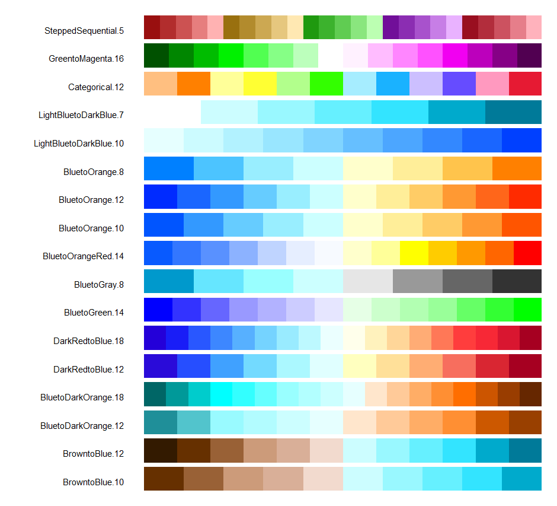

# Color in R

Xiaoyu Su


```r
library(ggplot2)
library(dplyr)
library(ggplot2movies)
library(RColorBrewer)
library(viridis)
library(ggplot2)
library(colorspace)
library(reshape2)
library(dichromat)
library(vcd)
```

## Overview
This section covers the syntax of using colors in R (which reviews some of the materials in class) as well as the related packages and tools that I found interesting.   

Color deployments might not always add analytic sense to the graph, but maybe a pleasant color representation brings comfort and so we have more patience towards it and stair a it longer. It's always better to look at a graph nicely colored. 

### Sections 

  - [Discrete Colors](#discrete-colors)
    - [Basics](#basics)
    - [RColorBrewer](#rcolorbrewer)
    - [Viridis](#viridis)
    - [Color Picker](#color-picker)

  - [Continuous Colors](#continuous-colors)
    - [Barplot](#barplot)
    - [Heatmap](#heatmap)
    - [Diverging Scales](#diverging-scales)
  
  - [Colorblind](#colorblind)

## Discrete Colors 


### Basics 
For discrete colors, we can select the exact colors we want using several different representations: common names, color Hex code, or rgb code. The following code shows this. Notice that the Hex code is case insensitive. For rgb, if you don't specify `maxColorValue=255`, the default value range is [0,1]. So in this case we need to divide every value by 255. 


```r
barplot(rep(1, 5), axes = FALSE, space = 0.1, border = 'white',
        col = c('pink', 
                '#BF87B3', 
                '#8255a1',  
                rgb(72/255, 32/255, 143/255), 
                rgb(31, 0, 127, maxColorValue=255)))
```


R differentiates between `color` and `fill`. Basically, you **color** the dots and lines but you **fill** in an area. In ggplot2, the syntax are usually `scale_color_something` and `scale_fill_something` respectively. Let's take a look at the grey scale for an illustration.


```r
# color
ggplot(iris, aes(x=Petal.Width, y=Petal.Length)) +
  geom_point(aes(color=Species), size=3) +
  scale_color_grey(start = 0.6, end = 0.1) +
  theme_bw()

# fill
ggplot(iris, aes(x=Species, y=Petal.Width)) +
  geom_boxplot(aes(fill=Species)) + 
  scale_fill_grey(start = 0.8, end = 0.4) +
  theme_bw()
```


- [Back to Top](#sections)

### RColorBrewer
The <span style="color:red">RColorBrewer</span> package presents some nice color palettes for discrete color uses. First we can display all the palettes using this:

```r
display.brewer.all()
```


Here is how we can use brewer's palettes in ggplot2:

```r
# color
ggplot(iris, aes(x=Sepal.Width, y=Sepal.Length)) + 
  geom_point(aes(color=Species), size=3) +
  scale_color_brewer(palette = "Set2")

# fill
ggplot(iris,aes(x=reorder(Species, Sepal.Length, median),y=Sepal.Length)) + 
  geom_boxplot(aes(fill=Species), color='#80593D',varwidth=TRUE) +
  scale_fill_brewer(palette = "Set3") +
  labs(x='Sepal.Length')
```


It is worthing noting that we can also extract the Hex code directly from `RColorBrewer` like this:

```r
# say we want 5 colors from the palette 'Oranges'
brewer.pal(n=5, 'Oranges')
```

```
## [1] "#FEEDDE" "#FDBE85" "#FD8D3C" "#E6550D" "#A63603"
```

This adds flexibility to our use of the package. So for instance, we can pass the statements like above into the color arguments in `vcd` mosaic plots (`highlighting_fill` for **mosaic** and `gp` for **doubledecker**). Below shows a concrete example. 
(Note: `n` must at least be 3)


```r
doubledecker(Improved ~ Treatment + Sex, 
             data=Arthritis, 
             gp = gpar(fill = brewer.pal(n=3, 'Blues') ))
```


- [Back to Top](#sections)


### Viridis

The <span style="color:red">viridis</span> package has continuous scales, but we can use it discretely as well.

<p align="center">
{width=60%}
</p>

We can pass in the `discrete=TRUE` argument to make it work. In addition, we can choose the palette by adding `options=palette_name`. 


```r
ggplot(iris, aes(x=Petal.Length, y=Petal.Width)) +
  geom_point(aes(color=Species), size=3) +
  scale_color_viridis(discrete = TRUE, option='plasma') +
  theme_bw()
```


- [Back to Top](#sections)

###  Color Picker

But what if we see a color combination we would like to use without knowing its code or name? Here is a way to meet our demands. Simply take a screenshot and upload the image to this website https://imagecolorpicker.com/, and we can retrieve the color Hex code and rgb code easily by just scrolling over the desired pixel.


Thus it is easy to extract the colors we want. I picked two kinds of red from the picture above, `#f1beb6` and `#e48173`, and colored a histogram with them.


```r
movies <- filter(movies, length < 250)

ggplot(data=movies, aes(length)) +
     geom_histogram(aes(y=..density..),  fill="#f1beb6", col='#e48173', binwidth = 2)
```


- [Back to Top](#sections)

## Continuous Colors 

For continuous scale, we cannot use the <span style="color:red">RColorBrewer</span> package directly since it only has discrete palettes. But in general, continuous scales has these `low` and `high` arguments where you can pass in discrete colors and generate a continuous scale between them. For the syntax, typically, we can use something like `scale_fill_gradient`.

### Barplot

We might want to color a bar chart depending on the frequency or count. Beware the way we choose the colors so that the chart doesn't look perceptually non-uniform (or simply too ugly).  To create a perceptually uniformed barplot, we can do the following:


```r
# create a artifical dataframe
df <- data.frame(x=c('A','B','C','D','E','F','G'), count=c(2,10,14,16,20,15,8))

ggplot(df, aes(x=x, y=count)) + geom_col(aes(fill=count)) + scale_fill_gradient(low='#141f33',high='#5f99f3')
```


To make a continuous scale out of the  <span style="color:red">RColorBrewer</span> package, we can use a function called `colorRampPalette`. Then upon coloring, we need to specify `scale_fill_manual` instead. (Note: need to convert `y` to factors)


```r
discrete_colors <- brewer.pal(3, 'Greens')
continuous_palette <- colorRampPalette(discrete_colors)

ggplot(df, aes(x=x, y=count)) + 
  geom_col(aes(fill=as.factor(count))) +
  labs(fill ="count") + 
  scale_fill_manual(values=continuous_palette(7))
```


- [Back to Top](#sections)

### Heatmap

Some colored heatmaps could look more enjoyable and clearer than others. We could still use the `scale_fill_gradient` for these plots, but we can try `scale_fill_continuous` as well. There are also packages like <span style="color:red">colorspace</span> that does similar things. Feel free to explore these options. 


```r
ggplot(faithfuld, aes(waiting, eruptions, fill = density)) +
  geom_tile() + scale_fill_continuous(type='viridis')

# using the colorspace package
ggplot(faithfuld, aes(waiting, eruptions, fill = density)) +
  geom_tile() + scale_fill_continuous_sequential(palette = "Blues")
```


Here is another one.


```r
library(reshape2)

# normalize the data 
normalized_mtcars <- as.data.frame(apply(mtcars[, 3:7], 2, function(x) (x - min(x))/(max(x)-min(x))))

# melt the dataframe 
melt_mtcars <- melt(normalized_mtcars)
melt_mtcars$car <- rep(row.names(mtcars), 5)

# plot
ggplot(melt_mtcars, aes(variable, car)) +
    geom_tile(aes(fill = value), colour = "#f1beb6", width = 1, size=0.5, height=1) +
    scale_fill_gradient(low = "white", high = "red")
```


- [Back to Top](#sections)

### Diverging Scales  
A diverging color scale creates a gradient between three different colors, allowing you to easily identify low, middle, and high values within your data. Here is an example with ggplot2. 


```r
# generate some data 
df1 <- data.frame(
    x = runif(100)-0.5, # 100 uniformly distributed random values
    y = runif(100), # 100 uniformly distributed random values
    z1 = rnorm(100)-0.5 # 100 normally distributed random values
)
df2 <- data.frame(
    x = runif(100)+0.5, # 100 uniformly distributed random values
    y = runif(100),     # 100 uniformly distributed random values
    z1 = rnorm(100)+0.5 # 100 normally distributed random values
)
df <- rbind(df1, df2)

# plot 
ggplot(df, aes(x, y)) +
  geom_point(aes(colour = z1), size=3) +
  scale_color_gradient2(low = 'blue', mid = 'white', high = 'red')
```


- [Back to Top](#sections)

### ColorBlind

In class we talked about the `ggthemes::scale_color_colorblind` method. Here are some other approaches. The <span style="color:red">RColorBrewer</span> package we used before has a selection of `colorblindFriendly` choices.

```r
display.brewer.all(colorblindFriendly = TRUE)
```


The <span style="color:red">dichromat</span> package provides color schemes to suit the needs of color blind users. This is how the color palettes look like:

<p align="center">
{width=65%}
</p>

Here is how you can extract the colors from the package:

```r
colorschemes$BrowntoBlue.12
```

```
##  [1] "#331A00" "#663000" "#996136" "#CC9B7A" "#D9AF98" "#F2DACE" "#CCFDFF"
##  [8] "#99F8FF" "#66F0FF" "#33E4FF" "#00AACC" "#007A99"
```

- [Back to Top](#sections)

## Resources

* Color Picker Website, "https://imagecolorpicker.com/"
* [viridis](https://cran.r-project.org/web/packages/viridis/vignettes/intro-to-viridis.html){target="_blank"} package introduction
* R Documentation of the [RColorBrewer](https://www.rdocumentation.org/packages/RColorBrewer/versions/1.1-2/topics/RColorBrewer){target="_blank"}    package.
* The [colorspace](https://cran.r-project.org/web/packages/colorspace/index.html){target="_blank"} package on CRAN.
* [Color Tutorial](https://stat545.com/colors.html){target="_blank"} from [stat545.com](https://stat545.com/colors.html)
* ["Top R Color Palettes to Know For Great Data Visualization"](https://www.datanovia.com/en/blog/top-r-color-palettes-to-know-for-great-data-visualization/){target="_blank"} from [datanovia.com](https://www.datanovia.com/en/){target="_blank"}.
