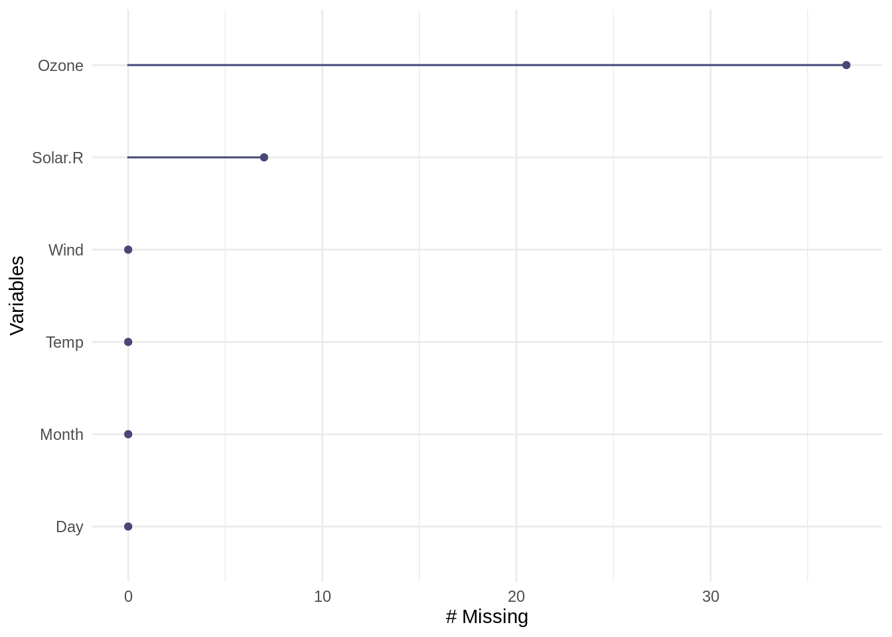
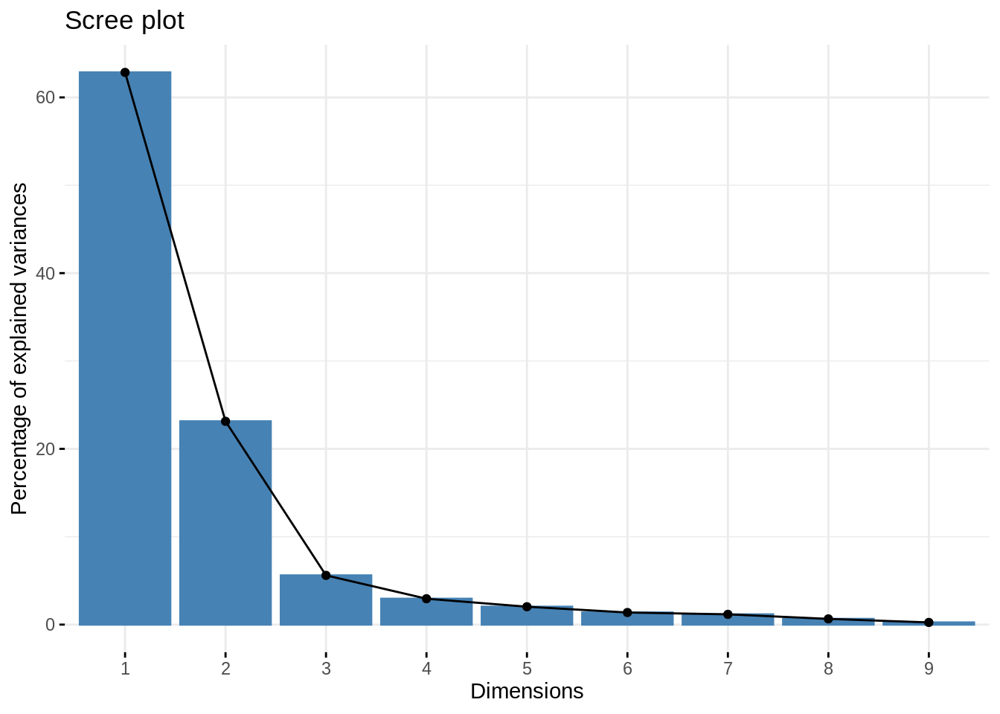

# Data Preprocessing and Feature Engineering in R

Kenny Jin


```r
library(naniar)
library(zoo)
library(dplyr)
library(VIM)
library(caret)
library(factoextra)
```

## Overview

Data proprocessing and feature engineering is usually a necessary step for data visualization and machine learning. This article will introduce several data preprocessing and feature engineering techniques and how to implement these techniques in R. 

## Missing Values

Real world datasets usually contain missing values. Hence, it is important to properly handle these missing values before we continue to perform any data related tasks. 

### Exploring the dataset
We use R's airquality dataset as an example. The first thing to do for handling missing values is to explore the dataset and find out how many values are missing, and where are these values. 


```r
head(airquality)
```

```
##   Ozone Solar.R Wind Temp Month Day
## 1    41     190  7.4   67     5   1
## 2    36     118  8.0   72     5   2
## 3    12     149 12.6   74     5   3
## 4    18     313 11.5   62     5   4
## 5    NA      NA 14.3   56     5   5
## 6    28      NA 14.9   66     5   6
```

Using head() function, we can clearly see that there are missing values (denoted as NA) in this dataset. But how many values are missing? We can find this out using the n_miss() function from the "naniar" package.


```r
n_miss(airquality)
```

```
## [1] 44
```

The function tells us that there are 44 missing values in total. We can also pass a single column to n_miss() to find out how many missing values are in the column.


```r
n_miss(airquality$Ozone)
```

```
## [1] 37
```

We see that the "Ozone" column alone has 37 missing values.

Usually we want to find out the proportion of missing values, rather than a single number. This can be easily achieved using prop_miss(). Note that you can also pass a single column to this function.


```r
prop_miss(airquality)
```

```
## [1] 0.04793028
```

```r
prop_miss(airquality$Ozone)
```

```
## [1] 0.2418301
```

The results above shows that there are about 4.79% of the values missing for the whole dataset, and 24.18% of the values are missing for the Ozone column.

We can also find out the count and proportion of non-missing values using n_complete(), prop_complete().


```r
n_complete(airquality)
```

```
## [1] 874
```

```r
prop_complete(airquality)
```

```
## [1] 0.9520697
```

```r
n_complete(airquality$Ozone)
```

```
## [1] 116
```

```r
prop_complete(airquality$Ozone)
```

```
## [1] 0.7581699
```

We can also get a summary for the whole dataset using miss_var_summary(). Note this is a summary for each column, or variable. n_miss is the number of missing values in that column, and pct_miss is the percentage.


```r
miss_var_summary(airquality)
```

```
## # A tibble: 6 x 3
##   variable n_miss pct_miss
##   <chr>     <int>    <dbl>
## 1 Ozone        37    24.2 
## 2 Solar.R       7     4.58
## 3 Wind          0     0   
## 4 Temp          0     0   
## 5 Month         0     0   
## 6 Day           0     0
```

Getting the summary for each row, or each case, can be achieved using miss_case_summary(). "case" is the row number of the observation. n_miss is the number of missing values in that row, and pct_miss is the percentage.


```r
miss_case_summary(airquality)
```

```
## # A tibble: 153 x 3
##     case n_miss pct_miss
##    <int>  <int>    <dbl>
##  1     5      2     33.3
##  2    27      2     33.3
##  3     6      1     16.7
##  4    10      1     16.7
##  5    11      1     16.7
##  6    25      1     16.7
##  7    26      1     16.7
##  8    32      1     16.7
##  9    33      1     16.7
## 10    34      1     16.7
## # … with 143 more rows
```

We can also visualize the count of missing values for each column using gg_miss_var().


```r
gg_miss_var(airquality)
```



### Handling Missing Values and Imputation

The easiest way to handle the missing values is simply to drop all instances(rows) with NA. This can be achieved using na.omit().


```r
airquality_clean = na.omit(airquality)
head(airquality_clean)
```

```
##   Ozone Solar.R Wind Temp Month Day
## 1    41     190  7.4   67     5   1
## 2    36     118  8.0   72     5   2
## 3    12     149 12.6   74     5   3
## 4    18     313 11.5   62     5   4
## 7    23     299  8.6   65     5   7
## 8    19      99 13.8   59     5   8
```

```r
n_miss(airquality_clean)
```

```
## [1] 0
```

Using n_miss, we see that all rows with NAs are dropped.

Sometimes we want to fill in the NA values rather than simply dropping the row. The process of filling in NA entries is called "Imputation". 

#### Mean Imputation

There are many imputation methods, and one of the most popular is "mean imputation", to fill in all the missing values with the mean of that column.

To implement mean imputation, we can use the mutate_all() from the package dplyr.


```r
air_imp <- airquality %>% mutate_all(~ifelse(is.na(.x), mean(.x, na.rm = TRUE), .x))
n_miss(air_imp)
```

```
## [1] 0
```

```r
head(air_imp)
```

```
##      Ozone  Solar.R Wind Temp Month Day
## 1 41.00000 190.0000  7.4   67     5   1
## 2 36.00000 118.0000  8.0   72     5   2
## 3 12.00000 149.0000 12.6   74     5   3
## 4 18.00000 313.0000 11.5   62     5   4
## 5 42.12931 185.9315 14.3   56     5   5
## 6 28.00000 185.9315 14.9   66     5   6
```

We can see that all NAs are replaced by the mean value of that column.

We can also achieve the mean imputation using na.aggregate() from package zoo.


```r
air_imp_1 <- na.aggregate(airquality)
n_miss(air_imp_1)
```

```
## [1] 0
```

```r
head(air_imp_1)
```

```
##      Ozone  Solar.R Wind Temp Month Day
## 1 41.00000 190.0000  7.4   67     5   1
## 2 36.00000 118.0000  8.0   72     5   2
## 3 12.00000 149.0000 12.6   74     5   3
## 4 18.00000 313.0000 11.5   62     5   4
## 5 42.12931 185.9315 14.3   56     5   5
## 6 28.00000 185.9315 14.9   66     5   6
```

The results are the same as above.

It is worth noting that mean imputation might be problematic if the variable we are imputing is correlated with other variables. In this case, the relationships between variables might be destroyed.

#### KNN Imputation

We can also fill in the missing values using the k-nearest neighbor methods. Instead of computing the overall mean for the whole column, The algorithm will only compute the average of the k nearest data points when performing inference regarding the missing values. 

KNN imputation can be achieved using kNN() function from package VIM.


```r
air_imp_knn <- kNN(airquality, k = 5, variable = "Ozone")
n_miss(air_imp_knn$Ozone)
```

```
## [1] 0
```

```r
head(air_imp_knn)
```

```
##   Ozone Solar.R Wind Temp Month Day Ozone_imp
## 1    41     190  7.4   67     5   1     FALSE
## 2    36     118  8.0   72     5   2     FALSE
## 3    12     149 12.6   74     5   3     FALSE
## 4    18     313 11.5   62     5   4     FALSE
## 5    18      NA 14.3   56     5   5      TRUE
## 6    28      NA 14.9   66     5   6     FALSE
```

k is the number of neighbors for inference. In this example we specify k = 5.

A modifed KNN method is to compute the distance-weighted mean. The weights are inverted distanced from each neighbor. This can also be achieved using kNN().


```r
air_imp_knn_1 <- kNN(airquality, k = 5, variable = "Ozone", numFun = weighted.mean, weightDist = TRUE)
n_miss(air_imp_knn_1$Ozone)
```

```
## [1] 0
```

```r
head(air_imp_knn_1)
```

```
##   Ozone Solar.R Wind Temp Month Day Ozone_imp
## 1    41     190  7.4   67     5   1     FALSE
## 2    36     118  8.0   72     5   2     FALSE
## 3    12     149 12.6   74     5   3     FALSE
## 4    18     313 11.5   62     5   4     FALSE
## 5    18      NA 14.3   56     5   5      TRUE
## 6    28      NA 14.9   66     5   6     FALSE
```

## Feature Selection

Reference: https://learn.datacamp.com/courses/machine-learning-with-caret-in-r

Before performing any supervised machine learning tasks, it is ususally necessary to select features. One common technique for feature selection is to remove features with low variance. If a feature has low variance, it is likely that it contains "low information", thus might not be very helpful for predictive analysis.

We use the BloodBrain dataset from caret as an example.


```r
data(BloodBrain)
```


```r
bloodbrain_x = bbbDescr
```

We can identify the features that have low variance with the nearZeroVar() function from caret library.


```r
# Identify near zero variance predictors: remove_cols
remove_cols <- nearZeroVar(bloodbrain_x, names = TRUE, 
                           freqCut = 2, uniqueCut = 20)
```


```r
remove_cols
```

```
##  [1] "negative"            "peoe_vsa.3"          "peoe_vsa.4"         
##  [4] "peoe_vsa.5"          "peoe_vsa.2.1"        "peoe_vsa.3.1"       
##  [7] "peoe_vsa.4.1"        "peoe_vsa.5.1"        "peoe_vsa.6.1"       
## [10] "a_acid"              "vsa_acid"            "vsa_base"           
## [13] "vsa_pol"             "slogp_vsa2"          "slogp_vsa6"         
## [16] "slogp_vsa8"          "smr_vsa4"            "frac.anion7."       
## [19] "rule.of.5violations" "alert"               "inthb"              
## [22] "chdh3"
```


```r
# Get all column names from bloodbrain_x: all_cols
all_cols <- names(bloodbrain_x)

# Remove from data: bloodbrain_x_small
bloodbrain_x_small <- bloodbrain_x[ , setdiff(all_cols, remove_cols)]
```


```r
dim(bloodbrain_x)
```

```
## [1] 208 134
```

```r
dim(bloodbrain_x_small)
```

```
## [1] 208 112
```

After removing the features with low variance, we are left with only 112 features instead of the original 134 features.

We can also remove the features with low variance using caret's preProcess() function, just to specify the method as "nzv". Note that a separate predict() step is needed to get the transformed dataset.


```r
preproc = preProcess(bloodbrain_x, method = "nzv", freqCut = 2, uniqueCut = 20)
bloodbrain_x_small_1 = predict(preproc, bloodbrain_x)
dim(bloodbrain_x_small_1)
```

```
## [1] 208 112
```

## Dimentionality Reduction

### Principal Component Analysis (PCA)

We usually need to do dimensionality reduction for data analysis. PCA is one of the most commonly used method, and can be used simply with base R's function prcomp().

We use base R's mtcars dataset as an example.


```r
mtcars.pca <- prcomp(mtcars[,c(1:7,10,11)], center = TRUE,scale. = TRUE)
```


```r
predict(mtcars.pca, mtcars)
```

```
##                             PC1        PC2         PC3         PC4         PC5
## Mazda RX4           -0.66422351  1.1734476 -0.20431724 -0.12601751  0.75200784
## Mazda RX4 Wag       -0.63719807  0.9769448  0.11077779 -0.08567709  0.65668822
## Datsun 710          -2.29973601 -0.3265893 -0.21014955 -0.10862524 -0.07622329
## Hornet 4 Drive      -0.21529670 -1.9768101 -0.32946822 -0.30806225 -0.24391787
## Hornet Sportabout    1.58697405 -0.8287285 -1.03299254  0.14738418 -0.22270405
## Valiant              0.04960512 -2.4466838  0.11177774 -0.87154914 -0.12574876
## Duster 360           2.71439677  0.3610529 -0.65206041  0.09633337  0.29674234
## Merc 240D           -2.04370658 -0.8006412  0.84898795 -0.27451338 -0.26307848
## Merc 230            -2.29506729 -1.3056004  1.96848450  0.05055875 -0.45988113
## Merc 280            -0.38252133  0.5811211  0.88632274  0.07026946  0.45835852
## Merc 280C           -0.36652708  0.4121971  1.14860950  0.06150898  0.48309076
## Merc 450SE           1.88466875 -0.7241198 -0.20604588 -0.21856675  0.27996207
## Merc 450SL           1.67107231 -0.7144354 -0.32644071 -0.28933625  0.28061777
## Merc 450SLC          1.77692371 -0.8411687 -0.08557921 -0.28421711  0.34961695
## Cadillac Fleetwood   3.64958983 -0.9480878  0.88315862  0.21645793 -0.34788247
## Lincoln Continental  3.71033756 -0.8426945  0.93230325  0.34099021 -0.34260485
## Chrysler Imperial    3.33196300 -0.4805609  0.67061959  0.65189724 -0.43940743
## Fiat 128            -3.45236266 -0.4327074 -0.22604214  0.10018032 -0.33470301
## Honda Civic         -3.85477722  0.7084152 -0.22670973  1.19340342  0.53954318
## Toyota Corolla      -3.85488283 -0.3872111 -0.25488964  0.21962306 -0.30372397
## Toyota Corona       -1.90375523 -1.5725638  0.06620424  0.07989679  0.50126570
## Dodge Challenger     1.80402354 -1.1340965 -1.00776416 -0.58796239  0.09903732
## AMC Javelin          1.46483534 -0.9777629 -0.76680342 -0.03308788  0.26871378
## Camaro Z28           2.60135738  0.7649595 -0.48915140  0.95247550  0.53065965
## Pontiac Firebird     1.87424485 -0.9791561 -0.89787633  0.22438738 -0.50770999
## Fiat X1-9           -3.14830645 -0.2552569 -0.36230545  0.06406082  0.03361267
## Porsche 914-2       -2.77939557  1.6373369 -0.35969974  0.31886540 -0.43251030
## Lotus Europa        -2.90895427  1.3962368 -0.91635036 -0.90254314 -0.75861156
## Ford Pantera L       1.54812696  3.0206982 -0.51945216  0.86560850 -0.86048411
## Ferrari Dino         0.08049995  2.8346567  0.34481747 -1.14659658  0.29944552
## Maserati Bora        2.96252801  3.9993896  0.70296512 -0.73000448 -0.22756074
## Volvo 142E          -1.90443632  0.1084190  0.39906976  0.31285789  0.11738974
##                             PC6         PC7          PC8          PC9
## Mazda RX4           -0.12506777 -0.42357334 -0.003259165 -0.167051112
## Mazda RX4 Wag       -0.06619437 -0.44849307  0.056643244 -0.071592094
## Datsun 710          -0.56693648  0.38612406 -0.202035744  0.114505030
## Hornet 4 Drive       0.08382435  0.03299362 -0.023714111 -0.145255757
## Hornet Sportabout    0.18280435 -0.05793795  0.152342587 -0.154646072
## Valiant             -0.23043022  0.22451528  0.098663134 -0.004233901
## Duster 360           0.27763557  0.44227307 -0.306373481 -0.186980810
## Merc 240D           -0.19042527 -0.39416400 -0.187088365 -0.010461330
## Merc 230             0.20443847  0.53713423  0.413455512 -0.169005773
## Merc 280            -0.07984989 -0.26113412  0.204105964  0.110461785
## Merc 280C           -0.16066456 -0.07979514  0.352641772  0.027108266
## Merc 450SE           0.17135058 -0.08914480  0.092140434  0.396034809
## Merc 450SL           0.33682412  0.03346598  0.182323579  0.196526577
## Merc 450SLC          0.13926264  0.20632469  0.295340402  0.147796262
## Cadillac Fleetwood  -0.24002207 -0.31053111 -0.171865268 -0.251117818
## Lincoln Continental -0.22646211 -0.28589695 -0.239313268 -0.028994385
## Chrysler Imperial    0.31045750 -0.38304409 -0.359765688  0.223097923
## Fiat 128             0.57303421 -0.24650594 -0.066340528  0.220271421
## Honda Civic          0.37207104 -0.20055288  0.087333576 -0.241702175
## Toyota Corolla       0.83750899 -0.10186868  0.104053562  0.042833437
## Toyota Corona       -0.07212137  0.74680802 -0.408144457 -0.082722856
## Dodge Challenger    -0.33920894 -0.14045443  0.156086022 -0.050247532
## AMC Javelin         -0.31479492  0.03753417  0.370979414 -0.043466032
## Camaro Z28           0.05970074  0.38212238 -0.289612990  0.082069840
## Pontiac Firebird     0.20785973 -0.32709161  0.027471038 -0.130958896
## Fiat X1-9           -0.09586730  0.10352270 -0.020876499  0.021084764
## Porsche 914-2       -0.69006515 -0.26313120 -0.105695694  0.085027267
## Lotus Europa         0.05473409 -0.03491081 -0.236552376 -0.046341050
## Ford Pantera L      -0.50704173  0.37940892  0.548070377  0.053196712
## Ferrari Dino        -0.08124583 -0.26924964 -0.123537656 -0.047915313
## Maserati Bora        0.65580986  0.49422807 -0.082329298 -0.053112079
## Volvo 142E          -0.48091826  0.31102454 -0.315146031  0.165790892
```

We can plot the percentages of explained variances using fviz_eig() from the library factoextra.


```r
fviz_eig(mtcars.pca)
```



In practice, we usually use "elbow" method to select the number of components. In this case, the best number of component is 3.


