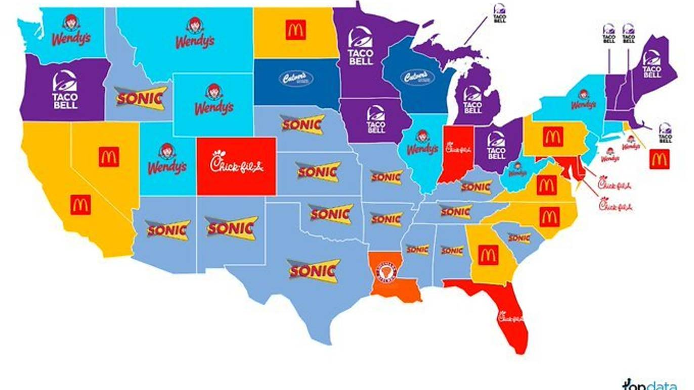

# Visualization of geographical maps

Yuxin Qian
```{r, include=FALSE}
knitr::opts_chunk$set(echo = TRUE)
```

```{r, message=FALSE, warning=FALSE}
library(maps)
library(tmap)
```
### 1. What is map visualization

When dealing with geographically-related data, you might want to show the result on a map instead of just a bin graph for a more concrete and vivid effect.

Let's first look at an example. The following graph from TopData highlights the most popular fast food chain in each state during quarantine.[(Source)](https://www.timeout.com/usa/news/this-map-highlights-the-most-popular-fast-food-chain-in-each-state-during-quarantine-062420) I accidentally saw it on Twitter one day (during my quarantine) and thought it would be really helpful and interesting if I know how to draw such a graph.




Therefore, in this article, I will briefly introduce how to conduct map visualization in R.

### 2. How to draw a map in R

There are several useful package related to various geographical maps. First, we are going to use the package **maps**. The package includes the world map, as well as maps of several countries.

```{r, fig.width=6, fig.height=4}
map(database = "state")
title("The United States")
```

And it also includes state maps for the U.S.
```{r, fig.width=3, fig.height=5}
map("county", regions = "ca") 
```

For each map function, there is a logical flag `add`. By setting the flag to be true, we can add more details, such as colors and texts, to the existed plot. The following is an example.
```{r, fig.width=6, fig.height=4}
map("state", fill = FALSE)
map('state', regions = c('texas', 'ca', 'utah'),
    fill = TRUE, col = 'green',
    add = TRUE)
map('state', regions = c('penn', 'new york'),
    fill = TRUE, col = 'yellow',
    add = TRUE)
map.text('state', regions = 'ca', labels ="CA",
         add = TRUE)
```

### 3. tmap

If you cannot find the map you are looking for in the **maps** package, or you are not satisfied with the limited functions it provided, you may consider using the **tmap** package instead.

The tmap package saves data of the maps as 'SpatialPolygonsDataFrame', or say, an sp objects. Let's take the world map as an example. As we can see, besides the geographical info, there are also some other existed variable included in the map data such as gdp and population.

```{r}
data(World)
summary(World)
```

Let's try to draw a world map based on life expectation.
```{r}
tm_shape(World) +
    tm_polygons("life_exp")
```

The **tmap** package plot the map in a way similar ggplot2, which means many functions are still workable in the map drawing, such as facet. You can also change the layout as you like. Here is an example.

```{r}
tm_shape(World) +
  tm_polygons(c("life_exp","economy")) +
  tm_facets(sync = TRUE, nrow = 2) +
  tm_layout(bg.color = "#66CCFF")
```

### 4.Optional watching: create your own sf object

The **tmap** package itself does not include enough sf object. So in application, you may have to create a new sf object yourself. This can be done by installing the **sf** package, using the `sf_read` function to introduce your shapefile to a new sf object, and combining it with your dataset. I find a 6-minute video on this topic which I think is very helpful, and I would post the link here. [click](https://www.youtube.com/watch?v=GMi1ThlGFMo)

