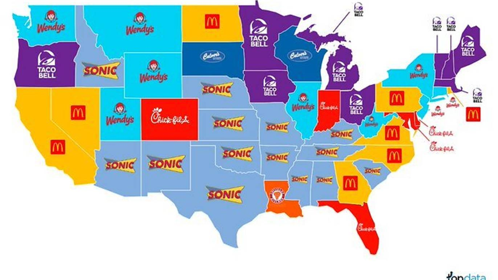
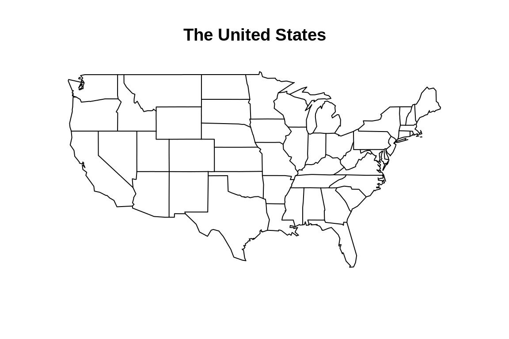
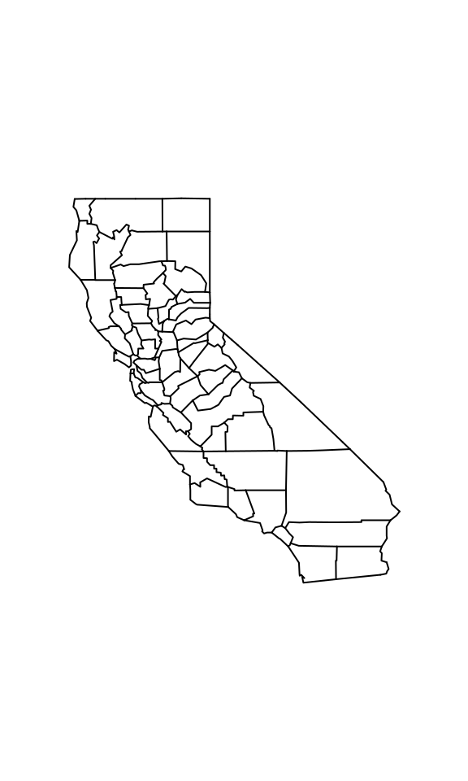
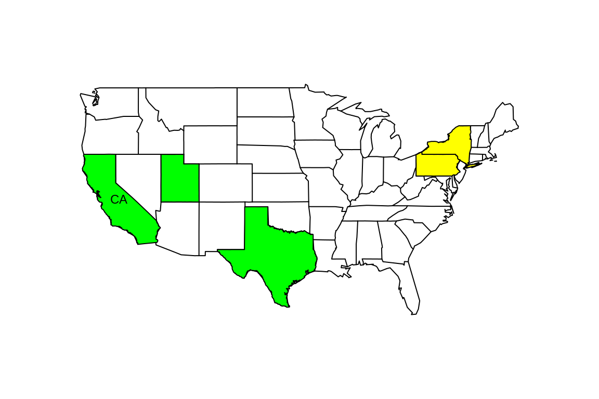
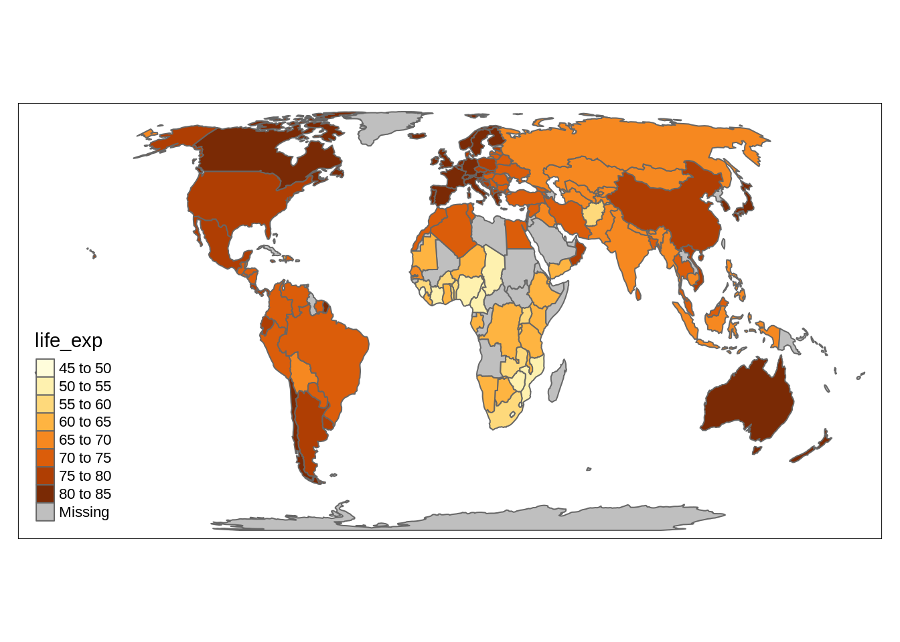
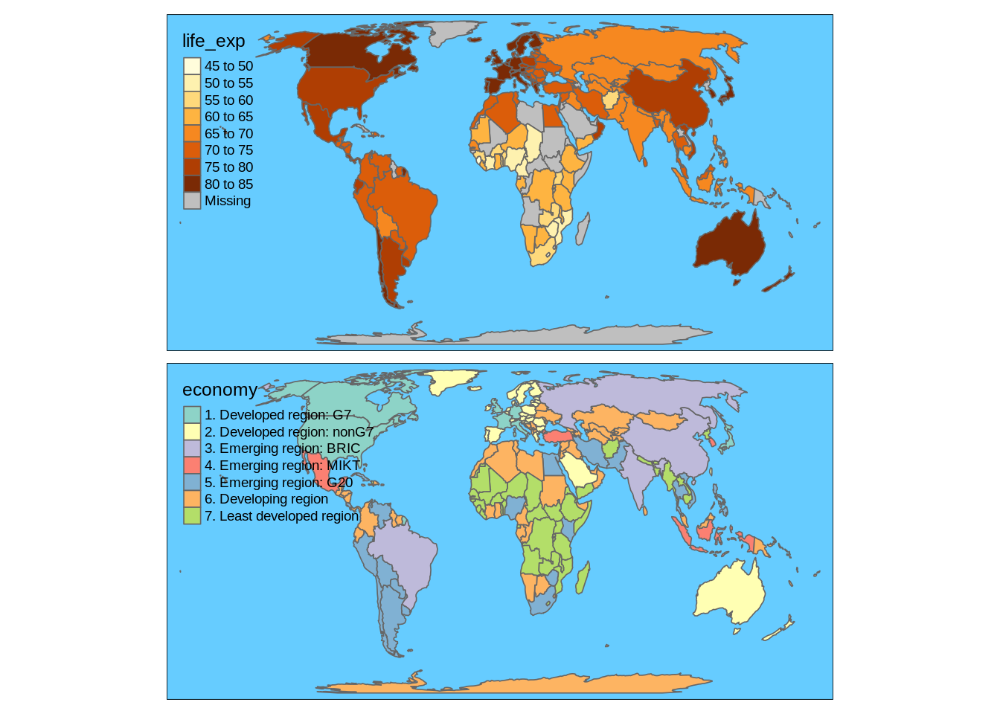

# Visualization of geographical maps

Yuxin Qian


```r
library(maps)
library(tmap)
```
### 1. What is map visualization

When dealing with geographically-related data, you might want to show the result on a map instead of just a bin graph for a more concrete and vivid effect.

Let's first look at an example. The following graph from TopData highlights the most popular fast food chain in each state during quarantine.[(Source)](https://www.timeout.com/usa/news/this-map-highlights-the-most-popular-fast-food-chain-in-each-state-during-quarantine-062420) I accidentally saw it on Twitter one day (during my quarantine) and thought it would be really helpful and interesting if I know how to draw such a graph.




Therefore, in this article, I will briefly introduce how to conduct map visualization in R.

### 2. How to draw a map in R

There are several useful package related to various geographical maps. First, we are going to use the package **maps**. The package includes the world map, as well as maps of several countries.


```r
map(database = "state")
title("The United States")
```



And it also includes state maps for the U.S.

```r
map("county", regions = "ca") 
```



For each map function, there is a logical flag `add`. By setting the flag to be true, we can add more details, such as colors and texts, to the existed plot. The following is an example.

```r
map("state", fill = FALSE)
map('state', regions = c('texas', 'ca', 'utah'),
    fill = TRUE, col = 'green',
    add = TRUE)
map('state', regions = c('penn', 'new york'),
    fill = TRUE, col = 'yellow',
    add = TRUE)
map.text('state', regions = 'ca', labels ="CA",
         add = TRUE)
```



### 3. tmap

If you cannot find the map you are looking for in the **maps** package, or you are not satisfied with the limited functions it provided, you may consider using the **tmap** package instead.

The tmap package saves data of the maps as 'SpatialPolygonsDataFrame', or say, an sp objects. Let's take the world map as an example. As we can see, besides the geographical info, there are also some other existed variable included in the map data such as gdp and population.


```r
data(World)
summary(World)
```

```
##      iso_a3             name                        sovereignt 
##  AFG    :  1   Afghanistan:  1   France                  :  3  
##  AGO    :  1   Albania    :  1   Denmark                 :  2  
##  ALB    :  1   Algeria    :  1   Israel                  :  2  
##  ARE    :  1   Angola     :  1   United Kingdom          :  2  
##  ARG    :  1   Antarctica :  1   United States of America:  2  
##  ARM    :  1   Argentina  :  1   Afghanistan             :  1  
##  (Other):171   (Other)    :171   (Other)                 :165  
##          continent       area             pop_est           pop_est_dens      
##  Africa       :51   Min.   :    2590   Min.   :1.400e+02   Min.   :   0.0003  
##  Asia         :47   1st Qu.:   42390   1st Qu.:3.442e+06   1st Qu.:  20.8203  
##  Europe       :39   Median :  183630   Median :9.036e+06   Median :  65.3438  
##  North America:18   Mean   :  814568   Mean   :3.827e+07   Mean   : 105.5498  
##  South America:13   3rd Qu.:  622980   3rd Qu.:2.595e+07   3rd Qu.: 116.8924  
##  Oceania      : 7   Max.   :16376870   Max.   :1.339e+09   Max.   :1198.8237  
##  (Other)      : 2                                                             
##                        economy                     income_grp
##  1. Developed region: G7   : 7   1. High income: OECD   :32  
##  2. Developed region: nonG7:32   2. High income: nonOECD:17  
##  3. Emerging region: BRIC  : 4   3. Upper middle income :44  
##  4. Emerging region: MIKT  : 4   4. Lower middle income :47  
##  5. Emerging region: G20   :19   5. Low income          :37  
##  6. Developing region      :66                               
##  7. Least developed region :45                               
##   gdp_cap_est          life_exp       well_being      footprint     
##  Min.   :   300.5   Min.   :48.91   Min.   :2.867   Min.   : 0.610  
##  1st Qu.:  2215.4   1st Qu.:65.04   1st Qu.:4.575   1st Qu.: 1.425  
##  Median :  7394.8   Median :73.24   Median :5.200   Median : 2.604  
##  Mean   : 14977.1   Mean   :70.80   Mean   :5.412   Mean   : 3.223  
##  3rd Qu.: 19193.8   3rd Qu.:76.93   3rd Qu.:6.300   3rd Qu.: 4.482  
##  Max.   :200000.0   Max.   :83.24   Max.   :7.800   Max.   :15.820  
##  NA's   :1          NA's   :41      NA's   :41      NA's   :41      
##    inequality           HPI                 geometry  
##  Min.   :0.04322   Min.   :12.78   MULTIPOLYGON :177  
##  1st Qu.:0.13931   1st Qu.:21.21   epsg:NA      :  0  
##  Median :0.21293   Median :26.29   +proj=eck4...:  0  
##  Mean   :0.23427   Mean   :26.48                      
##  3rd Qu.:0.32932   3rd Qu.:31.73                      
##  Max.   :0.50734   Max.   :44.71                      
##  NA's   :41        NA's   :41
```

Let's try to draw a world map based on life expectation.

```r
tm_shape(World) +
    tm_polygons("life_exp")
```



The **tmap** package plot the map in a way similar ggplot2, which means many functions are still workable in the map drawing, such as facet. You can also change the layout as you like. Here is an example.


```r
tm_shape(World) +
  tm_polygons(c("life_exp","economy")) +
  tm_facets(sync = TRUE, nrow = 2) +
  tm_layout(bg.color = "#66CCFF")
```



### 4.Optional watching: create your own sf object

The **tmap** package itself does not include enough sf object. So in application, you may have to create a new sf object yourself. This can be done by installing the **sf** package, using the `sf_read` function to introduce your shapefile to a new sf object, and combining it with your dataset. I find a 6-minute video on this topic which I think is very helpful, and I would post the link here. [click](https://www.youtube.com/watch?v=GMi1ThlGFMo)

