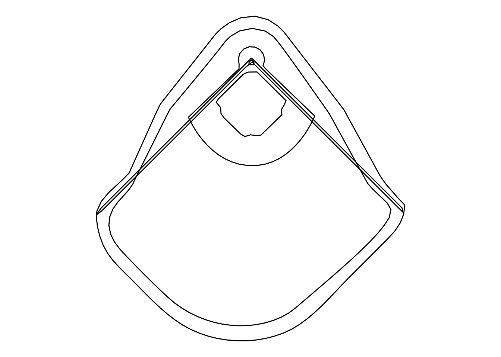
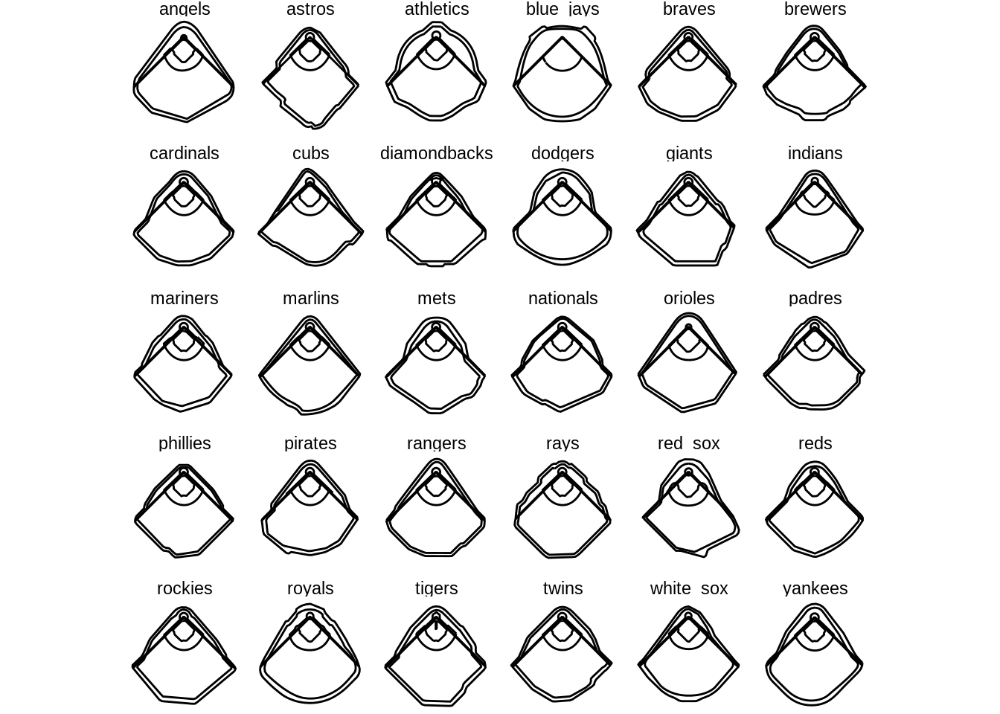
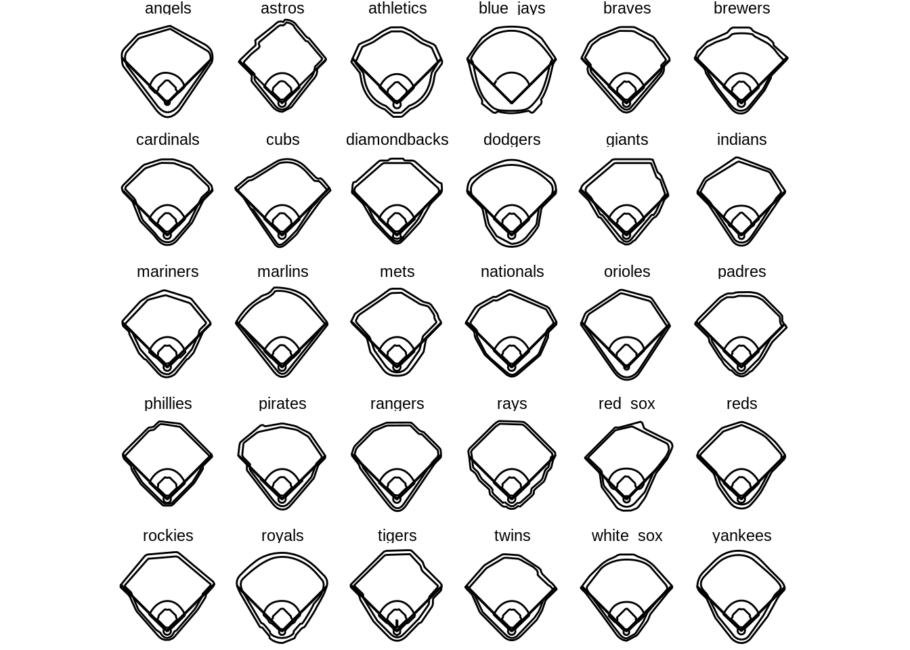
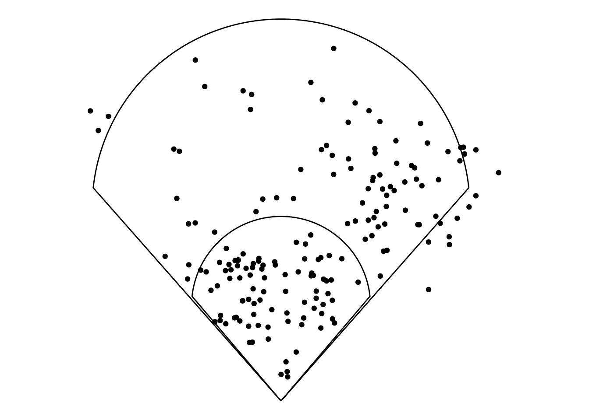
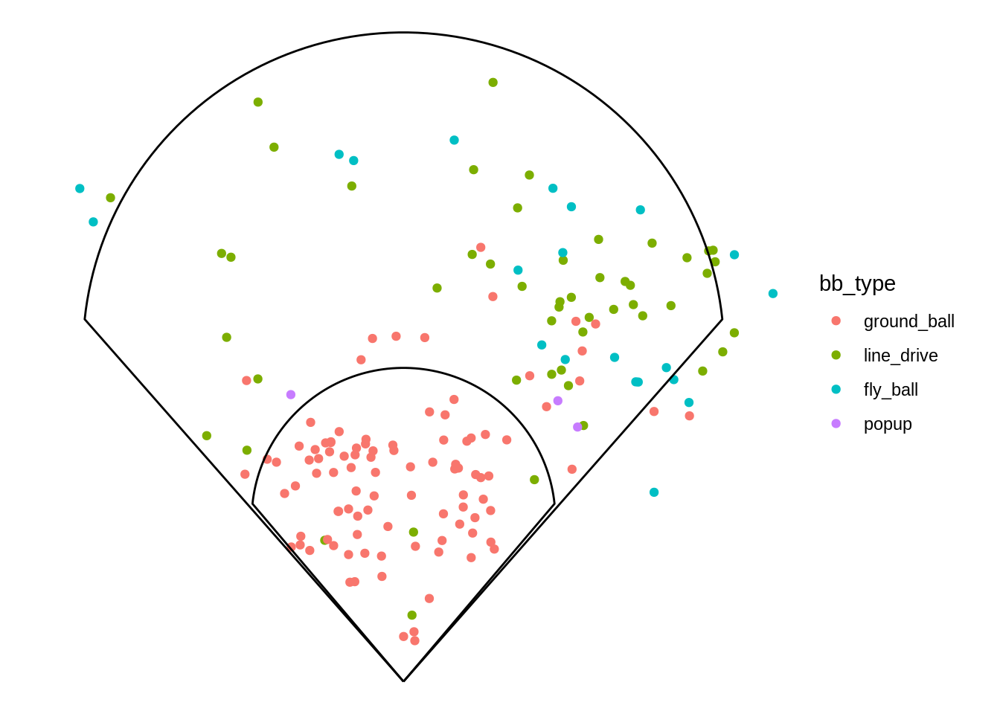
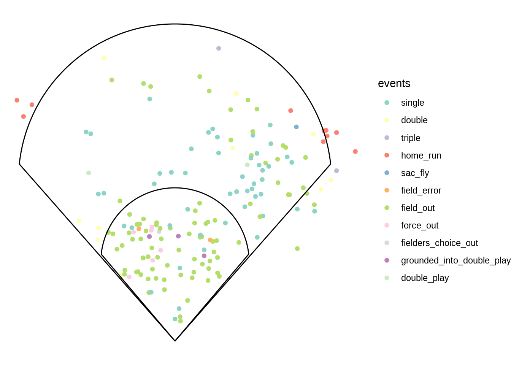
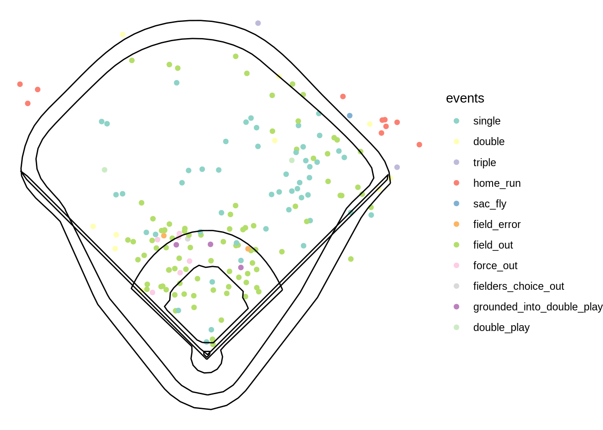
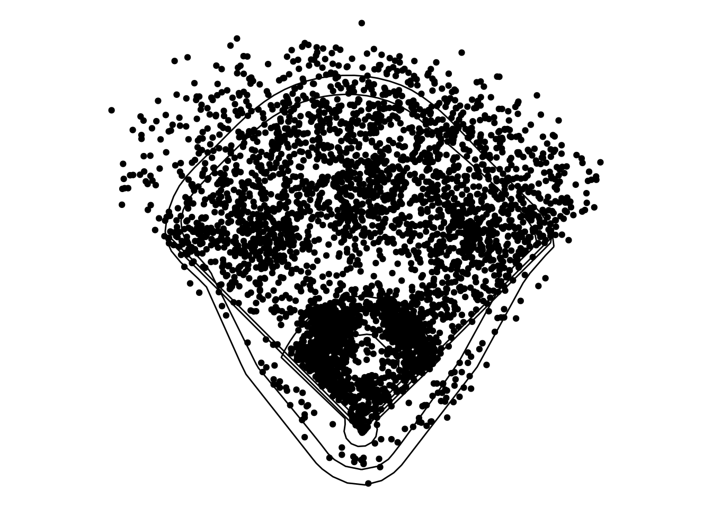
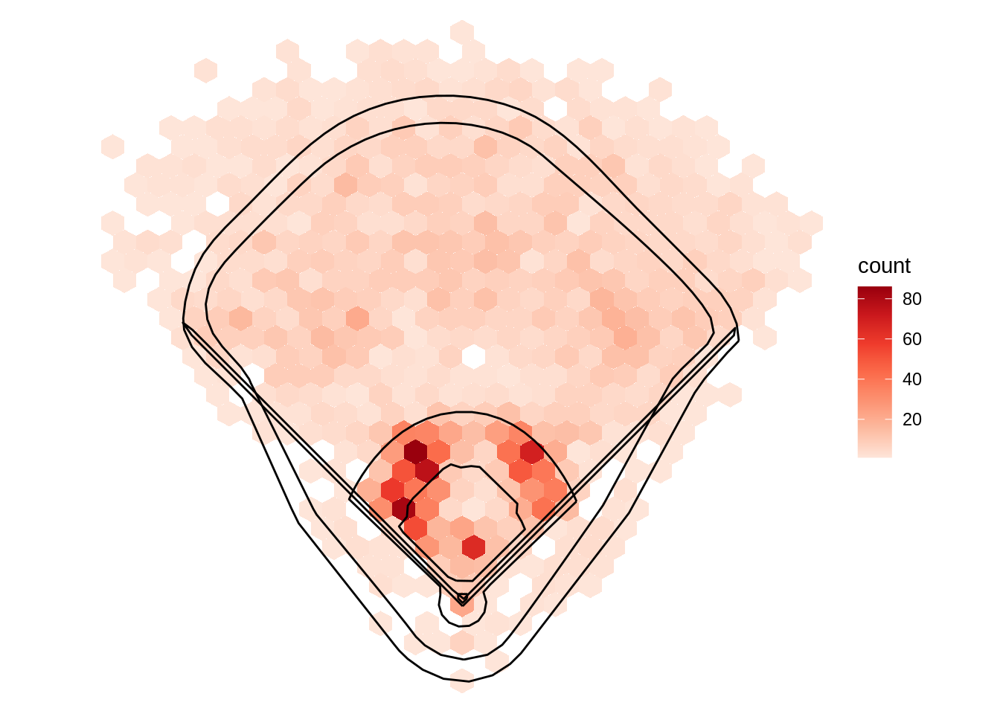
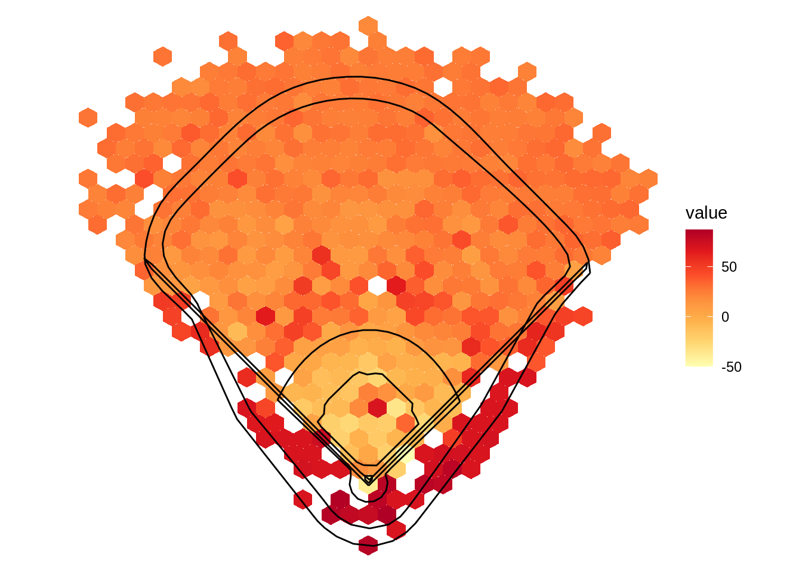

# GeomMLBStadiums

James Ding


## Overview

Baseball is one of the most data driven sports in the world due to the number of games played and the format of the sport. However, since the majority of the people involved in baseball are not statisticians, there is a need for data visualization for easier consumption. One type of data commonly used in the sport is location of batted balls in play. Due to the unique shape of Major League Baseball (MLB) Stadiums, the plotting of this data needs a specialized package, `GeomMLBStadiums`, developed by 
Ben Dilday at https://github.com/bdilday/GeomMLBStadiums.

## Setup

To install the `GeomMLBStadiums`package, first install `devtools`. Then use 'devtools' to install `GeomMLBStadiums` from Github, as shown in the code below.


```r
install.packages("devtools")
devtools::install_github("bdilday/GeomMLBStadiums")
```

Once the package is downloaded, open up the `GeomMLBStadiums` library, as well as `ggplot2` and `dplyr`.


```r
library(GeomMLBStadiums)
library(ggplot2)
library(dplyr)
```

## `geom_mlb_stadium`

To just see the stadium, you can use `geom_mlb_stadium` with `ggplot`. The plots are drawn from the data in `MLBStadiumsPathData`, which is a dataframe included in the package. Below, I show the dimensions of Yankee Stadium.

Notice that the parameter `stadium_ids` takes the team name rather than the stadium name. For example, if you want Wrigley Field, you would set `stadium_ids = "cubs"`.

Make sure to set `stadium_segments = "all"`. By default it is set to `"outfield outer"`, which will only show the outer dimension of the stadium. I would also recommend using `coord_fixed()` so the graph doesn't get stretched out and `theme_void` so that the background doesn't affect the readability of the graph.


```r
ggplot() +
  geom_mlb_stadium(stadium_ids = "yankees", stadium_segments = "all") +
  coord_fixed() +
  theme_void()
```



If you wanted to see all the stadiums in one plot, you can set `stadium_ids = "all_mlb"` and use facets. 


```r
ggplot() + 
  geom_mlb_stadium(stadium_ids = "all_mlb", stadium_segments = "all") + 
  facet_wrap(~team) + 
  coord_fixed() +
  theme_void()
```



While this may seem fine at first, it appears that this function accidentally mirrors the stadiums. This is most notable in the Red Sox's stadium (Fenway Park), which is known for having a short left field with a large wall (known as "The Green Monster"). However, in this plot the Green Monster is clearly in right field. Don't worry, as this mistake is easily corrected by setting the parameter `stadium_transform = TRUE`. This also has the added benefit of changing home plate to be at the bottom of each plot, which is a more natural representation of the stadiums for baseball fans.


```r
ggplot() + 
  geom_mlb_stadium(stadium_ids = "all_mlb", 
                   stadium_segments = "all", 
                   stadium_transform_coords = TRUE) + 
  facet_wrap(~team) + 
  coord_fixed() +
  theme_void()
```




## `geom_spraychart`

This is the most important part of the package, as `geom_spraychart` allows for the plotting of batted ball data. Nowadays, Major League Baseball teams are moving their defensive players around more and more. These shifts are usually to put defenders in areas where the batter tends to hit the ball, thereby getting more outs. `geom_spraychart` allows for easy visualizations of batters' hitting tendencies.

To demonstrate this part of the package, I will use real data from MLB's Statcast database (data from MLB's Baseball Savant Website, https://baseballsavant.mlb.com/statcast_search). However, if you do not feel like using this data, you can create your own data; all you need is a dataframe of x and y coordinates.

### `mlbam_xy_transformation`

`mlbam_xy_transformation` is a function in the `GeomMLBStadiums` package that will change the x and y coordinates of the data such that home plate will appear at the bottom and the coordinates of home plate will be (0,0). This function is useful because Statcast presents its data with home plate at the top. Calling this function on a dataframe will add two columns to the dataframe: one for the adjusted x-values and one for the adjusted y-values. Keep in mind that these values must be numeric; in later examples you'll see me convert these columns to numbers in order to use this function. By default, these columns are named by adding an underscore to the end of the names for the x and y coordinate columns. To see this function in action, take a look at the next section.

### Spraycharts

For this section, I will be using data from DJ LeMahieu's 2020 regular season. I only used data on balls in play, as it wouldn't make sense to plot other pitches. This data was downloaded from the link above as a CSV.


```r
DJLeMahieu <- read.csv("https://raw.githubusercontent.com/dncamp/GeomMLBStadiums-Tutorial/main/DJLeMahieu.csv")
head(DJLeMahieu %>% select(game_date, events, hc_x, hc_y, 
                           balls, strikes, outs_when_up, inning))
```

```
##    game_date    events   hc_x   hc_y balls strikes outs_when_up inning
## 1 2020-09-27 field_out 113.82 135.79     1       0            2      7
## 2 2020-09-27    single  81.61 117.79     3       2            1      5
## 3 2020-09-27    single 127.53 188.21     0       1            1      3
## 4 2020-09-26    single 135.01  90.69     1       1            2      7
## 5 2020-09-26    double  78.35 139.04     0       1            1      6
## 6 2020-09-26 field_out 128.37 195.82     0       1            1      5
```

The important columns here are `hc_x` and `hc_y`, as these are the coordinates where LeMahieu hit the ball. However, since these values are the Statcast values, we will need to use `mlbam_xy_transformation` to adjust these values to use with our plot. The adjusted values are in columns `hc_x_` and `hc_y_`.


```r
DJLeMahieu <- mlbam_xy_transformation(DJLeMahieu)
head(DJLeMahieu %>% select(hc_x, hc_y, hc_x_, hc_y_))
```

```
##     hc_x   hc_y       hc_x_      hc_y_
## 1 113.82 135.79  -27.901602 157.751364
## 2  81.61 117.79 -108.287165 202.673442
## 3 127.53 188.21    6.314048  26.928290
## 4 135.01  90.69   24.981667 270.306126
## 5  78.35 139.04 -116.423052 149.640433
## 6 128.37 195.82    8.410411   7.936234
```

This data is then easily plotted using `ggplot2` and `geom_spraychart`. For the mapping, make sure to set `x` and `y` to the adjusted columns. Note that if the parameter `stadium_ids` is left blank for `geom_spraychart`, the data will be plotted on a generic field.


```r
ggplot(DJLeMahieu, aes(x = hc_x_, y = hc_y_)) +
  geom_spraychart(stadium_transform_coords = TRUE, stadium_segments = "all") +
  coord_fixed() +
  theme_void()
```



From here there are almost infinite possibilities. For example, we can change the color of each point to represent the type of batted ball (called `bb_type` in the dataframe).


```r
DJLeMahieu$bb_type <- factor(DJLeMahieu$bb_type, 
                             levels = c("ground_ball", "line_drive", "fly_ball", "popup"))

ggplot(DJLeMahieu, aes(x = hc_x_, y = hc_y_, color = bb_type)) +
  geom_spraychart(stadium_transform_coords = TRUE, stadium_segments = "all") +
  coord_fixed() +
  theme_void()
```



This data helps to show what types of batted balls LeMahieu hits in different locations. For example, LeMahieu the vast majority of balls that LeMahieu hits into the infield are ground balls. This is abnormal because you would expect more infield pop ups if this were an average player.

Another option is to change color based on the result of the batted ball (called `events` in the dataframe).


```r
DJLeMahieu$events <- factor(DJLeMahieu$events, 
                            levels = c("single", "double", "triple", "home_run", "sac_fly", "field_error", "field_out", "force_out", "fielders_choice_out", "grounded_into_double_play", "double_play"))

ggplot(DJLeMahieu, aes(x = hc_x_, y = hc_y_, color = events)) +
  geom_spraychart(stadium_transform_coords = TRUE, stadium_segments = "all") +
  scale_color_brewer(palette = "Set3") +
  coord_fixed() +
  theme_void()
```



While most of this data is fairly standard, one data point seems to stick out in particular. One home run in the top right of the plot is well inside the boundary of the stadium, and it seems to be further from the wall than some of Lemahieu's non-home run hits. To see an explanation for this, we  can plot Lemahieu's data in his home stadium, Yankee Stadium.


```r
ggplot(DJLeMahieu, aes(x = hc_x_, y = hc_y_, color = events)) +
  geom_spraychart(stadium_ids = "yankees", stadium_transform_coords = TRUE, stadium_segments = "all") +
  scale_color_brewer(palette = "Set3") +
  coord_fixed() +
  theme_void()
```



From this plot we can see that the outlier home run in may be the result of Yankee Stadium's "short porch". `GeomMLBStadiums` allows for this easy comparison between stadiums.


## Other types of Visualizations with `GeomMLBStadiums`

While these spray charts may be the good for the data used above, it sometimes these plots, which are basically a variant of scatter plots, may not be the best solution. For example the data used above was taken during the 2020 MLB season which was shortened to 60 games due to COVID-19. If the data were over a full MLB season (162 games) or even over multiple seasons, the resulting spray chart could get quite messy. For example, below I plotted a spraychart for the entire New York Yankees team in 2019.


```r
yankees <- read.csv("https://raw.githubusercontent.com/dncamp/GeomMLBStadiums-Tutorial/main/Yankees.csv")
yankees <- yankees %>% filter(hc_x != "null")
yankees$hc_x <- as.numeric(yankees$hc_x)
yankees$hc_y <- as.numeric(yankees$hc_y)
yankees <- mlbam_xy_transformation(yankees)

ggplot(yankees, aes(x = hc_x_, y = hc_y_)) +
  geom_spraychart(stadium_ids = "yankees", stadium_transform_coords = TRUE, stadium_segments = "all") +
  coord_fixed() +
  theme_void()
```



There is too much data, so a simple spraychart is too hard to read. In these cases, a different visualization may be necessary.

### Heatmaps with `GeomMLBStadiums`

As with other geoms in `ggplot2`, you can add multiple geoms to the plot. Below I used both `geom_hex` and `geom_mlb_stadium` to create a heatmap of the data. Keep in mind that the last geom is the one that will appear on top, so I would suggest plotting `geom_hex` first and `geom_mlb_stadium` second.

```r
ggplot(yankees, aes(x = hc_x_, y = hc_y_)) +
  geom_hex() +
  scale_fill_distiller(palette = "Reds", direction = 1) +
  geom_mlb_stadium(stadium_ids = "yankees", stadium_transform_coords = TRUE, stadium_segments = "all") +
  coord_fixed() +
  theme_void()
```



This resulting visualization is much easier to read compared to the original spraychart. This is because `geom_hex` summarizes the amount of data points within each hexagon, so the clutter of the spray chart is avoided.

### `stat_summary_hex` with `GeomMLBStadiums`

Another great way to use the package is in conjunction with `stat_summary_hex`. Recently, the term "launch angle" has started to gain popularity with fans and analysts, but what constitutes a good launch angle? Using `stat_summary_hex` we can graph hit locations like we have done before, but we can also use color to indicate the launch angle of balls hit in that location as well. To do so, in the mapping we just need to set `z = launch_angle`.


```r
yankees$launch_angle <- as.numeric(yankees$launch_angle)

ggplot(yankees, aes(x = hc_x_, y = hc_y_, z = launch_angle)) +
  stat_summary_hex() +
  scale_fill_distiller(palette = "YlOrRd", direction = 1) +
  geom_mlb_stadium(stadium_ids = "yankees", stadium_transform_coords = TRUE, stadium_segments = "all") +
  coord_fixed() +
  theme_void()
```



From the above visualization, it seems that the ideal launch angle is between 25 and 35 degrees if the goal is to hit a home run. Batted balls with high launch angles tend to end up in foul territory or in the shallow part of the outfield. Batted balls with low launch angles ended up in the infield.


