# Brief Introduction and Tutorial of ggpubr Package

Heng Kan and Haichao Yi


## Installation and loading


```r
install.packages("ggpubr")
```
 

```r
library(ggplot2)
library(ggpubr)
```

 
## Introduction
ggplot2, by Hadley Wickham, is an excellent and flexible package for elegant data visualization in R. However the default generated plots requires some formatting before we can send them for publication. Furthermore, to customize a ggplot, the syntax is opaque and this raises the level of difficulty for researchers with no advanced R programming skills.

The ggpubr package provides some easy-to-use functions for creating and customizing ‘ggplot2’- based publication ready plots.

We will give some examples about how to use easy functions in ggpubr to give various kinds of plots.

 

## Histogram

We construct a dataset with attributes sex and height where there are 300 people for each sex and values of height are in inches.


```r
set.seed(2000)
heightdata <- data.frame(
          sex = factor(rep(c("Female", "Male"), each=300)),
   height = c(rnorm(300, 65), rnorm(300, 69)))
```

Now we use heightdata to plot the corresponding histogram. Here we use the function gghistogram where we add mean lines showing mean values for each sex and marginal rug showing one-dimensional density plot on the axis.


```r
gghistogram(heightdata, x = "height",
   add = "mean", rug = TRUE,
   color = "sex", fill = "sex", bins= 15)
```

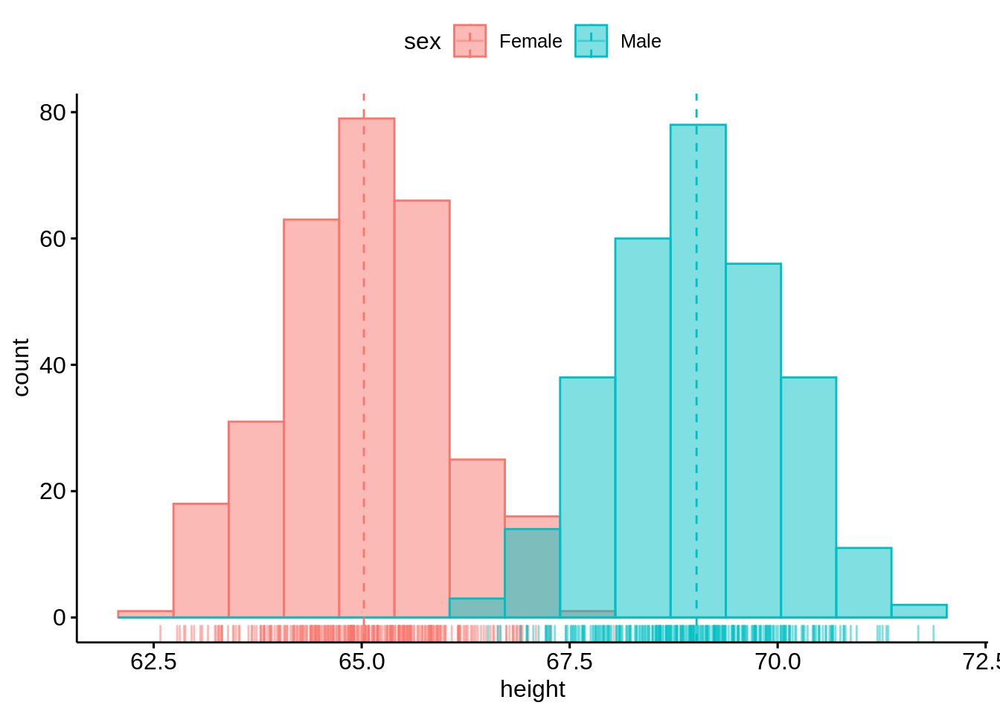

The histogram is good-looking and straightforward to plot. 


## Density plot

Now we still use heightdata to plot the corresponding two-dimensional density plot. Here we still add the mean lines and marginal rug.


```r
ggdensity(heightdata, x = "height",
   add = "mean", rug = TRUE,
   color = "sex", fill = "sex")
```

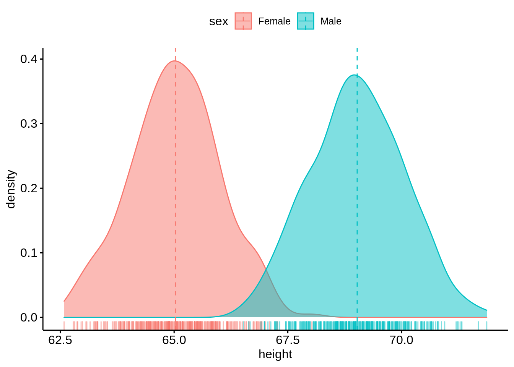

The density plot is similar as the histogram, it is also easy and straightforward to plot. 

## Box plot

We use the first 50 rows of ais dataset in 'alr4' package.

```r
data(ais, package = "alr4")
ais <- ais[1:50,]
head(ais,10)
```

```
##    Sex    Ht   Wt   LBM  RCC WCC   Hc   Hg Ferr   BMI   SSF  Bfat    Label
## 1    1 195.9 78.9 63.32 3.96 7.5 37.5 12.3   60 20.56 109.1 19.75 f-b_ball
## 2    1 189.7 74.4 58.55 4.41 8.3 38.2 12.7   68 20.67 102.8 21.30 f-b_ball
## 3    1 177.8 69.1 55.36 4.14 5.0 36.4 11.6   21 21.86 104.6 19.88 f-b_ball
## 4    1 185.0 74.9 57.18 4.11 5.3 37.3 12.6   69 21.88 126.4 23.66 f-b_ball
## 5    1 184.6 64.6 53.20 4.45 6.8 41.5 14.0   29 18.96  80.3 17.64 f-b_ball
## 6    1 174.0 63.7 53.77 4.10 4.4 37.4 12.5   42 21.04  75.2 15.58 f-b_ball
## 7    1 186.2 75.2 60.17 4.31 5.3 39.6 12.8   73 21.69  87.2 19.99 f-b_ball
## 8    1 173.8 62.3 48.33 4.42 5.7 39.9 13.2   44 20.62  97.9 22.43 f-b_ball
## 9    1 171.4 66.5 54.57 4.30 8.9 41.1 13.5   41 22.64  75.1 17.95 f-b_ball
## 10   1 179.9 62.9 53.42 4.51 4.4 41.6 12.7   44 19.44  65.1 15.07 f-b_ball
##     Sport
## 1  b_ball
## 2  b_ball
## 3  b_ball
## 4  b_ball
## 5  b_ball
## 6  b_ball
## 7  b_ball
## 8  b_ball
## 9  b_ball
## 10 b_ball
```

We now draw a box plot with jittered points of Wt variable within different groups of Sports. We can also change the colors and shapes based on the kind of sports.


```r
pbox <- ggboxplot(ais,x = "Sport", y = "Wt",
                color = "Sport",  
                add = "jitter", shape = "Sport")
pbox
```

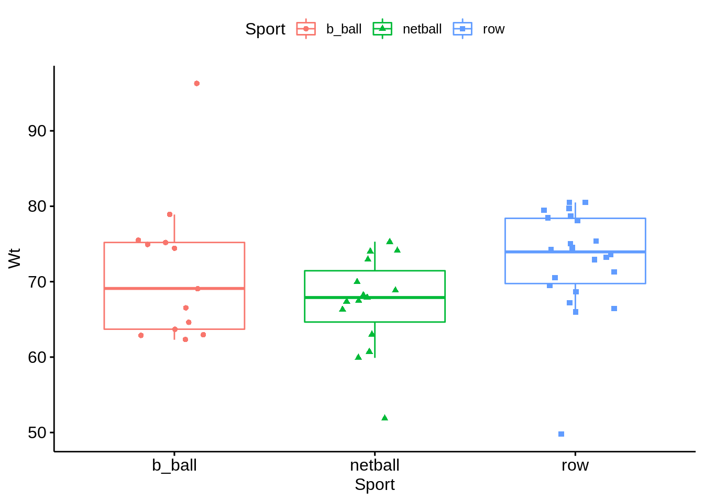

This boxplot is different from what we have seen in geom_boxplot(). In this boxplot, we can see the distribution of all points within different groups of Sports. Also, we can change the color and shape very easily. 

We can set up customized comparison of mean between groups. And the result p-value of ANOVA can be added to the graph as well. The p-value of Kruskal-Wallis test can also be shown on the graph. 

```r
mycomparisons <- list(c("b_ball", "netball"), c("netball", "row"), c("b_ball", "row"))
pbox + stat_compare_means(comparisons = mycomparisons)+
   stat_compare_means(label.y = 50)
```

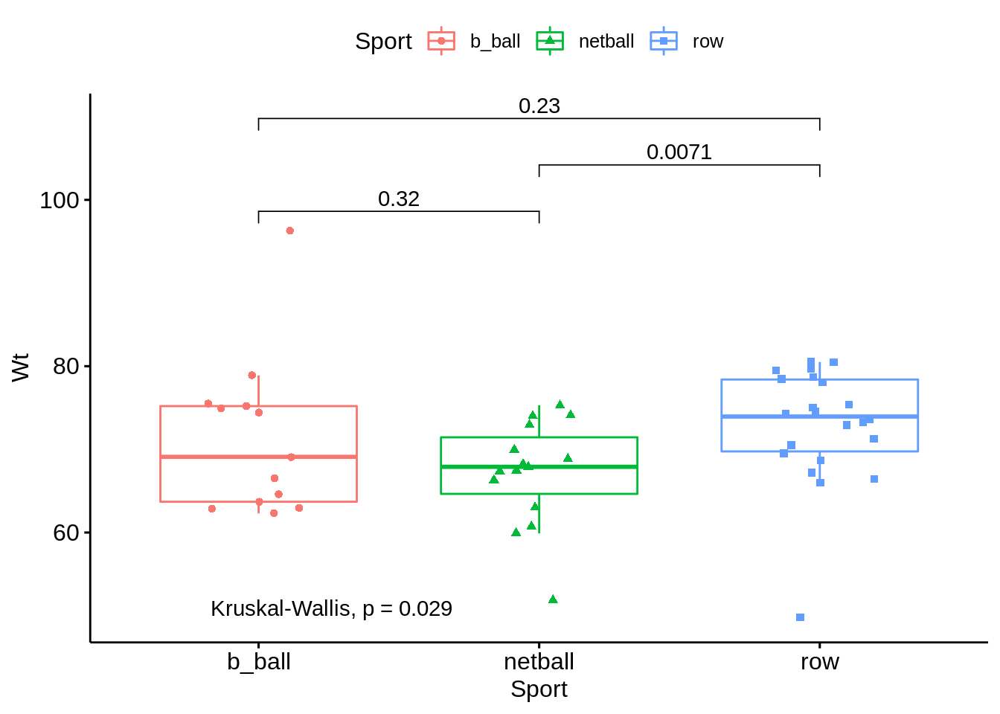

## Violin plot

We still use the first 50 rows of ais dataset. This time, we draw a violin plot regarding Wt variable with boxplots inside. And we can also compare means with ths plot. Just like the boxplot we have above, we can have the p-value of ANOVA on the violin plot as well. 


```r
ggviolin(ais, x = "Sport", y = "Wt", fill = "Sport",
         add = "boxplot", add.params = list(fill = "white"))+
   stat_compare_means(comparisons = mycomparisons)+
   stat_compare_means(label.y = 50)
```

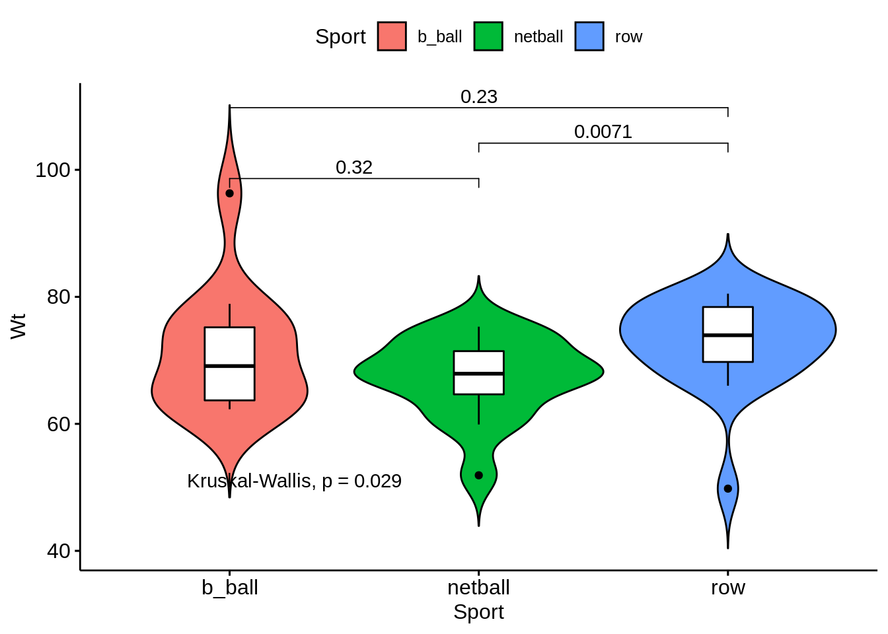

## Bar plot 

We use the mtcars dataset. We convert the gear variable to a factor. And we add the name columns. 


```r
data(mtcars)
cars <- mtcars
cars$gear <- factor(cars$gear)
cars$name <- rownames(cars)
head(cars[,c("name", "wt", "hp","gear")])
```

```
##                                name    wt  hp gear
## Mazda RX4                 Mazda RX4 2.620 110    4
## Mazda RX4 Wag         Mazda RX4 Wag 2.875 110    4
## Datsun 710               Datsun 710 2.320  93    4
## Hornet 4 Drive       Hornet 4 Drive 3.215 110    3
## Hornet Sportabout Hornet Sportabout 3.440 175    3
## Valiant                     Valiant 3.460 105    3
```

Now we draw a bar plot of hp variable and we change the fill color by grouping variable gear. Sorting will be done globally.


```r
ggbarplot(cars, x = "name", y = "hp",
          fill = "gear",               
          color = "white",
          palette = "jco",
          sort.val = "desc",  
          sort.by.groups = FALSE,
          x.text.angle = 60,
          ylab = "Horse Power",
          xlab = FALSE,
          legend.title="Gear"
          )
```

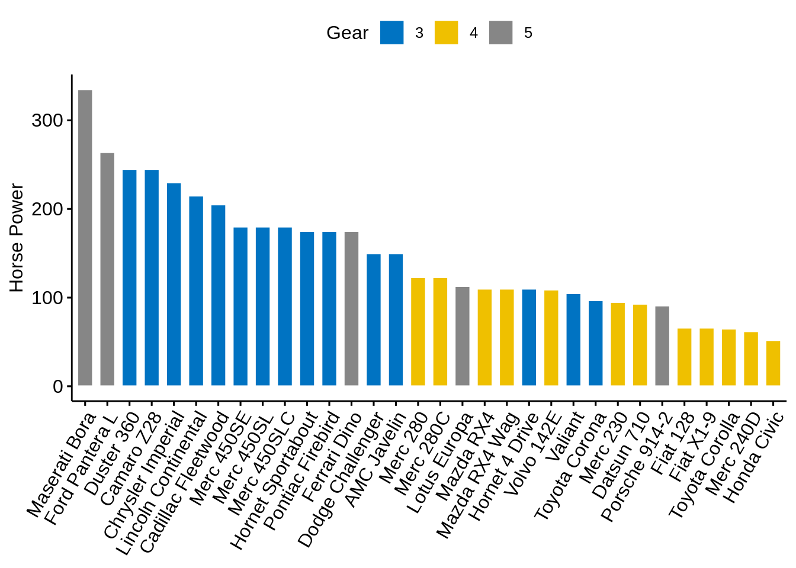

Now we sort bars inside each group. 


```r
ggbarplot(cars, x = "name", y = "hp",
          fill = "gear",               
          color = "white",  
          palette = "jco",
          sort.val = "asc",  
          sort.by.groups = TRUE,
          x.text.angle = 60,
          ylab = "Horsepower",
          xlab = FALSE,
          legend.title="Gear"
          )
```

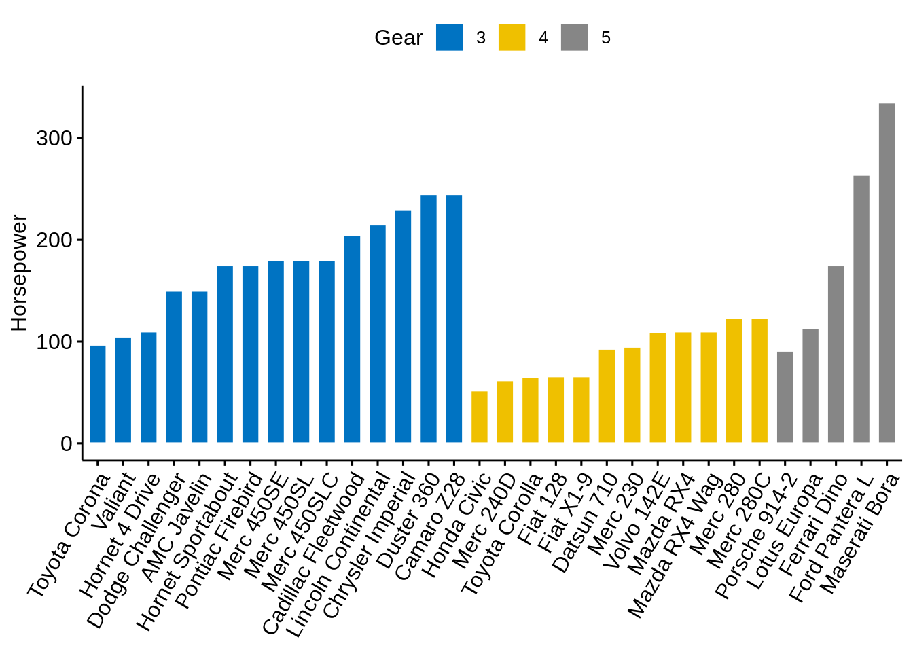

We can standarize the hp and compare each model with the mean.


```r
cars$hp_z <- (cars$hp-mean(cars$hp))/sd(cars$hp)
cars$hp_grp <- factor(ifelse(cars$hp_z<0, "low","high"), levels=c("low", "high"))
head(cars[,c("name", "wt", "hp", "hp_grp", "gear")])
```

```
##                                name    wt  hp hp_grp gear
## Mazda RX4                 Mazda RX4 2.620 110    low    4
## Mazda RX4 Wag         Mazda RX4 Wag 2.875 110    low    4
## Datsun 710               Datsun 710 2.320  93    low    4
## Hornet 4 Drive       Hornet 4 Drive 3.215 110    low    3
## Hornet Sportabout Hornet Sportabout 3.440 175   high    3
## Valiant                     Valiant 3.460 105    low    3
```

```r
ggbarplot(cars, x="name", y="hp_z",
          fill = "hp_grp",
          color = "white",
          palette = "jco",
          sort.val = "asc",
          sort.by.groups = FALSE,
          x.text.angle=60,
          ylab = "Horsepower z-scores",
          xlab = FALSE, 
          legend.title="Horsepower Group")
```

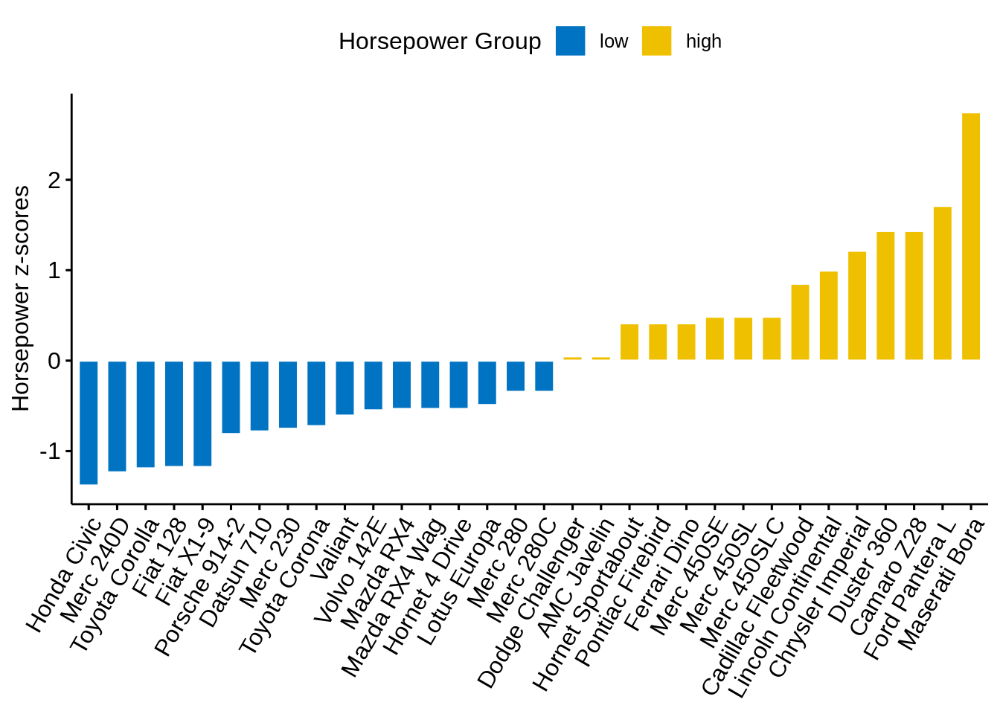

We can rotate it with adding just one line of code:

```r
rotate=TRUE
```


```r
ggbarplot(cars, x="name", y="hp_z",
          fill = "hp_grp",
          color = "white",
          palette = "jco",
          sort.val = "asc",
          sort.by.groups = FALSE,
          x.text.angle=90,
          ylab = "Horsepower z-scores",
          xlab = FALSE, 
          legend.title="Horsepower Group",
          rotate=TRUE,
          ggtheme = theme_minimal())
```

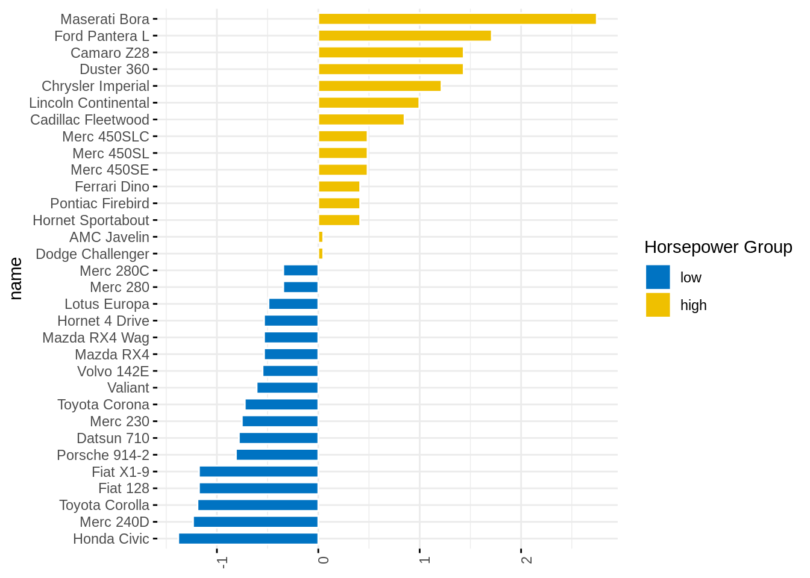

## Lollipop Chart

Lollipop chart is an alternative to bar plots, when you have a large set of values to visualize.


```r
ggdotchart(cars, x="name", y="hp",
           color="gear",
           palette = "jco",
           sorting = "ascending",
           add = "segments",
           ggtheme = theme_pubr(),
           legend.title = "Gear",
           ylab="Horsepower",
           xlab=FALSE)
```

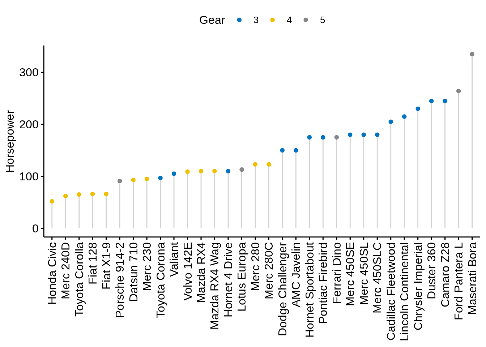

We can custom dots with labels:

```r
ggdotchart(cars, x="name", y="hp",
           color="gear",
           palette = "jco",
           sorting = "descending",
           add = "segments",
           rotate=TRUE,
           group="gear",
           dot.size=6,
           label=round(cars$mpg),
           font.label = list(color="white", size=9, vjust=0.5),
           ggtheme = theme_pubr(),
           legend.title = "Gear",
           ylab=FALSE,
           xlab = "Horsepower")
```

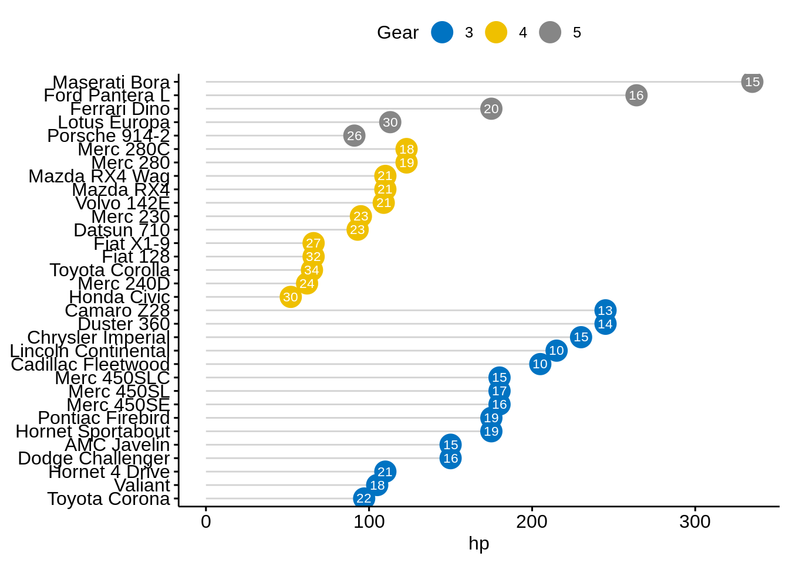


## Cleveland dot plot

We still use mtcars dataset to draw a Cleveland dot plot. 


```r
ggdotchart(cars, x = "name", y = "hp",
           color = "gear", 
           palette = "jco",
           sorting = "descending",                 
           rotate = TRUE,                          
           dot.size = 2,
           ggtheme = theme_pubr(),
           legend.title = "Gear")+
  theme_cleveland()                                
```


It is more interesting to color y text by groups. All we need to add is: 

```r
y.text.col=TRUE
```


```r
ggdotchart(cars, x = "name", y = "hp",
           color = "gear", 
           palette = "jco",
           sorting = "descending",                 
           rotate = TRUE,                          
           dot.size = 2,                           
           ggtheme = theme_pubr(),
           y.text.col=TRUE,
           legend.title = "Gear")+
  theme_cleveland()      
```

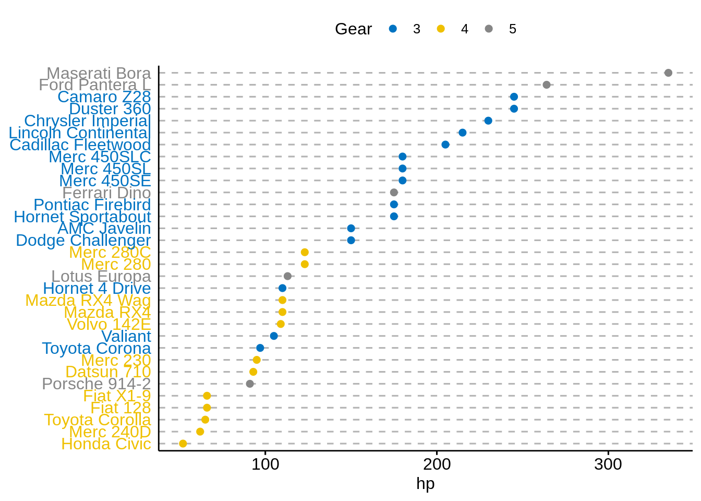
 
As we can see, it's a lot easier to plot required graphs using ggpubr without learning much about layers of ggplot2, which makes graphing less difficult for people who are not familiar with R programming. However, for people who want to customize more with their plots, ggplot2 is still a better option. 

**Sources:** 

<https://cran.r-project.org/web/packages/ggpubr/index.html>

<https://github.com/kassambara/ggpubr>
