# How to plot grouped data for multivariate (in Chinese)

Yihui Hu and Liuxin Chen

原始网页 Original website：http://www.sthda.com/english/articles/32-r-graphics-essentials/132-plot-grouped-data-box-plot-bar-plot-and-more/#grouped-continuous-variables


## 数据准备

加载所需的软件包并将主题函数theme_pubclean()设置为默认主题：


```r
library(dplyr) 
library(ggplot2)
library(ggpubr)
theme_set(theme_pubclean())
```

  
  

## 分类变量分组制图

绘图类型：分类变量频率的分组条形图。

关键函数：geom_bar()。

演示数据集：dimonds[ggplot2]。 

演示示例中使用的类别变量为：

- cut：切工的钻石质量（一般，良好，非常好，优质，理想）。

- color：钻石色，从J（最差）到D（最佳）。

在演示示例中，我们将仅绘制数据的子集（颜色J和D）。 

步骤如下：

a.过滤数据以仅保留颜色在其中的菱形（“ J”，“ D”）

b.按切割质量和钻石颜色对数据进行分组

c.按组计算频率

d.创建条形图

### 筛选特定分组数据及计算频率


```r
df <- diamonds %>%
  filter(color %in% c("J", "D")) %>%
  group_by(cut, color) %>%
  summarise(counts = n()) 
head(df, 4)
```

```
## # A tibble: 4 x 3
## # Groups:   cut [2]
##   cut   color counts
##   <ord> <ord>  <int>
## 1 Fair  D        163
## 2 Fair  J        119
## 3 Good  D        662
## 4 Good  J        307
```

### 分组频率柱状图

关键函数：geom_bar()。

主要参数：stat ="identity"。

使用scale_color_manual()和scale_fill_manual()函数手动设置条形边框的线条颜色和区域填充颜色。


```r
# 堆积条形图  y = counts，x = cut，同时柱颜色由变量“color”决定
# position = position_stack() 
ggplot(df, aes(x = cut, y = counts)) +
  geom_bar(
    aes(color = color, fill = color),
    stat = "identity", position = position_stack()
    ) +
  scale_color_manual(values = c("#0073C2FF", "#EFC000FF"))+
  scale_fill_manual(values = c("#0073C2FF", "#EFC000FF"))
```

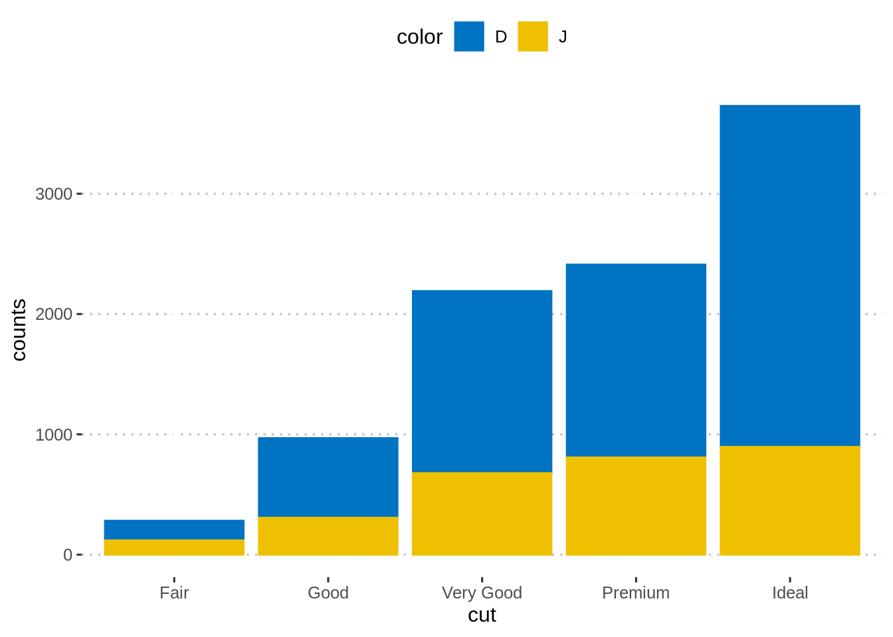

```r
# position = position_dodge() 
p <- ggplot(df, aes(x = cut, y = counts)) +
  geom_bar(
    aes(color = color, fill = color),
    stat = "identity", position = position_dodge(0.8),
    width = 0.7
    ) +
  scale_color_manual(values = c("#0073C2FF", "#EFC000FF"))+
  scale_fill_manual(values = c("#0073C2FF", "#EFC000FF"))
p
```

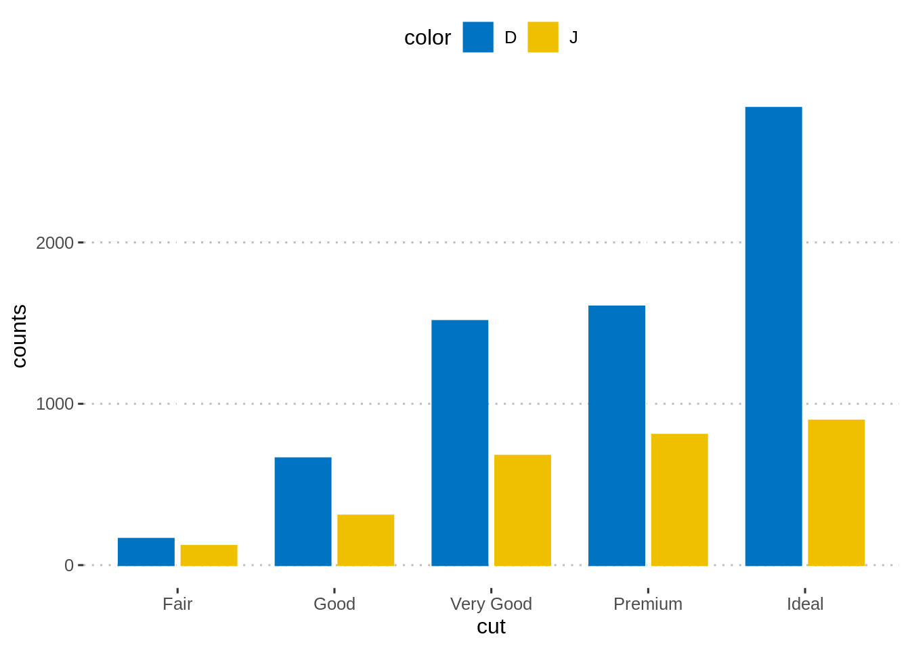

另外，可以使用ggpubr软件包轻松创建点图。


```r
ggdotchart(df, x = "cut", y ="counts",
           color = "color", palette = "jco", size = 3, 
           add = "segment", 
           add.params = list(color = "lightgray", size = 1.5),
           position = position_dodge(0.3),
           ggtheme = theme_pubclean()
           )
```


### 加入数据标签（并列柱状图）


```r
p + geom_text(
  aes(label = counts, group = color), 
  position = position_dodge(0.8),
  vjust = -0.3, size = 3.5
)
```

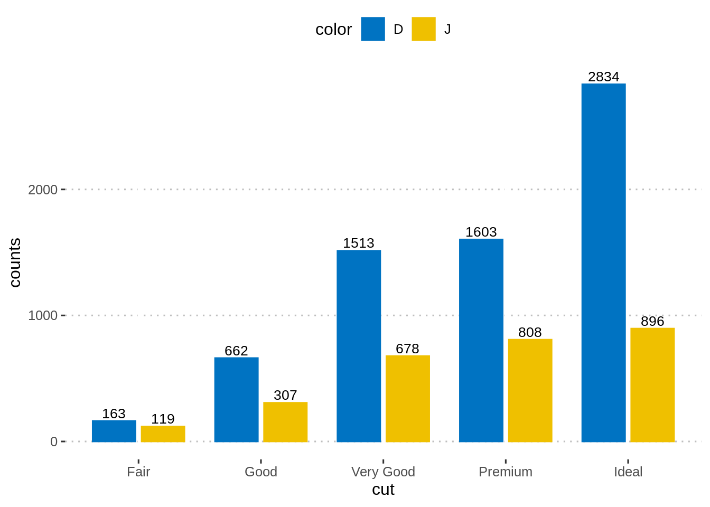

### 加入数据标签（堆积柱状图）

- 按cut和color列对数据进行排序。当position_stack()反转组顺序时，颜色列应按降序排序。

- 计算每个切割类别的累计计数总和。用作标签的y坐标。要将标签放在条形图的中间，我们将使用cumsum（counts）-0.5 *计数。

- 创建条形图并添加标签。


```r
df <- df %>%
  arrange(cut, desc(color)) %>%
  mutate(lab_ypos = cumsum(counts) - 0.5 * counts) 
head(df, 4)
```

```
## # A tibble: 4 x 4
## # Groups:   cut [2]
##   cut   color counts lab_ypos
##   <ord> <ord>  <int>    <dbl>
## 1 Fair  J        119     59.5
## 2 Fair  D        163    200. 
## 3 Good  J        307    154. 
## 4 Good  D        662    638
```

```r
ggplot(df, aes(x = cut, y = counts)) +
  geom_bar(aes(color = color, fill = color), stat = "identity") +
  geom_text(
    aes(y = lab_ypos, label = counts, group = color),
    color = "white"
  ) + 
  scale_color_manual(values = c("#0073C2FF", "#EFC000FF"))+
  scale_fill_manual(values = c("#0073C2FF", "#EFC000FF")) 
```

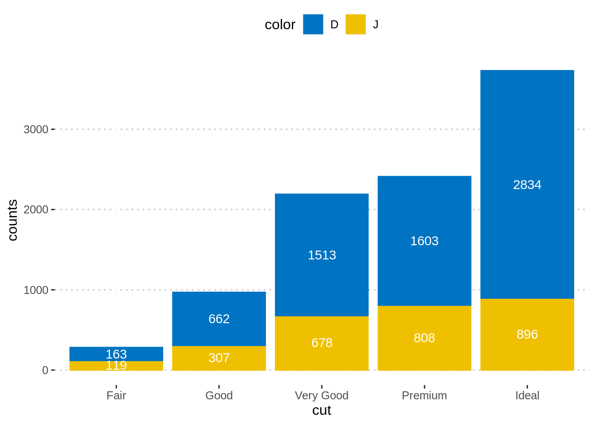

### 其他类型柱状图

可以绘制具有离散x轴和离散y轴的两个离散变量，而不是创建计数的条形图。

每个单独的点均按组显示。对于给定的组，点数与该组中的记录数相对应。

关键函数：geom_jitter()。

主要参数：alpha, color, fill, shape，size。


```r
diamonds.frac <- dplyr::sample_frac(diamonds, 1/5)
ggplot(diamonds.frac, aes(cut, color)) +
  geom_jitter(aes(color = cut), size = 0.3)+
  ggpubr::color_palette("jco")+
  ggpubr::theme_pubclean()
```

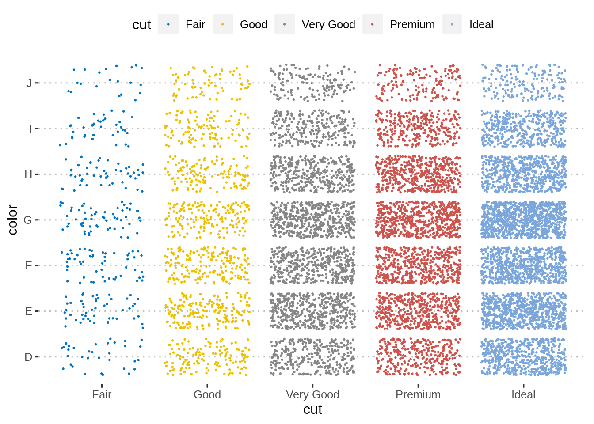

   
    
    
## 连续变量分组制图

在本节中，我们将展示如何使用箱形图、小提琴图、带状图和替代方法绘制成有组别的连续变量。 

我们还将介绍如何自动添加比较组的p值。  

在本节中，我们将theme_bw()设置为默认的ggplot主题：


```r
theme_set(
  theme_bw()
)
```

### 数据格式

演示数据集：ToothGrowth  

连续变量：len (即牙齿长度), 作为y轴变量。  

分组变量：dose (维生素C的剂量水平：每天0.5、1、2毫克)，作为x轴变量。  

首先，将变量dose从数字转换为离散因子变量：  
 

```r
data("ToothGrowth")
ToothGrowth$dose <- as.factor(ToothGrowth$dose)
head(ToothGrowth)
```

```
##    len supp dose
## 1  4.2   VC  0.5
## 2 11.5   VC  0.5
## 3  7.3   VC  0.5
## 4  5.8   VC  0.5
## 5  6.4   VC  0.5
## 6 10.0   VC  0.5
```

### 箱型图

关键功能：geom_boxplot()      

关键参数：

- width：箱形图的宽度。    

- notch：逻辑参数。如果为TRUE，则创建一个缺口箱图。凹口在中位数附近显示置信区间，该置信区间通常基于中位数+/- 1.58*IQR/sqrt(n)。槽口用于组与组之间的比较；如果两个盒子的凹口不重叠，则证明中位数不同。  

- color, size, linetype：边框线的颜色，大小和线型。    

- fill：箱形图区域填充颜色。     

- outlier.colour, outlier.shape, outlier.size：异常值点的颜色，形状和大小。   

#### 创建基本箱形图   
   
(1) 标准箱形图和缺口箱形图


```r
# Default plot
e <- ggplot(ToothGrowth, aes(x = dose, y = len))
e + geom_boxplot()
```

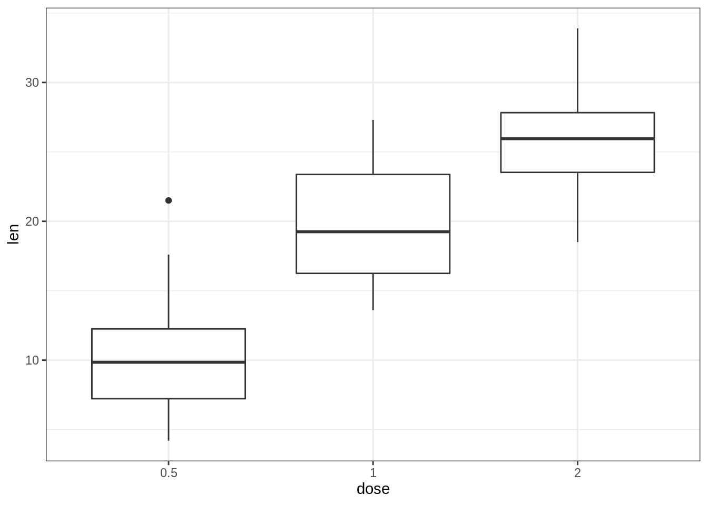

```r
# Notched box plot with mean points
e + geom_boxplot(notch = TRUE, fill = "lightgray")+
  stat_summary(fun.y = mean, geom = "point",
               shape = 18, size = 2.5, color = "#FC4E07")
```


   
(2) 按组更改箱形图颜色


```r
# Color by group (dose)
e + geom_boxplot(aes(color = dose))+
  scale_color_manual(values = c("#00AFBB", "#E7B800", "#FC4E07"))
```

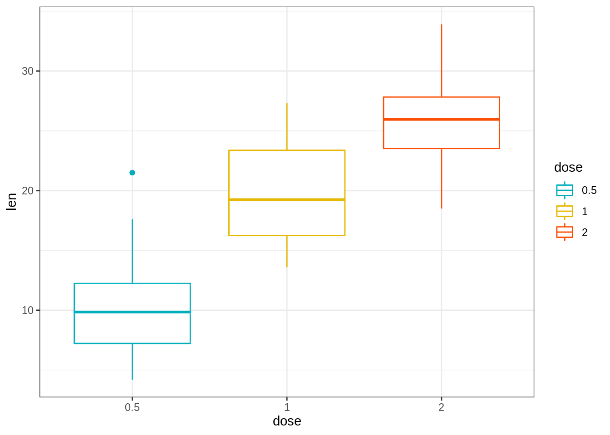

```r
# Change fill color by group (dose)
e + geom_boxplot(aes(fill = dose)) +
  scale_fill_manual(values = c("#00AFBB", "#E7B800", "#FC4E07"))
```

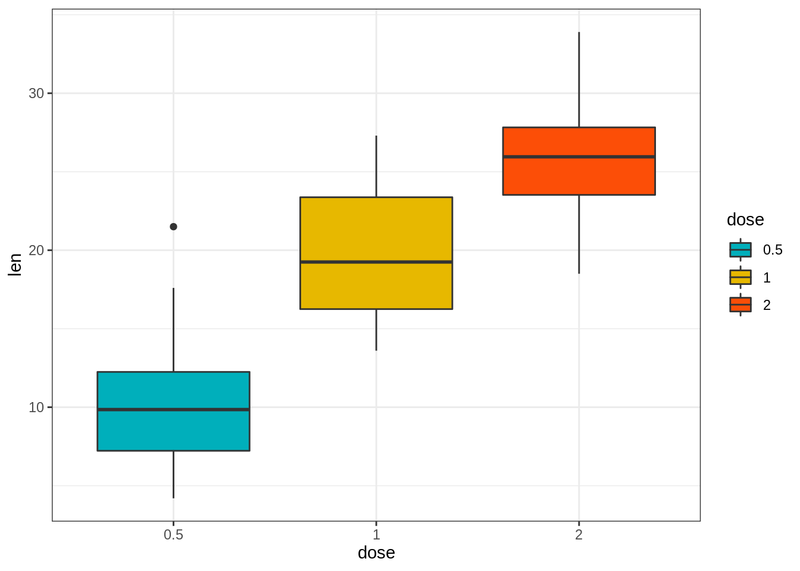

请注意，可以将scale_x_discrete()函数用于：  

- 选择要显示的项目：例如c("0.5","2")，

- 更改项目的顺序：例如从c("0.5","1","2")更改为c("2","0.5","1")  

例如，键入：


```r
# Choose which items to display: group "0.5" and "2"
e + geom_boxplot() + 
  scale_x_discrete(limits=c("0.5", "2"))
```

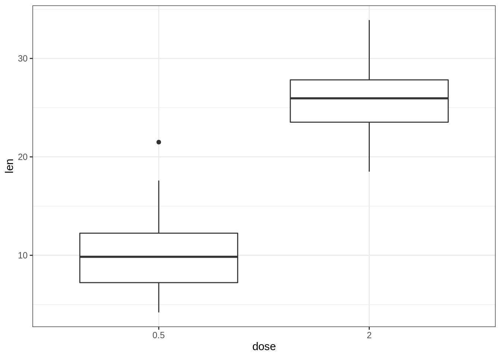

```r
# Change the default order of items
e + geom_boxplot() +
  scale_x_discrete(limits=c("2", "0.5", "1"))
```

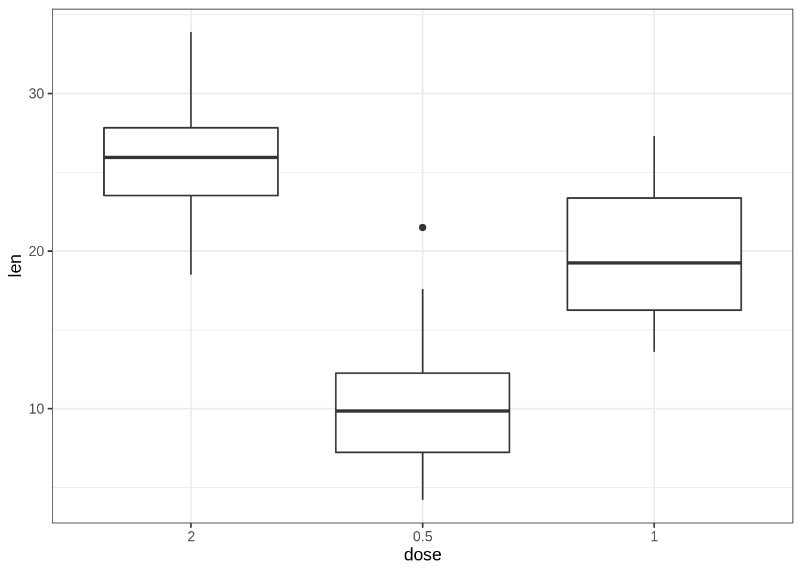

#### 创建具有多个组的箱形图

使用两个不同的分组变量：dose作为x轴变量，supp作为填充颜色（图例变量）。 

使用函数position_dodge()可以调整分组箱形图之间的间隔。


```r
e2 <- e + geom_boxplot(
  aes(fill = supp),
  position = position_dodge(0.9) 
  ) +
  scale_fill_manual(values = c("#999999", "#E69F00"))
e2
```

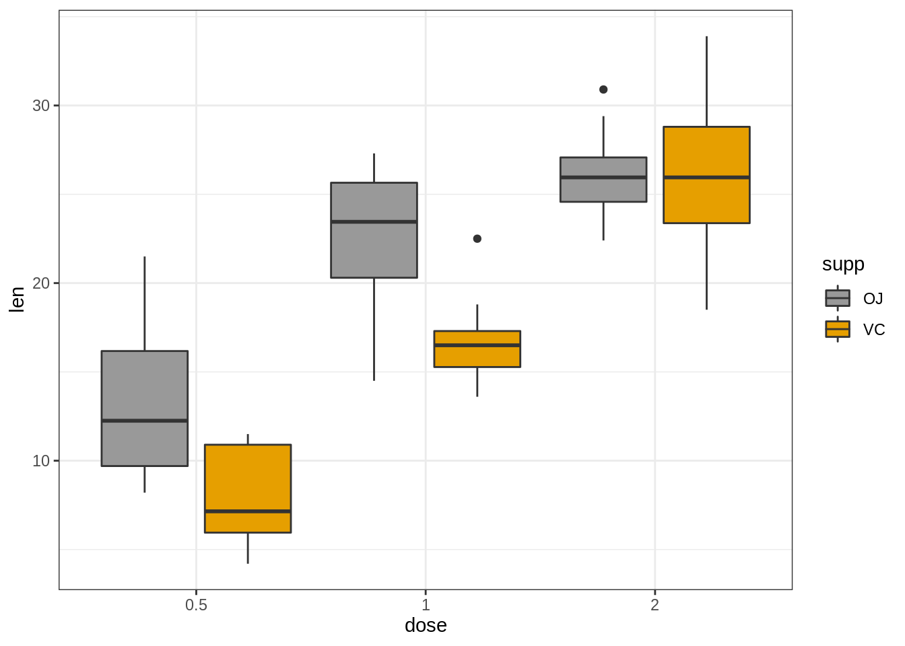

使用函数facet_wrap()可将图分成多个面板：


```r
e2 + facet_wrap(~supp)
```

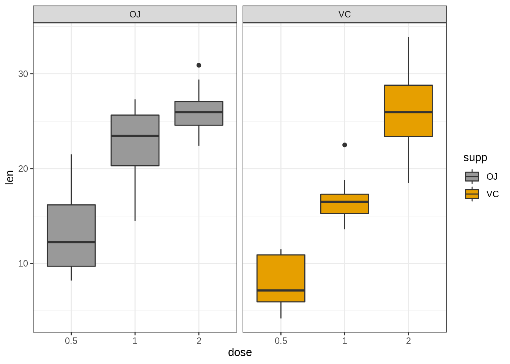

### 小提琴图

小提琴图类似于箱形图，不同之处在于它们还显示了不同值的数据的核概率密度。

通常，小提琴图将包括数据中位数的标记和指示四分位数范围的框，如在标准框图中一样。       

关键函数：

(1) geom_violin()：创建小提琴图。主要参数：

- color, size, linetype：边框线的颜色，大小和线型。 

- fill：区域填充颜色。

- trim：逻辑变量。如果为TRUE(默认)，则将小提琴的尾部修整到数据范围。如果为FALSE，则不修剪尾部数据。

(2) stat_summary()：在小提琴图上添加摘要统计信息（平均值，中位数等）。

#### 使用摘要统计信息创建基本的小提琴图


```r
# Add mean points +/- SD
# Use geom = "pointrange" or geom = "crossbar"
e + geom_violin(trim = FALSE) + 
  stat_summary(
    fun.data = "mean_sdl",  fun.args = list(mult = 1), 
    geom = "pointrange", color = "black"
    )
```

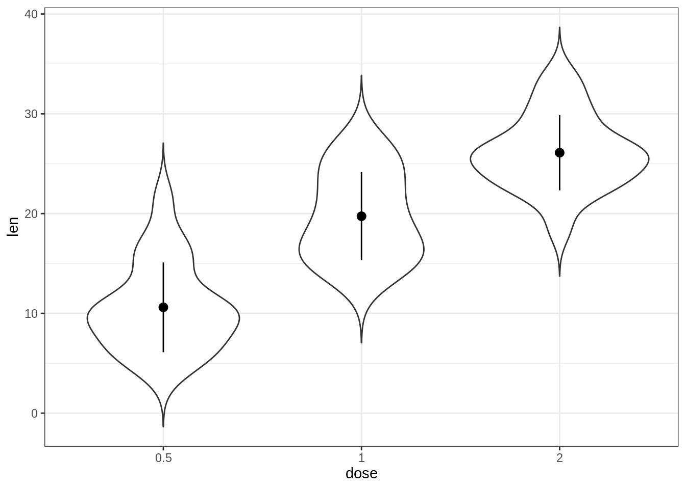

```r
# Combine with box plot to add median and quartiles
# Change color by groups
e + geom_violin(aes(fill = dose), trim = FALSE) + 
  geom_boxplot(width = 0.2)+
  scale_fill_manual(values = c("#00AFBB", "#E7B800", "#FC4E07"))+
  theme(legend.position = "none")
```

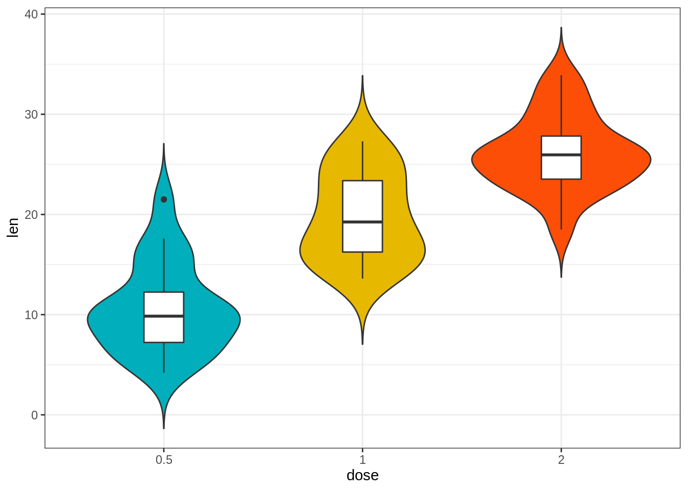

#### 创建具有多个组的小提琴图


```r
e + geom_violin(
  aes(color = supp), trim = FALSE,
  position = position_dodge(0.9) 
  ) +
  geom_boxplot(
    aes(color = supp), width = 0.15,
    position = position_dodge(0.9)
    ) +
  scale_color_manual(values = c("#00AFBB", "#E7B800"))
```

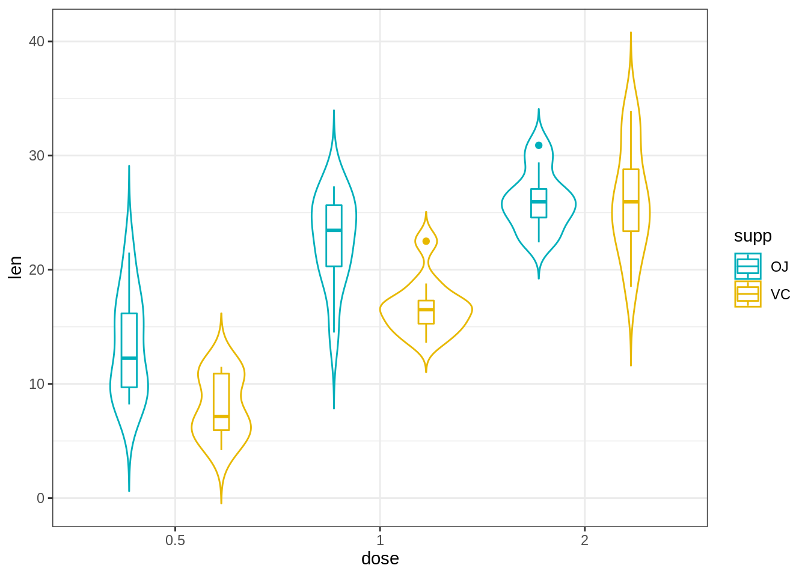


### 点图

关键函数：

geom_dotplot()：创建堆叠的点，每个点代表一个观测值。主要参数：

- stackdir：点堆叠的方向。 “上”（默认），“下”，“中心”，“整个中心”（居中，但点对齐）。

- stackratio：堆叠点的距离。默认值为1，其中点与点之间仅接触。对于较小的重叠点，请使用较小的值。

- olor, fill：点边界颜色和区域填充。

- dotsize：相对于binwidth的点的直径，默认为1。

对于小提琴图，通常将摘要统计信息添加到点图。

#### 创建基本点图


```r
# Violin plots with mean points +/- SD
e + geom_dotplot(
  binaxis = "y", stackdir = "center",
  fill = "lightgray"
  ) + 
  stat_summary(
    fun.data = "mean_sdl", fun.args = list(mult=1), 
    geom = "pointrange", color = "red"
    )
```

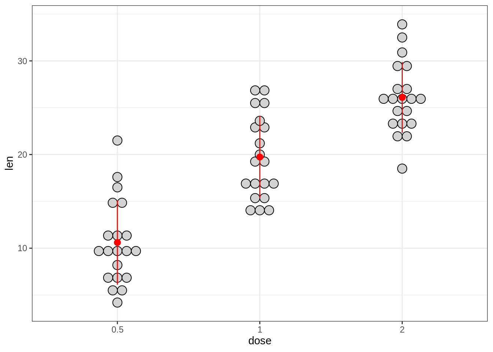

```r
# Combine with box plots
e + geom_boxplot(width = 0.5) + 
  geom_dotplot(
    binaxis = "y", stackdir = "center",
    fill = "white"
    ) 
```

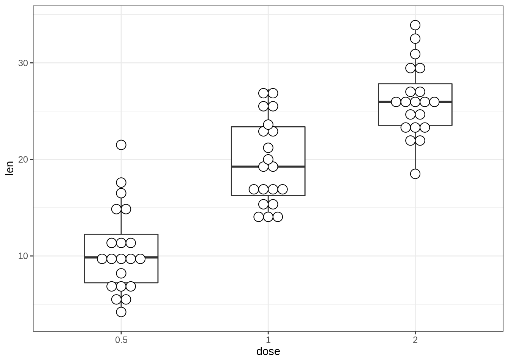

```r
# Dot plot + violin plot + stat summary
e + geom_violin(trim = FALSE) +
  geom_dotplot(
    binaxis='y', stackdir='center',
    color = "black", fill = "#999999"
    ) +
  stat_summary(
    fun.data="mean_sdl",  fun.args = list(mult=1), 
    geom = "pointrange", color = "#FC4E07", size = 0.4
    )
```

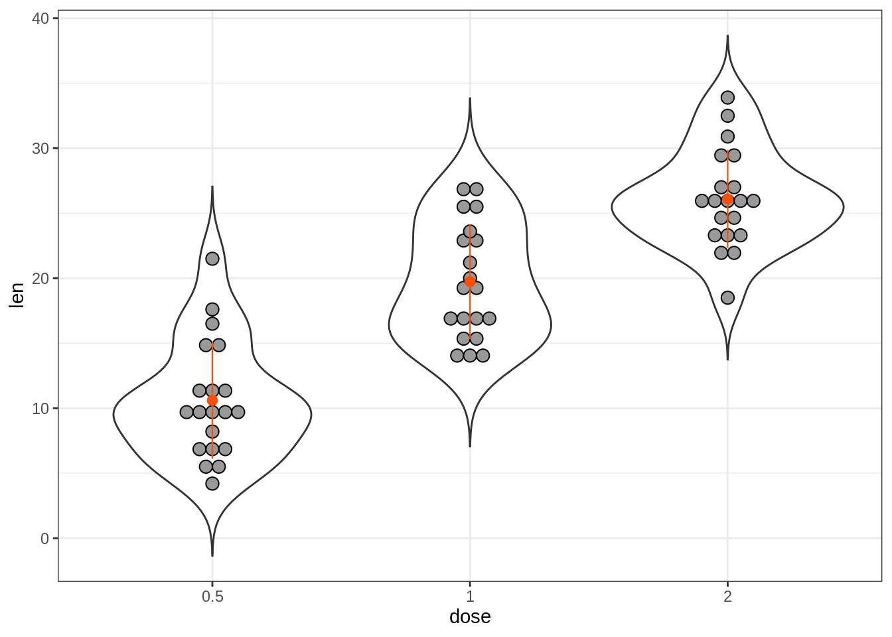


#### 创建具有多个组的点图


```r
# Color dots by groups
e + geom_boxplot(width = 0.5, size = 0.4) +
  geom_dotplot(
    aes(fill = supp), trim = FALSE,
    binaxis='y', stackdir='center'
  )+
  scale_fill_manual(values = c("#00AFBB", "#E7B800"))
```

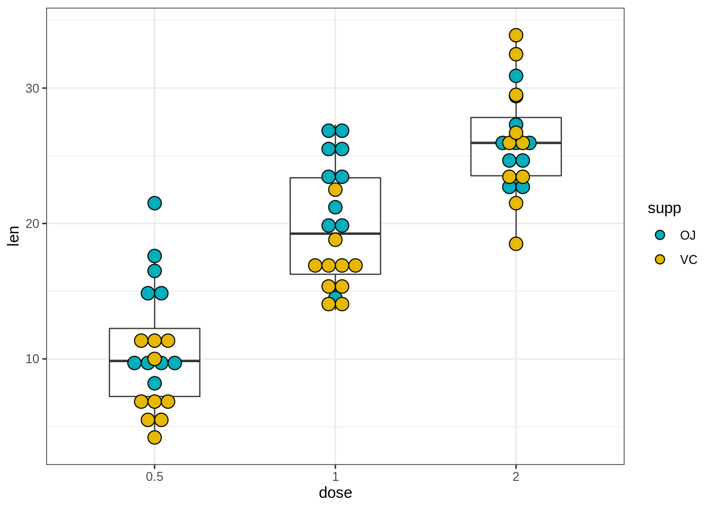

```r
# Change the position : interval between dot plot of the same group
e + geom_boxplot(
  aes(color = supp), width = 0.5, size = 0.4,
  position = position_dodge(0.8)
  ) +
  geom_dotplot(
    aes(fill = supp, color = supp), trim = FALSE,
    binaxis='y', stackdir='center', dotsize = 0.8,
    position = position_dodge(0.8)
  )+
  scale_fill_manual(values = c("#00AFBB", "#E7B800"))+
  scale_color_manual(values = c("#00AFBB", "#E7B800"))
```

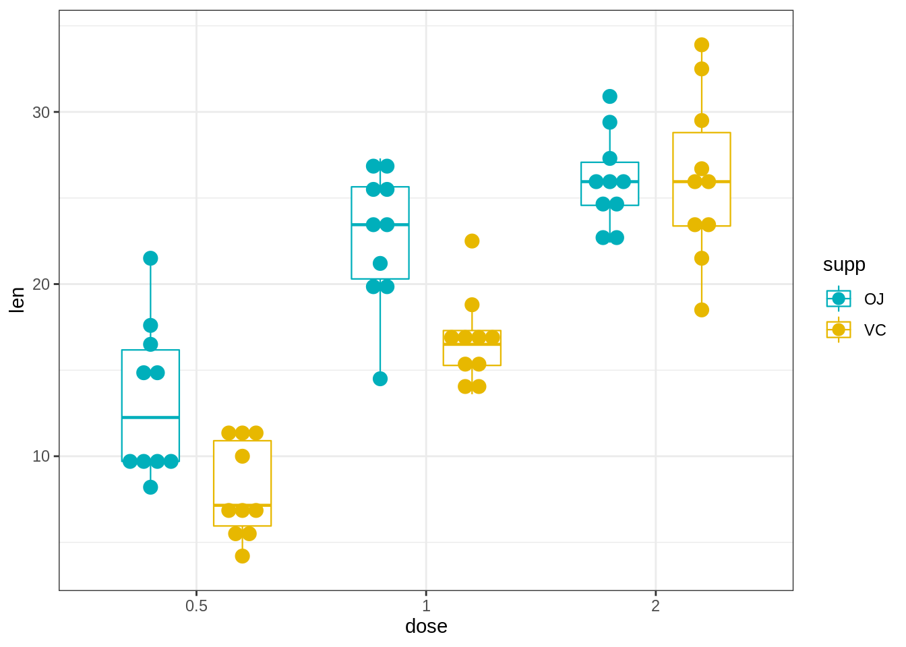


### 带状图

带状图也称为一维散点图。当样本量较小时，与箱形图相比，带状图更合适。

关键函数：

geom_jitter()。关键参数：

color, fill, size, shape：更改点的颜色，填充，大小和形状

#### 创建一个基本的带状图

- 按组更改点的形状和颜色

- 调整抖动程度：position_jitter(0.2)

- 添加摘要统计信息


```r
e + geom_jitter(
  aes(shape = dose, color = dose), 
  position = position_jitter(0.2),
  size = 1.2
  ) +
  stat_summary(
    aes(color = dose),
    fun.data="mean_sdl",  fun.args = list(mult=1), 
    geom = "pointrange",  size = 0.4
    )+
  scale_color_manual(values =  c("#00AFBB", "#E7B800", "#FC4E07"))
```

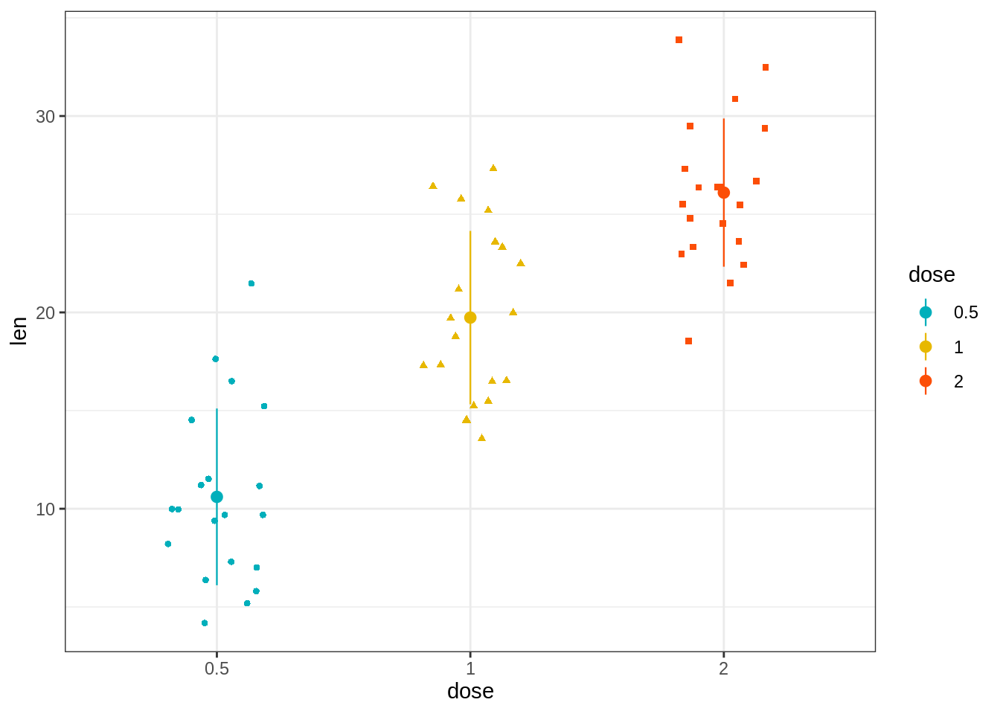

#### 创建具有多个组的带状图。

R代码类似于在点图部分中看到的代码。

但是，要创建躲避的抖动点，应使用position_jitterdodge()函数而不是position_dodge()。


```r
e + geom_jitter(
  aes(shape = supp, color = supp), 
  position = position_jitterdodge(jitter.width = 0.2, dodge.width = 0.8),
  size = 1.2
  ) +
  stat_summary(
    aes(color = supp),
    fun.data="mean_sdl",  fun.args = list(mult=1), 
    geom = "pointrange",  size = 0.4,
    position = position_dodge(0.8)
    )+
  scale_color_manual(values =  c("#00AFBB", "#E7B800"))
```

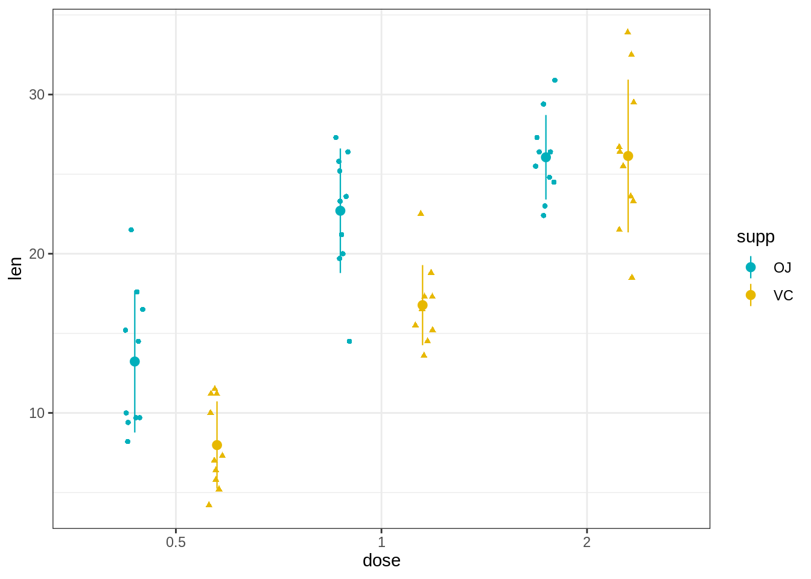


### Sina图

Sina图的灵感来自于带状图和小提琴图。

通过让标准化的点密度限制沿x轴的抖动，该图显示的轮廓与小提琴图相同，但类似于少量数据点的简单带状图。

这样，该图以非常简单，可理解和精简的格式传达数据点数量，密度分布，离群值和散布信息。

关键函数：

geom_sina（）[ggforce]


```r
library(ggforce)
# Create some data
d1 <- data.frame(
  y = c(rnorm(200, 4, 1), rnorm(200, 5, 2), rnorm(400, 6, 1.5)),
  group = rep(c("Grp1", "Grp2", "Grp3"), c(200, 200, 400))
  )
# Sinaplot
ggplot(d1, aes(group, y)) +
  geom_sina(aes(color = group), size = 0.7)+
  scale_color_manual(values =  c("#00AFBB", "#E7B800", "#FC4E07"))
```

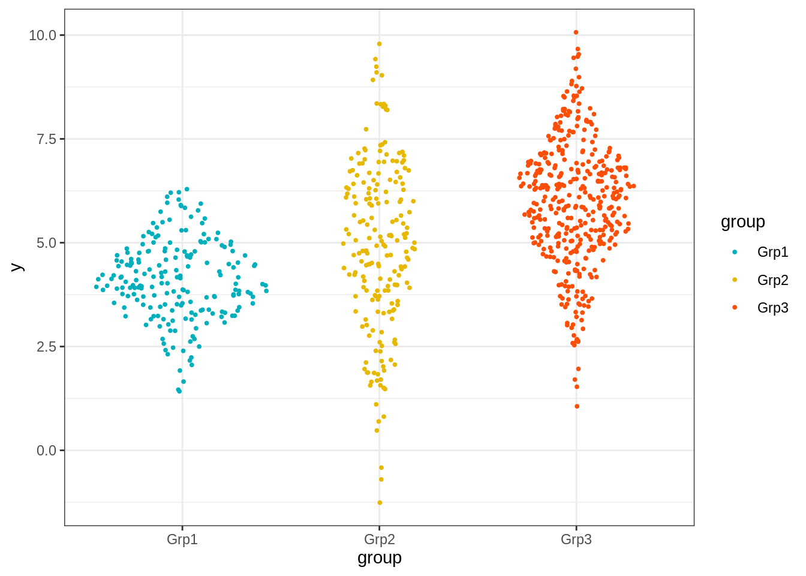


### 带有误差线的均值和中位数图

在本节中，我们将展示如何绘制由一个或多个分组变量组成的连续变量的摘要统计信息。

请注意，ggpubr软件包提供了一种简单的方法，只需较少的输入即可创建均值/中位数图。 

将默认主题设置为theme_pubr()[在ggpubr中]：

```r
theme_set(ggpubr::theme_pubr())
```

#### 基本均值/中位数图

一个连续变量和一个分组变量的情况。

(1) 准备数据：ToothGrowth数据集。


```r
df <- ToothGrowth
df$dose <- as.factor(df$dose)
head(df, 3)
```

```
##    len supp dose
## 1  4.2   VC  0.5
## 2 11.5   VC  0.5
## 3  7.3   VC  0.5
```

(2) 计算按变量dose分组的变量len的摘要统计量。


```r
library(dplyr)
df.summary <- df %>%
  group_by(dose) %>%
  summarise(
    sd = sd(len, na.rm = TRUE),
    len = mean(len)
  )
df.summary
```

```
## # A tibble: 3 x 3
##   dose     sd   len
##   <fct> <dbl> <dbl>
## 1 0.5    4.50  10.6
## 2 1      4.42  19.7
## 3 2      3.77  26.1
```

(3) 使用摘要统计数据创建误差图。 

主要函数：

- geom_crossbar(): 用于空心柱，中间用水平线表示

- geom_errorbar(): 用于误差柱

- geom_errorbarh(): 用于水平误差线

- geom_linerange(): 用于绘制由垂直线表示的间隔

- geom_pointrange(): 用于创建由垂直线表示的间隔，中间有一个点。

首先使用摘要统计数据初始化ggplot：

- 通常指定x和y-指定ymin = len-sd和ymax = len + sd以添加上下误差线。
- 如果只想添加较高的误差线，而不是较低的误差线，则使用ymin = len（而不是len-sd）和ymax = len + sd。


```r
# Initialize ggplot with data
f <- ggplot(
  df.summary, 
  aes(x = dose, y = len, ymin = len-sd, ymax = len+sd)
  )
```

(4) 创建简单的误差图


```r
# Vertical line with point in the middle
f + geom_pointrange()
```

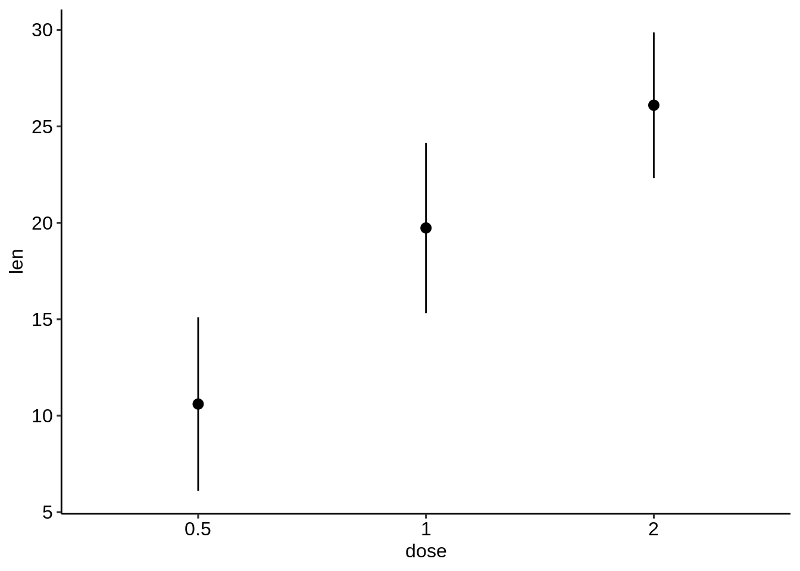

```r
# Standard error bars
f + geom_errorbar(width = 0.2) +
  geom_point(size = 1.5)
```

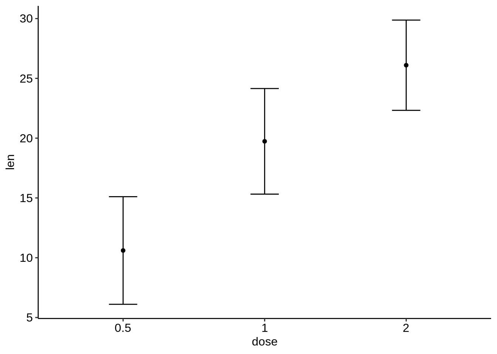

(5) 创建水平误差图。 将dose放在y轴上，len放在x轴上。指定xmin和xmax。


```r
# Horizontal error bars with mean points
# Change the color by groups
ggplot(
  df.summary, 
  aes(x = len, y = dose, xmin = len-sd, xmax = len+sd)
  ) +
  geom_point(aes(color = dose)) +
  geom_errorbarh(aes(color = dose), height=.2)+
  theme_light()
```

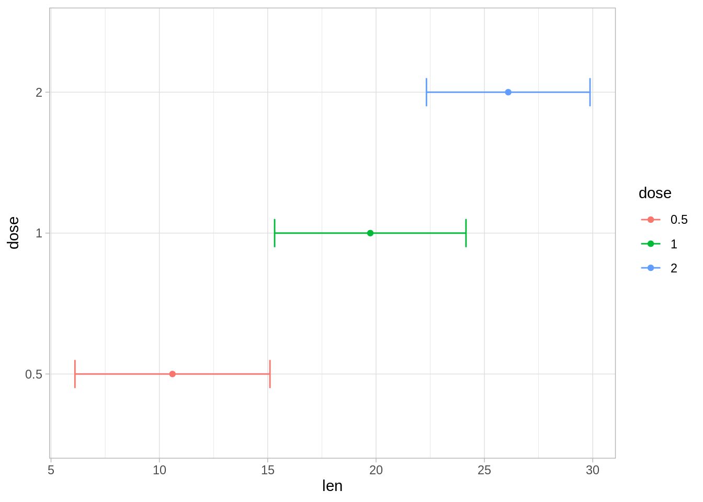

(6) 添加抖动点（代表单个点），点图和小提琴图。

为此，应使用原始数据（df）初始化ggplot并在误差绘图功能（此处为geom_pointrange()）中指定df.summary数据。


```r
# Combine with jitter points
ggplot(df, aes(dose, len)) +
  geom_jitter(
    position = position_jitter(0.2), color = "darkgray"
    ) + 
  geom_pointrange(
    aes(ymin = len-sd, ymax = len+sd),
    data = df.summary
    )
```

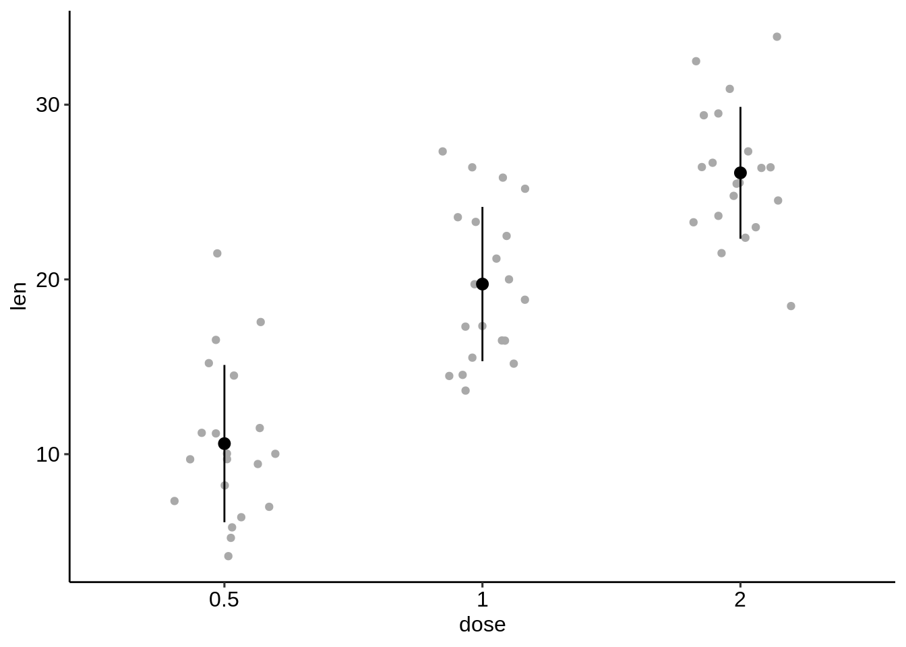

```r
# Combine with violin plots
ggplot(df, aes(dose, len)) +
  geom_violin(color = "darkgray", trim = FALSE) + 
  geom_pointrange(
    aes(ymin = len-sd, ymax = len+sd),
    data = df.summary
    )
```

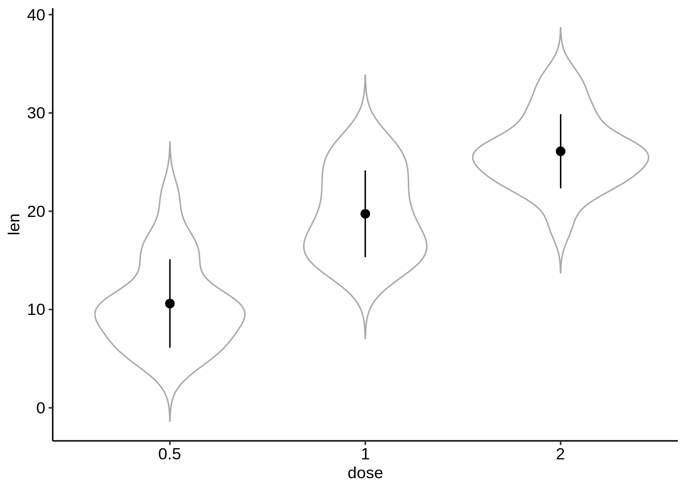

(7) 创建平均+/-误差的基本条形图/线图。 

我们只需要df.summary数据。

为线图添加上下误差线：ymin = len-sd和ymax = len + sd。

为条形图仅添加较高的误差线：ymin = len（而不是len-sd）和ymax = len + sd。


```r
# (1) Line plot
ggplot(df.summary, aes(dose, len)) +
  geom_line(aes(group = 1)) +
  geom_errorbar( aes(ymin = len-sd, ymax = len+sd),width = 0.2) +
  geom_point(size = 2)
```

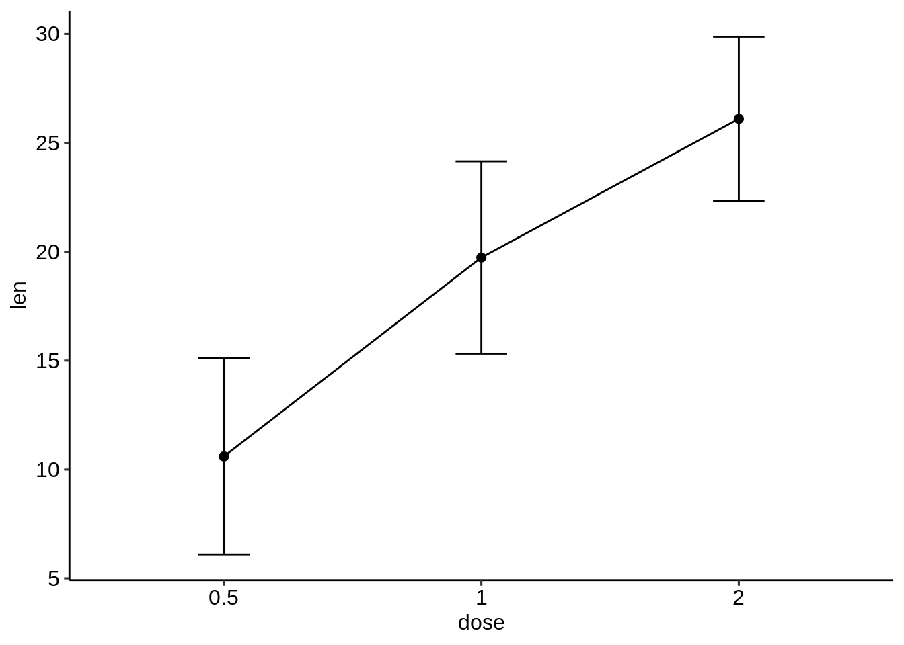

```r
# (2) Bar plot
ggplot(df.summary, aes(dose, len)) +
  geom_bar(stat = "identity", fill = "lightgray", 
           color = "black") +
  geom_errorbar(aes(ymin = len, ymax = len+sd), width = 0.2) 
```

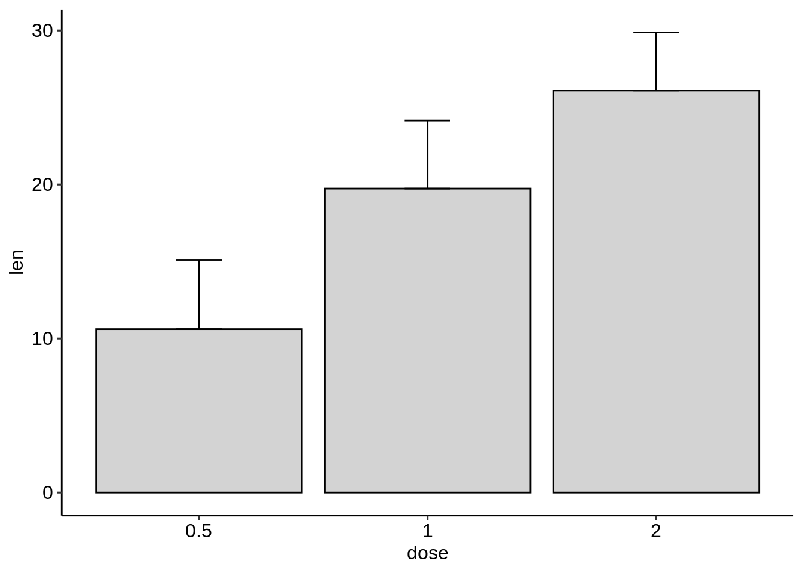

对于线图，我们也可以将x轴视为数字：


```r
df.sum2 <- df.summary
df.sum2$dose <- as.numeric(df.sum2$dose)
ggplot(df.sum2, aes(dose, len)) +
  geom_line() +
  geom_errorbar( aes(ymin = len-sd, ymax = len+sd),width = 0.2) +
  geom_point(size = 2)
```

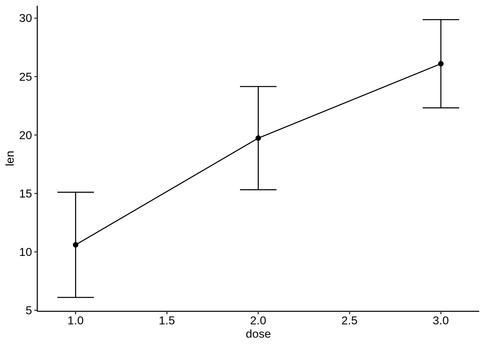

(8) 条形图和折线图+抖动点。 

我们需要用于抖动点的原始df数据和其他geom层的df.summary数据。

对于线图：首先，添加抖动点，然后在抖动点顶部添加线条+误差线+均值点。

对于条形图：首先，添加条形图，然后在条形图的顶部添加抖动点+误差线。


```r
# (1) Create a line plot of means + 
# individual jitter points + error bars 
ggplot(df, aes(dose, len)) +
  geom_jitter( position = position_jitter(0.2),
               color = "darkgray") + 
  geom_line(aes(group = 1), data = df.summary) +
  geom_errorbar(
    aes(ymin = len-sd, ymax = len+sd),
    data = df.summary, width = 0.2) +
  geom_point(data = df.summary, size = 2)
```

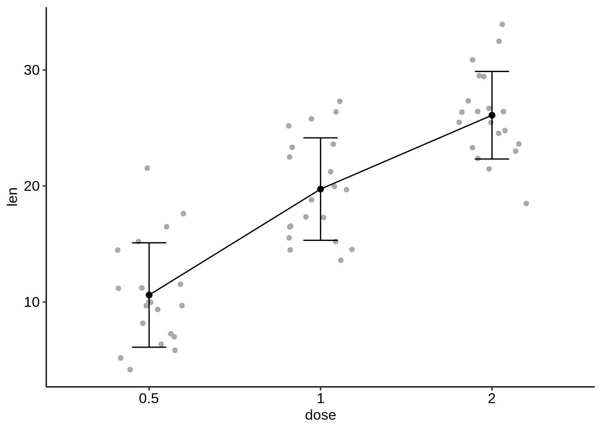

```r
# (2) Bar plots of means + individual jitter points + errors
ggplot(df, aes(dose, len)) +
  geom_bar(stat = "identity", data = df.summary,
           fill = NA, color = "black") +
  geom_jitter( position = position_jitter(0.2),
               color = "black") + 
  geom_errorbar(
    aes(ymin = len-sd, ymax = len+sd),
    data = df.summary, width = 0.2) 
```

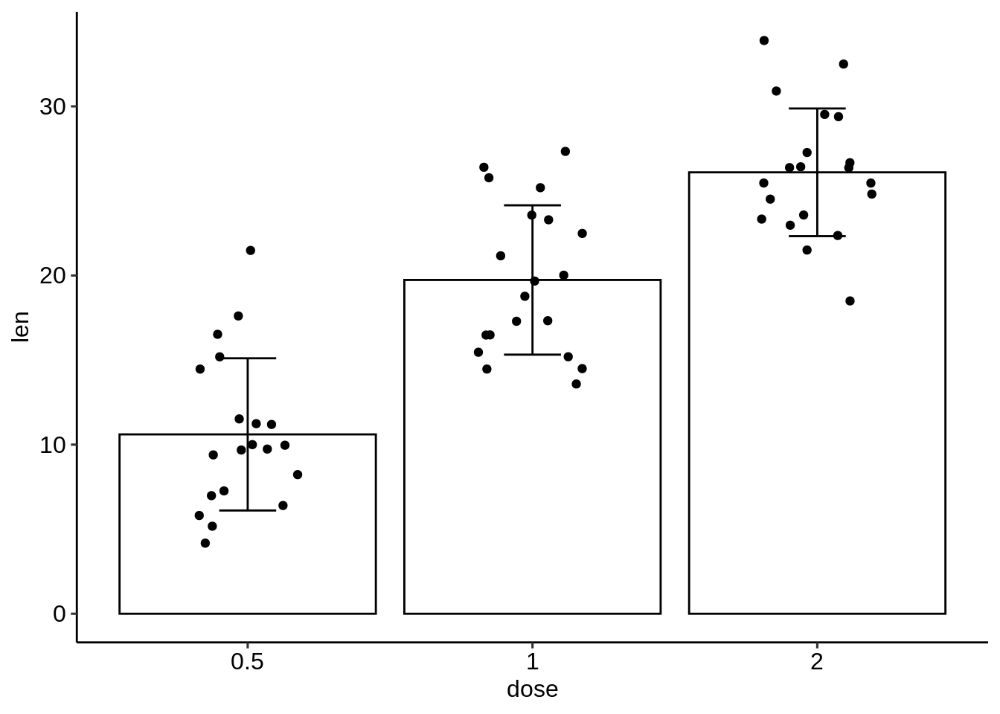

#### 多个组的均值/中位数图。 

一个连续变量（len）和两个分组变量（dose，supp）的情况。

(1) 计算按dose和supp分组的len的摘要统计量。


```r
library(dplyr)
df.summary2 <- df %>%
  group_by(dose, supp) %>%
  summarise(
    sd = sd(len),
    len = mean(len)
  )
df.summary2
```

```
## # A tibble: 6 x 4
## # Groups:   dose [3]
##   dose  supp     sd   len
##   <fct> <fct> <dbl> <dbl>
## 1 0.5   OJ     4.46 13.2 
## 2 0.5   VC     2.75  7.98
## 3 1     OJ     3.91 22.7 
## 4 1     VC     2.52 16.8 
## 5 2     OJ     2.66 26.1 
## 6 2     VC     4.80 26.1
```

(2) 为多个组创建误差图。

- 按组着色的点范围（supp）

- 标准误差线+按组着色的平均值（supp）


```r
# (1) Pointrange: Vertical line with point in the middle
ggplot(df.summary2, aes(dose, len)) +
  geom_pointrange(
    aes(ymin = len-sd, ymax = len+sd, color = supp),
    position = position_dodge(0.3)
    )+
  scale_color_manual(values = c("#00AFBB", "#E7B800"))
```

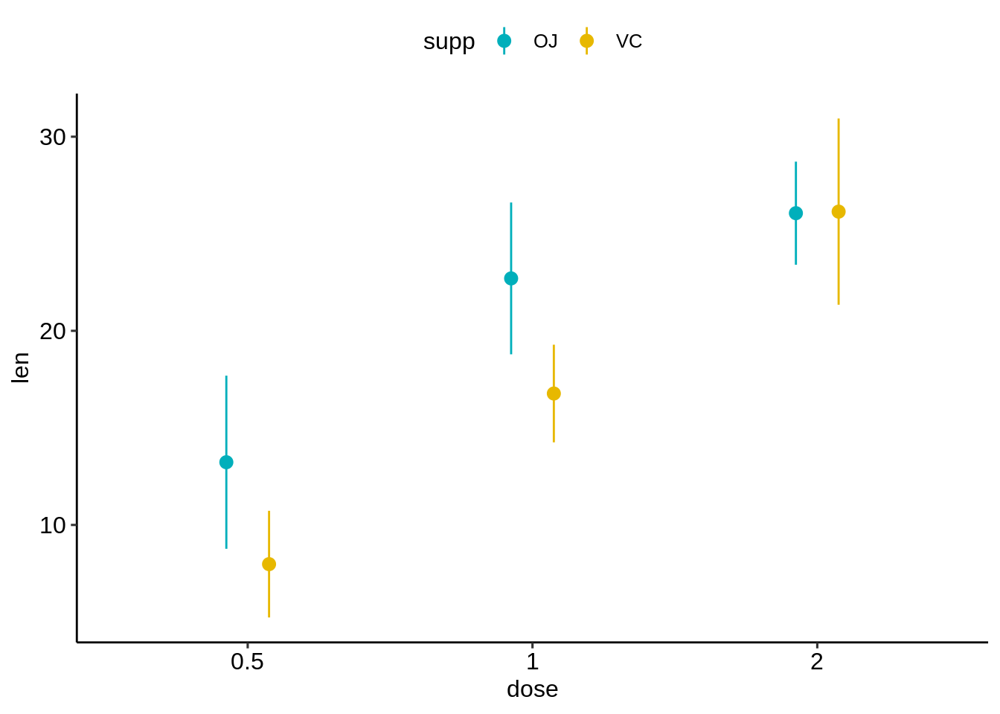

```r
# (2) Standard error bars
ggplot(df.summary2, aes(dose, len)) +
  geom_errorbar(
    aes(ymin = len-sd, ymax = len+sd, color = supp),
    position = position_dodge(0.3), width = 0.2
    )+
  geom_point(aes(color = supp), position = position_dodge(0.3)) +
  scale_color_manual(values = c("#00AFBB", "#E7B800"))
```

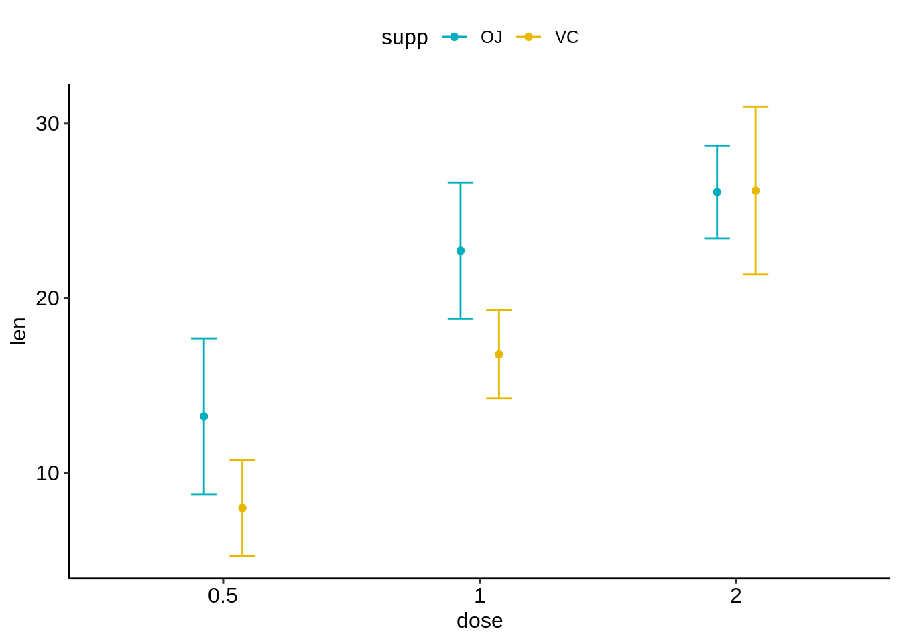

(3) 为多个组创建简单的线/条形图。

- 线图：按组更改线型（Supp）

- 条形图：按组更改填充颜色（Supp）


```r
# (1) Line plot + error bars
ggplot(df.summary2, aes(dose, len)) +
  geom_line(aes(linetype = supp, group = supp))+
  geom_point()+
  geom_errorbar(
    aes(ymin = len-sd, ymax = len+sd, group = supp),
     width = 0.2
    )
```

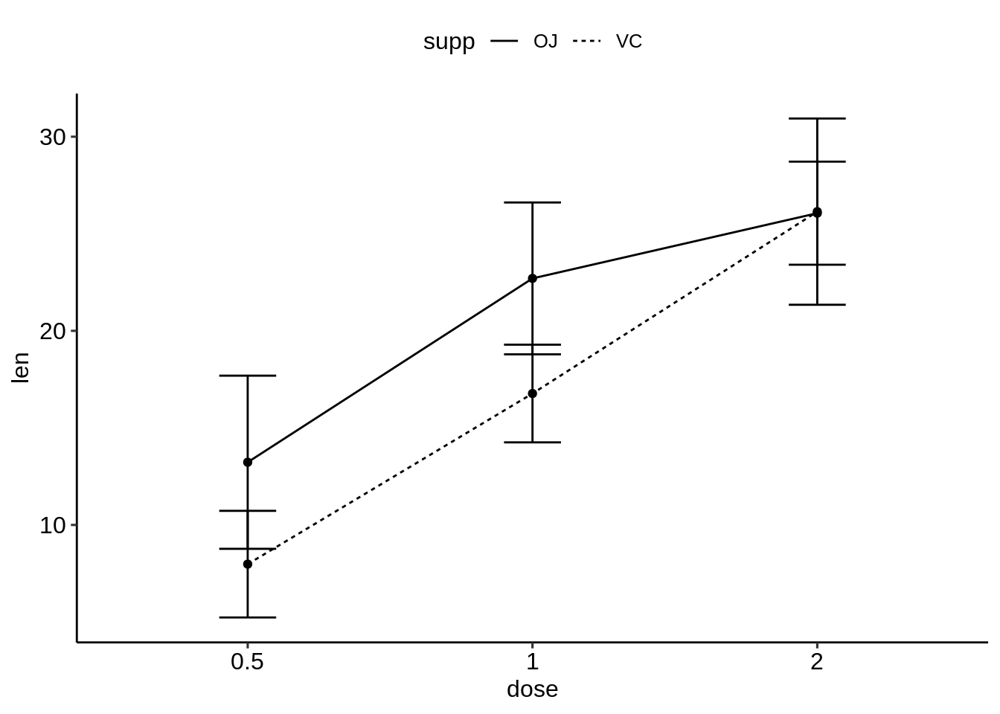

```r
# (2) Bar plots + upper error bars.
ggplot(df.summary2, aes(dose, len)) +
  geom_bar(aes(fill = supp), stat = "identity",
           position = position_dodge(0.8), width = 0.7)+
  geom_errorbar(
    aes(ymin = len, ymax = len+sd, group = supp),
    width = 0.2, position = position_dodge(0.8)
    )+
  scale_fill_manual(values = c("grey80", "grey30"))
```

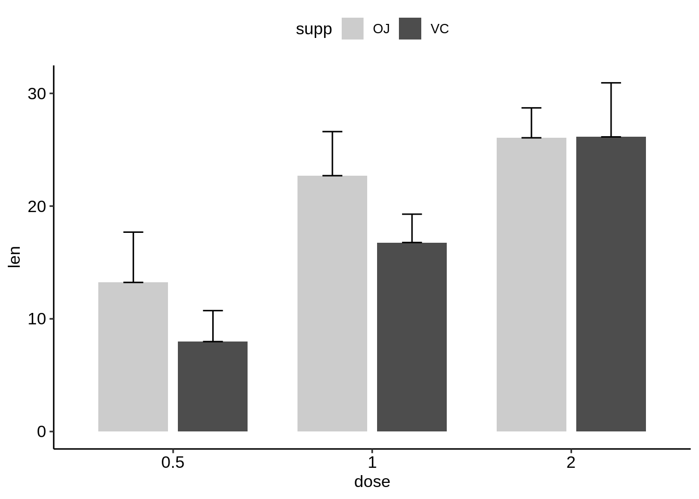

(4) 创建多个组的平均值+/-sd的图。 

使用ggpubr软件包，该软件包将自动计算摘要统计信息并创建图形。


```r
library(ggpubr)
# Create line plots of means
ggline(ToothGrowth, x = "dose", y = "len", 
       add = c("mean_sd", "jitter"),
       color = "supp", palette = c("#00AFBB", "#E7B800"))
```

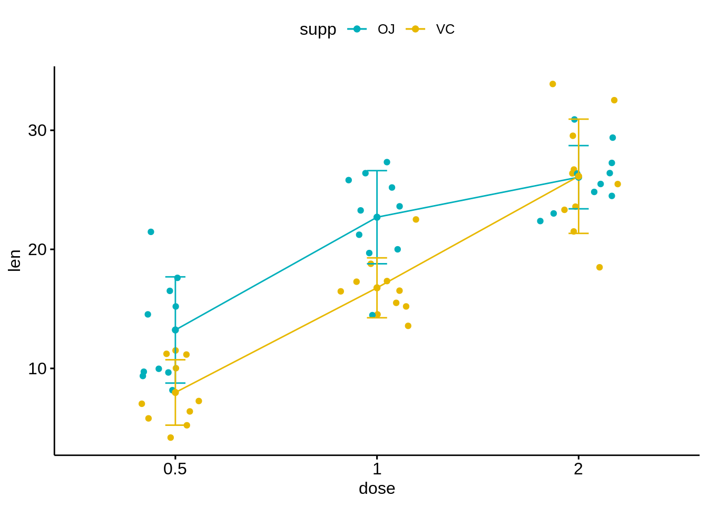

```r
# Create bar plots of means
ggbarplot(ToothGrowth, x = "dose", y = "len", 
          add = c("mean_se", "jitter"),
          color = "supp", palette = c("#00AFBB", "#E7B800"),
          position = position_dodge(0.8))
```

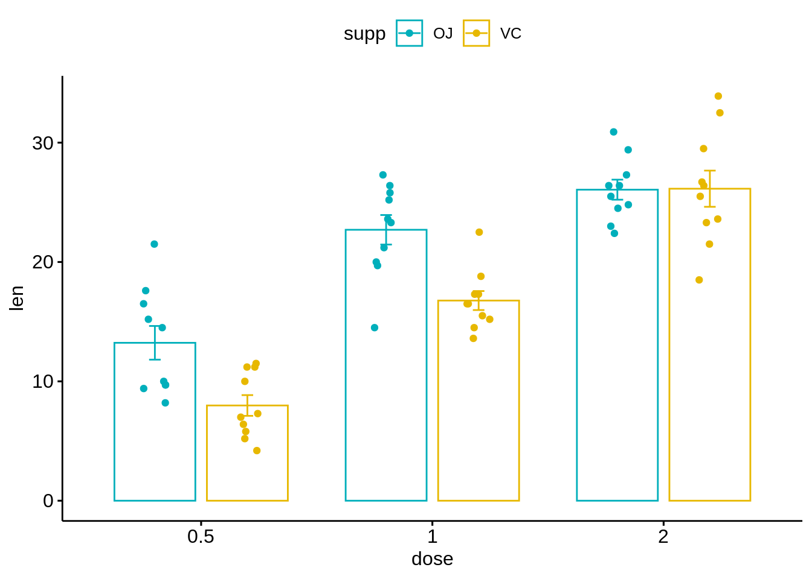

(5) 使用标准ggplot2来重现上面的线图.


```r
# Create line plots
ggplot(df, aes(dose, len)) +
  geom_jitter(
    aes(color = supp),
    position = position_jitter(0.2)
    ) + 
  geom_line(
    aes(group = supp, color = supp),
    data = df.summary2
    ) +
  geom_errorbar(
    aes(ymin = len-sd, ymax = len+sd, color = supp),
    data = df.summary2, width = 0.2
    )+
  scale_color_manual(values = c("#00AFBB", "#E7B800"))
```

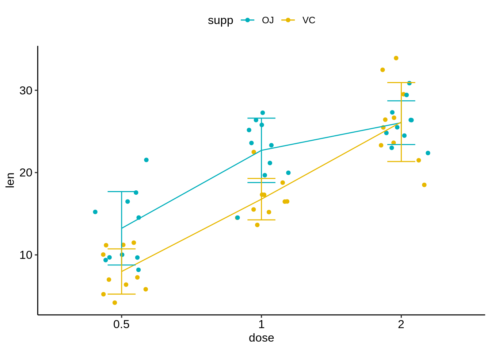


   
   
   

## 总结

### 可视化已分组的连续变量的分布

适用于：x轴上的分组变量和y轴上的连续变量。

可能的ggplot2层包括：

- geom_boxplot() 用于箱形图

- geom_violin() 用于小提琴图

- geom_dotplot() 用于点图

- geom_jitter() 用于带状图

- geom_line() 用于线图

- geom_bar() 用于柱状图

R代码示例：首先创建一个名为e的图，然后通过添加一个图层来完成它：

```r
ToothGrowth$dose <- as.factor(ToothGrowth$dose)
e <- ggplot(ToothGrowth, aes(x = dose, y = len))
```

### 创建带有误差线的均值和中位数图

适用于：x轴上的分组变量，y轴上的汇总连续变量（均值/中位数）。

计算摘要统计信息并使用摘要数据初始化ggplot：

```r
# Summary statistics
library(dplyr)
df.summary <- ToothGrowth %>%
  group_by(dose) %>%
  summarise(
    sd = sd(len, na.rm = TRUE),
    len = mean(len)
  )
# Initialize ggplot with data
f <- ggplot(
  df.summary, 
  aes(x = dose, y = len, ymin = len-sd, ymax = len+sd)
  )
```

### 将误差线与小提琴图，点图，线形图和条形图结合起来


```r
# Combine with violin plots
ggplot(ToothGrowth, aes(dose, len))+
  geom_violin(trim = FALSE) +
  geom_pointrange(aes(ymin = len-sd, ymax = len + sd),
                  data = df.summary)
```

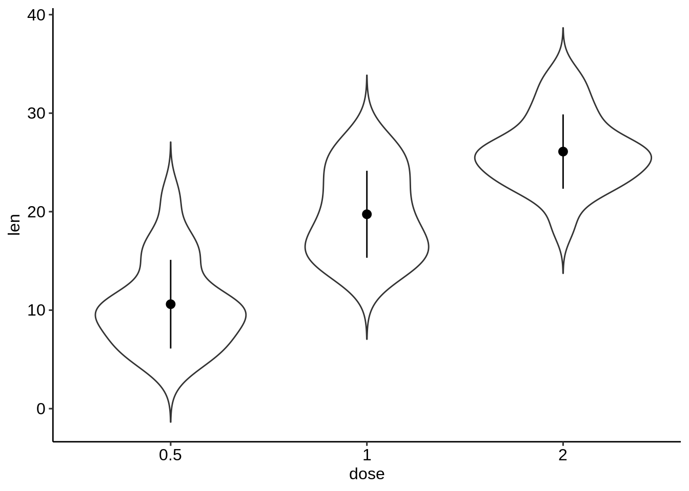

```r
# Combine with dot plots
ggplot(ToothGrowth, aes(dose, len))+
  geom_dotplot(stackdir = "center", binaxis = "y",
               fill = "lightgray", dotsize = 1) +
  geom_pointrange(aes(ymin = len-sd, ymax = len + sd),
                  data = df.summary)
```

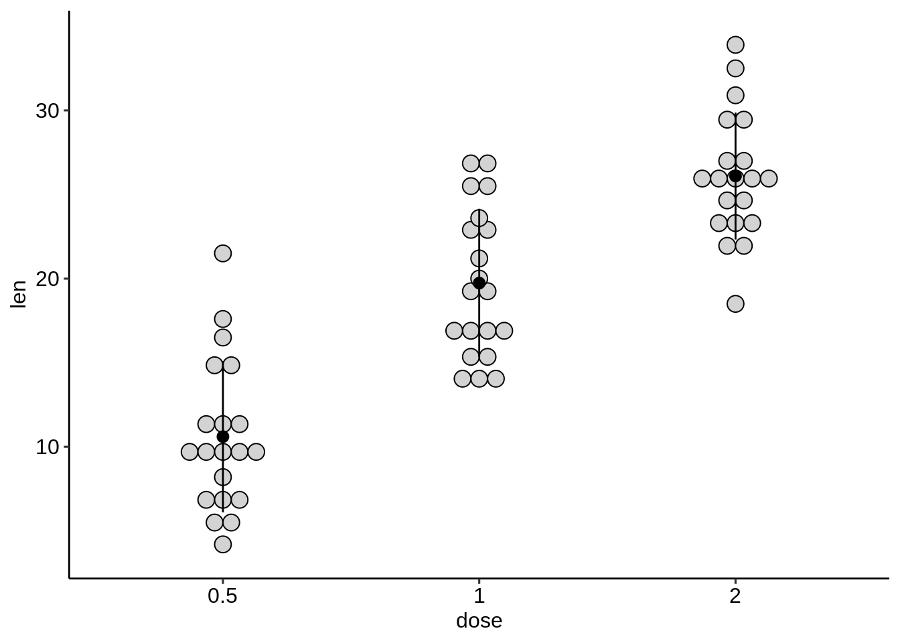

```r
# Combine with line plot
ggplot(df.summary, aes(dose, len))+
  geom_line(aes(group = 1)) +
  geom_pointrange(aes(ymin = len-sd, ymax = len + sd))
```

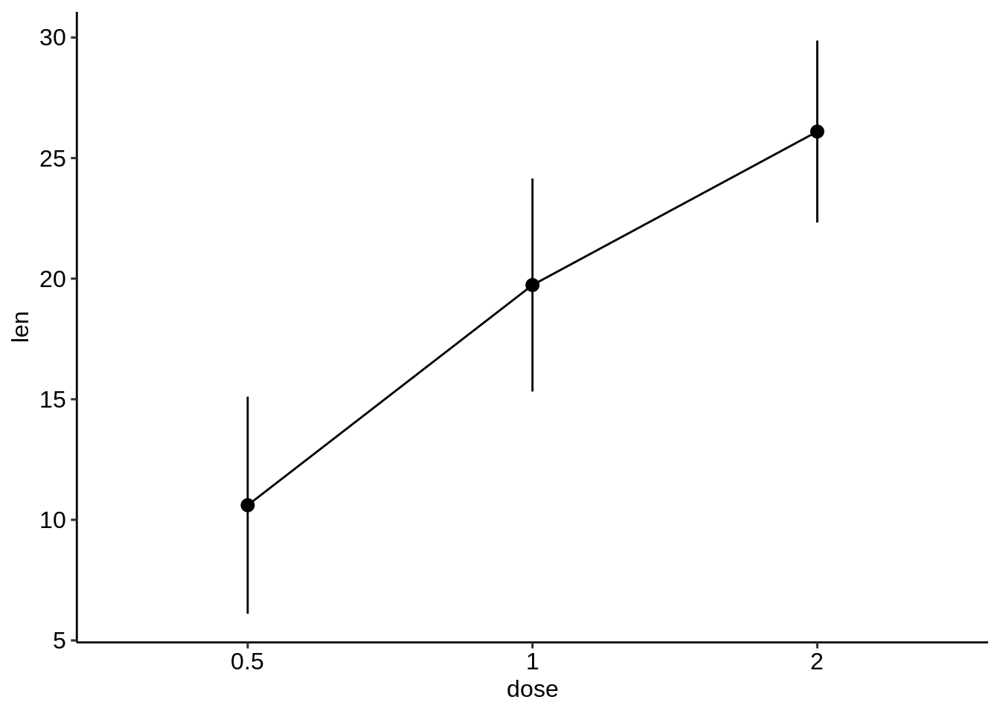

```r
# Combine with bar plots
ggplot(df.summary, aes(dose, len))+
  geom_bar(stat = "identity", fill = "lightgray") +
  geom_pointrange(aes(ymin = len-sd, ymax = len + sd))
```

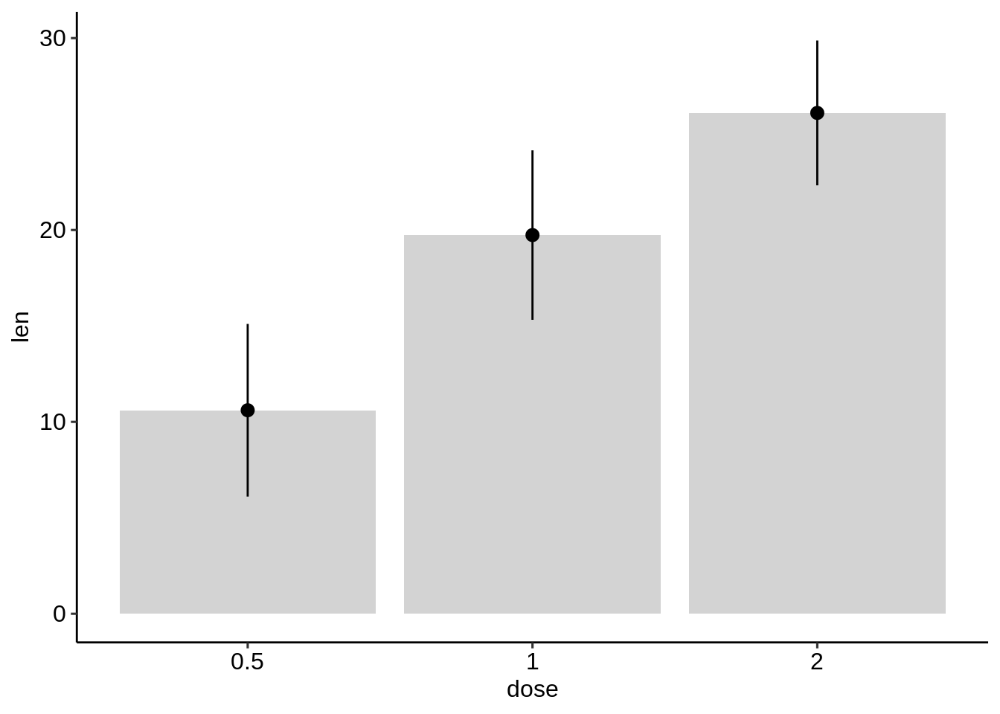

