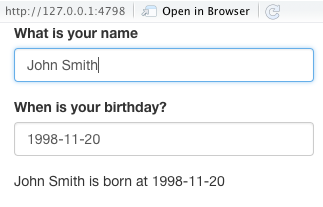
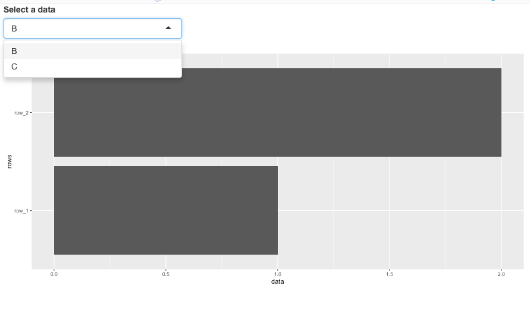
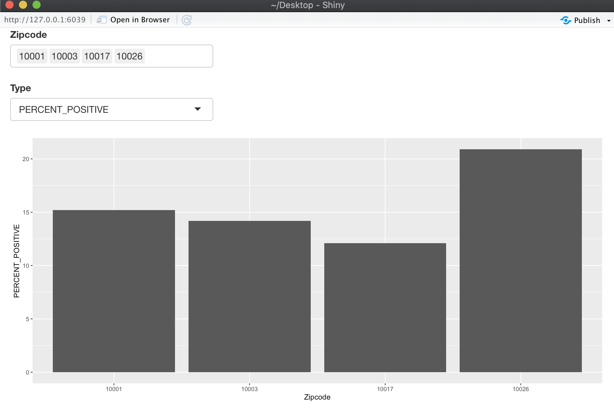

Visualization of Covid-19 information in NYC using R shiny

Junzhi Ge and Yifei Zhang

```{r, include=FALSE}
knitr::opts_chunk$set(echo = TRUE)
```

### Shiny R Introduction

In this document, we are going to talk a little bit about an useful R package called R shiny and using R shiny to visualize the information about Covid-19 in NYC.

First, import Shiny package. 
```{r}
library(shiny)
```

R shiny is an easy access R package without too much knowledge about HTML or Javascript and other developer languages to create an App. Here, we can use simple R code to construct interactive graphs and other designs, then we can share and access them on a Web page. 

### A first glance on Shiny

Shiny is easy as a tool to create an App for having a basic format. 

Basically, there are two parts for each Shiny project: the UI and server functions. UI is short for User Interface, and it is the key for how you would display your application to users. Server function is the inner function which you can define how you would pass user input to output and 

The basic template looks like follows:

```{r, results='hide'}
#This defines the ui, the web page which displays towards users. 
ui <- fluidPage(

)

#This defines the server function, which we could manipulate user input here. 
server <- function(input, output, session){

}

#This line would combine the ui and server function and create the output on the web.
shinyApp(ui, server)
```

### Your first shiny App! 
     
Let’s try our first shiny App:

```{r}
ui <- fluidPage("Hello, World!")

server <- function(input, output){}

shinyApp(ui = ui, server = server)
```

Note that we are not using any interactive characteristics, but we create an output webpage with only one sentence.

### UI

UI stands for user interface, fluidPage is the function that could automatically create a basic structure for a web page, we can also add other features and use sidebarlayout() to improve visualization on the graphs.

An more important feature from ui is that it can receive user input. There are several choices called shiny Widget, for example, we can choose selectInput() to create a bar with choices. The basic shiny Widgets are :


Function                  Widget
--------------------      -------------------------------------------------
actionButton()            Action Button
checkboxGroupInput()      A group of checkboxes
checkboxInput()           A single check box
dateInput()               A calendar to aid date selection
dateRangeInput()          A pair of calendars for selecting a date range
fileInput()               A file upload control wizard
helpText()                Help text that can be added to an input form
numericInput()            A field to enter numbers
radioButtons()            A set of radio buttons
selectInput()             A box with choices to select from
sliderInput()             A slider bar
submitButton()            A submit button
textInput()               A field to enter text
--------------------      -------------------------------------------------


Each input has different parameters, and the reader can check with their helper function. For example, we can create a simple app to accept user names.

```{r, echo = FALSE}
 library(shiny)

ui <- fluidPage(
  textInput("Name", label = "What is your name?"),
  dateInput("Birthday", label = "When is your birthday?"),
  
  textOutput("date")
)

server <- function(input, output)
{
  output$date <- renderText({paste0(input$Name, " is born on ", input$Birthday)})
}

shinyApp(ui = ui, server = server)
```


This following is an example for input.
```{r}

```


We can see that we use textInput to accept text, and shiny has a nice dataInput to let the user choose a date. Take textInput as an example, it has two parts, the first part is called inputId, which is ‘Name’ in this case. We access later in the server function using input$Name, thus it must be unique. The second part is called Label, it's normally a human readable message to let users understand our instructions. In this case, “What is your name?” represent our question, thus users would hopefully enter their name to complete our function. By using this, we can perform reactive programming while users change their inputs. 

### Server

Server is the function where we can manipulate user inputs. We update output, a list-like object to display everything in our App. We normally use a render function to create a reactive context that automatically tracks input and suits your output into a web page format.

Here is an example of plotting using user input:

```{r}
df <- data.frame('A' = c('row_1', 'row_2'), 'B' = 1:2, 'C' = 3:4)

ui <- fluidPage(
  selectInput("Data", 
              label = "Select a data",
              multiple = FALSE,
              choices = c('B', 'C')),
  
  plotOutput("data")
)

server <- function(input, output)
{
  output$data <- renderPlot({
    ggplot(df, aes(x = df[[input$Data]], y = df$A)) +
      geom_col() +
      xlab("data") +
      ylab('rows')

  })
}

shinyApp(ui = ui, server = server)
```


The following is an example for input 
```{r}

```


Each output function requires a single parameter of character string, and we will use it later in the render function as a name for output. For example, in the ui function, we name our output ‘data’, which we update using output$data in server function. output is similar to input, they are both list-like objects. But we cannot change input in the server function! There are many choices for output functions： 

Output function          Output 
--------------------     -------------
dataTableOutput()        DataTable
htmlOutput()             raw HTML
imageOutput()            image
plotOutput()             plot
tableOutput()            table
textOutput()             text
uiOutput()               raw HTML
verbatimTextOutput()     text
--------------------     -------------

It is common to use relative output function, for example, since I use plotOutput in ui, we use renderPlot in server function. There are many render functions: 

Render function      Output
------------------   ----------------------------------------------------
renderPlot()         Plot 
renderText()         Text
renderPrint()        Printable output
renderDataTable()    Table output with the JavaScript library DataTable
renderImage()        Image file 
renderTable()        Table
renderUI()           UI output
------------------   ----------------------------------------------------

Notice that in our example, we use renderPlot because we are plotting a data frame using geom_bar(), You will get an error if the expression returns nothing, or returns the wrong type of object. Also, we use {} in the render function to contain multiple lines of code. 

### Our application for R shiny for latest Covid-19 data set

As is known to all, COVID-19 is the most popular topic in 2020. This pandemic affects everyone’s life. As a part of the Columbia Community, we need to get updated with the information about Covid-19, especially that information in NYC to better protect ourselves and the whole Columbia community. There we decide to use R shiny to create a basic interactive dashboard to help us get a better understanding of the important and most updated (7 days) metrics about Covid-19 in NYC.

The data we used in available on NYC government github: https://github.com/nychealth/coronavirus-data/blob/master/testing/antibody-by-modzcta.csv

Dataset information:

MODZCTA: MODZCTA	
MODZCTA_NAME:	Neighborhood name of the MODZCTA	
PERCENTPOSITIVITY_7DAY:	Percentage of people with a PCR test who tested positive by MODZCTA	Cumulative across current day and 6 previous days
PEOPLE_TESTED: Number of people who received a PCR test by MODZCTA	Cumulative across current day and 6 previous days
PEOPLE_POSITIVE: Number of people with a positive result on a PCR test by MODZCTA	Cumulative across current day and 6 previous days
MEDIAN_DAILY_TEST_RATE:	Median rate of PCR testing per 100,000 people by MODZCTA	Median across current day and 6 previous days
ADEQUATELY_TESTED: Indicator used by NYC to identify MODZCTA where MEDIAN_DAILY_TEST_RATE exceeds 260 per 100,000 people	
DATERANGE: Range of dates included in the most recent 7 days	


Import R libraries we need:
```{r message = FALSE}
library(shiny)
library(ggplot2)
library(tidyr)
library(dplyr)
```
Import the data
```{r}
by_zipcode = read.csv('https://raw.githubusercontent.com/nychealth/coronavirus-data/master/latest/last7days-by-modzcta.csv')

head(by_zipcode)
```


Convert the datatype of the first column into string

```{r}
by_zipcode$modzcta_first <- as.character(by_zipcode$modzcta)
```

Define UI for application, we have two input, the zip code, and the metrics.

```{r}
# Define UI for application
ui <- fluidPage(
  
  selectInput(
    "Zipcode", 
    label    = "Zipcode", 
    multiple = TRUE, 
    choices  = unique(by_zipcode$modzcta), 
   selected = '10001'
  ),
  selectInput(
    "Type", 
    label    = "Type", 
    choices  = colnames(by_zipcode)[c(3, 4, 5, 6)],
    selected = 'NUM_PEOP_TEST'
  ),
  plotOutput("hist")
)
```
Defines the server-side logic of the Shiny application. This generally involves creating functions that map user inputs to various kinds of output.
```{r }
 #Define server logic
server <- function(input, output) 
  {
     output$hist <- renderPlot({
     aa <- by_zipcode %>% filter(modzcta %in% input$Zipcode)

     ggplot(aa, aes(x = modzcta, y = aa[[input$Type]])) +
     geom_col() +
      xlab("Zipcode") +
       ylab(input$Type)
       })
  }
```

```{r}
# Run the application 
shinyApp(ui = ui, server = server)
```
```{r}

```

We can choose different zip codes and different statistics (positive rate, test numbers, etc) as input, and the UI will display the bar chart for that information. We can have a clear view of the comparison between different metrics of Covid-19 in different areas. In the future, we hope to combine more kinds of information from the government website and build an interface with more information for students’ reference. 


Reference:
https://shiny.rstudio.com/
https://shiny.rstudio.com/tutorial/written-tutorial
https://mastering-shiny.org
https://github.com/nychealth/coronavirus-data/blob/master/testing/antibody-by-modzcta.csv


