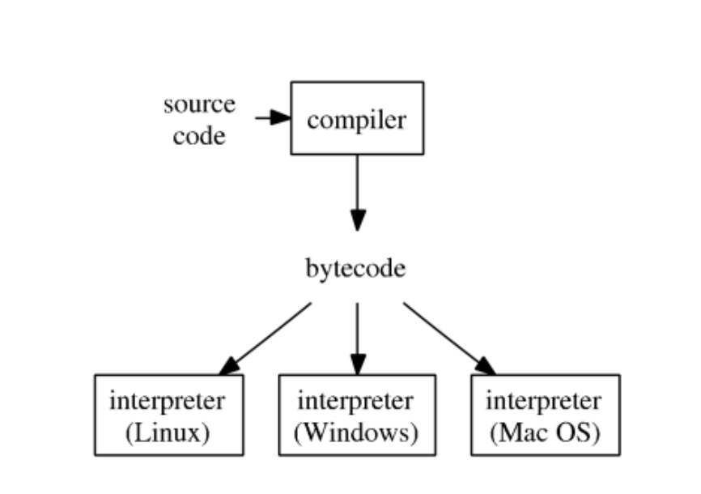
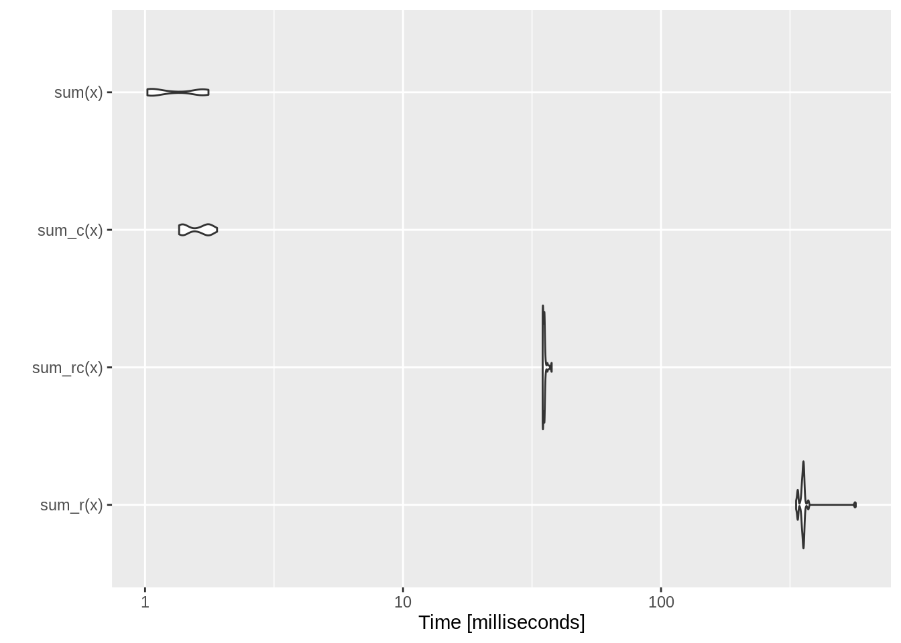

# Speed up in r programming

Hongling Liu and Xinrui Zhang


```r
library(ggplot2)
library(dplyr)
library(microbenchmark)
library(compiler)
library(Rcpp)
library(parallel)
```

It is well known that R is not a fast language, since R was deliberately designed to simplify our process of performing data analysis and statistics, rather than making life easier for our computers to process. While R is slow compared to some other programming languages, it’s fast enough for most of our purposes.

The goal of our community contribution is to give you a deeper understanding of how we could yield the maximum efficiency when running R. We will first introduce the typical development cycle computational statistics with R and what is some of R’s performance characteristics, to help you understand how R codes are being executed. We will also show you two relatively easy ways to speed up code using the Rcpp package and parallel processing.

## Typical development cycle for computational statistics

First, let's take a look at the usual steps of computational statistics with R, and what questions we need to ask ourselves for each step:

1. Scientific planning: What experiments would verify/invalidate our hypotheses? What parameter settings should we consider?

0. Code planning: What does the code need to do? How will the code fit together? What functions will be used? What are their inputs/outputs etc.

0. Implementation:

    1. Prototype functions, classes, etc., partial documentation
    
    2. Write unit tests
    
    3. Implement code, run unit tests, debug
    
    4. Broader testing, more debugging
    
    5. Profile code, identify bottlenecks
    
    6. Optimize code
    
0. Conduct experiments.

0. Full documentation.

## Bytecode compilation

- After profiling, what can we do to improve performance?

    1. Questions to ask ourselves: Are there obvious speedups? Are things being computed unnecessarily? Are you using a `data.frame` where you should be using a matrix etc.  
    
    2. Look up your problem on internet (e.g., search for "lapply slow" or "speeding up `lapply`" etc.)
    
    3. Try the just-in-time (JIT) compiler.
    
    4. Consider re-writing some or all of the code in a compiled language (e.g., C/C++).
    
    5. Try parallelization.

- R typical execution:

<p align="center">
{width=400px}

- Since R 2.1.4, the `compiler` package by Luke Tierney is distributed with base R. `compiler` package compiles an R function into bytecode.

### Example: summing a vector

Brute-force `for` loop for summing a vector:

```r
sum_r <- function(x) {
  sumx <- 0.0
  for (i in 1:length(x)) {
    sumx <- sumx + x[i]
  }
  return(sumx)
}
sum_r
```

```
## function(x) {
##   sumx <- 0.0
##   for (i in 1:length(x)) {
##     sumx <- sumx + x[i]
##   }
##   return(sumx)
## }
```

Run the code on 1e6 elements:

```r
library(microbenchmark)
library(ggplot2)

x = seq(from = 0, to = 100, by = 0.0001)
microbenchmark(sum_r(x))
```

```
## Unit: milliseconds
##      expr     min      lq     mean  median      uq     max neval
##  sum_r(x) 35.0608 35.1252 35.34773 35.1716 35.2753 40.5348   100
```

Let's compile the function into bytecode `sum_rc` and benchmark again:

```r
sum_rc <- cmpfun(sum_r)
sum_rc
```

```
## function(x) {
##   sumx <- 0.0
##   for (i in 1:length(x)) {
##     sumx <- sumx + x[i]
##   }
##   return(sumx)
## }
## <bytecode: 0x5584b81f6ef0>
```

Benchmark again:

```r
microbenchmark(sum_r(x), sum_rc(x))
```

```
## Unit: milliseconds
##       expr     min       lq     mean   median       uq     max neval cld
##   sum_r(x) 35.0601 35.09905 35.35134 35.14455 35.30405 37.5750   100   a
##  sum_rc(x) 35.0736 35.10195 35.29535 35.13505 35.21115 37.5022   100   a
```


Before we look into the results, let's look at the `microbenchmark` function. Here we use it as a more accurate replacement of the often seen `system.time( )` expression to accurately measure the time it takes to evaluate `expr`. Since we are only measuring the performance of a very small piece of code, we could get the accurate running time in milliseconds(ms), microseconds (µs) or even nanoseconds (ns) by using `microbenchmark`. 

`microbenchmark( )` runs each expression 100 times by default (it can be controlled by the times parameter). In the process, it also randomises the order of the expressions. It summarises the results with a minimum (min), lower quartile (lq), median, upper quartile (uq), and maximum (max). By default, microbenchmark( ) runs each expression 100 times (controlled by the times parameter). In the process, it also randomises the order of the expressions. It summarises the results with a minimum (min), lower quartile (lq), median, upper quartile (uq), and maximum (max). We could focus on the median and mean, and use the upper and lower quartiles (lq and uq) to get a feel for the variability. 

In our example, we can see that compiling into bytecode does not make a big difference, since according to `microbenchmark()`, the running time of our `sum_r` function is mostly (more than half) in the interquartile range(34.8257,35.02315), and after compiling, the interquartile range for `sum_rc(x)` is (34.86815,35.1907), so we could say that compiling into bytecode *does not help much*.

The reason behind this may be seen at the following code where we found out that the function `sum_r` is already compiled into bytecode before execution.


```r
sum_r
```

```
## function(x) {
##   sumx <- 0.0
##   for (i in 1:length(x)) {
##     sumx <- sumx + x[i]
##   }
##   return(sumx)
## }
## <bytecode: 0x5584b1999b20>
```

Let's turn off JIT (just-in-time compilation), re-define the (same) `sum_r` function, and benchmark again:

```r
enableJIT(0) # set JIT leval to 0
```

```
## [1] 3
```

```r
sum_r <- function(x) {
  sumx <- 0.0
  for (i in 1:length(x)) {
    sumx <- sumx + x[i]
  }
  return(sumx)
}
microbenchmark(sum_r(x))
```

```
## Unit: milliseconds
##      expr      min       lq     mean   median       uq      max neval
##  sum_r(x) 348.6904 353.7995 361.0195 355.7976 359.1445 577.1574   100
```
Now we witness the slowness of the un-compiled `sum_r`.

Documentation of `enableJIT`:  

> enableJIT enables or disables just-in-time (JIT) compilation. JIT is disabled if the argument is 0. If level is 1 then larger closures are compiled before their first use. If level is 2, then some small closures are also compiled before their second use. If level is 3 then in addition all top level loops are compiled before they are executed. JIT level 3 requires the compiler option optimize to be 2 or 3. The JIT level can also be selected by starting R with the environment variable R_ENABLE_JIT set to one of these values. Calling enableJIT with a negative argument returns the current JIT level. The default JIT level is 3.

Since R 3.4.0 (Apr 2017), the JIT (‘Just In Time’) bytecode compiler is enabled by default at its level 3. 

If you create a package, then you automatically compile the package on installation by adding

```r
ByteCompile: true
```
to the `DESCRIPTION` file.


## Rcpp

Now, we are going to introduce the package `Rcpp` which helps yield the maximum efficiency for R. And there is a learning source for whoever interested:

- _Advanced R_: <https://adv-r.hadley.nz/rcpp.html>

We previously used `compiler` package to compile R code into bytecode, which is translated to machine code by interpreter during execution. However, A low-level language such as C, C++, and Fortran is compiled into machine code directly, making it easy for our computer to process the code, and `Rcpp` makes it very simple to connect C++ to R, where it allows us to write C++ functions in R, therefore yielding the maximum efficiency.

### Use `cppFunction`

`Rcpp` package provides a convenient way to embed C++ code in R code.


```r
library(Rcpp)

cppFunction('double sum_c(NumericVector x) {
  int n = x.size();
  double total = 0;
  for(int i = 0; i < n; ++i) {
    total += x[i];
  }
  return total;
}')
sum_c
```

```
## function (x) 
## .Call(<pointer: 0x7f8a86f6c620>, x)
```
Benchmark (1) compiled C++ function `sum_c` together with (2) R function `sum_r`, (3) compiled R function `sum_rc`, and (4) the `sum` function in base R: 


```r
mbm <- microbenchmark(sum_r(x), sum_rc(x), sum_c(x), sum(x))
mbm
```

```
## Unit: milliseconds
##       expr      min        lq       mean    median       uq      max neval cld
##   sum_r(x) 333.8041 351.39795 359.413712 355.35945 357.9218 568.6876   100   c
##  sum_rc(x)  34.7744  34.83755  35.239997  35.18255  35.3564  37.6875   100  b 
##   sum_c(x)   1.3554   1.39690   1.589323   1.62370   1.7625   1.9016   100 a  
##     sum(x)   1.0213   1.04850   1.341310   1.20020   1.6717   1.7613   100 a
```

```r
autoplot(mbm)
```



**Remember we turned off JIT by `enableGIT(0)` earlier.**

This is a good example of where C++ is much more efficient than R. As shown by the above microbenchmark, `sum_c()` is competitive with the built-in (and highly optimised) `sum()`, while `sum_r()` is several orders of magnitude slower.

Therefore,`Rcpp` package is definitely a great tool for us to improve the efficiency for our R code. 

## Parallel computing

Now, we are going to discuss another way to get efficient with R -- parallel computing:

- Fact: base R was designed to be single-threaded. Even you request a fancy instance with 96 vCPUs, running R code is just using 1/96th of its power.

- To perform multi-core computation in R:

    1. Option 1: Manually run multiple R sessions.

    2. Option 2: Make multiple `system("Rscript")` calls. Typically automated by a scripting language (Python, Perl, shell script) or within R 

    3. Option 3: Use package `parallel`. 

- `parallel` package in R.

    - Authors: Brian Ripley, Luke Tieney, Simon Urbanek.
    
    - Included in base R since 2.14.0 (2011).
    
    - Based on the `snow` (Luke Tierney) and `multicore` (Simon Urbanek) packages.  
    
    - To find the number of cores:

```r
    library(parallel)
    detectCores()
```

```
## [1] 2
```

### Simulation example

Senario: Suppose we have a new method to calculate average, that is, to only choose primed-indexed number to calculate the average, and we would like to compute the average mean squared error (MSE) from both this new method and the classic method. Differently distributed random variables with different sample sizes will be tested. There are going to be many combinations of distribution and sample size. 

$$ 
  MSE = \frac{\sum_{r=1}^{\text{rep}} (\widehat \mu_r - \mu_{\text{true}})^2}{\text{rep}}
$$


```r
## check if a given integer is prime
isPrime = function(n) {
  if (n <= 3) {
    return (TRUE)
  }
  if (any((n %% 2:floor(sqrt(n))) == 0)) {
    return (FALSE)
  }
  return (TRUE)
}

## estimate mean only using observation with prime indices
estMeanPrimes = function(x) {
  n <- length(x)
  ind <- sapply(1:n, isPrime)
  return (mean(x[ind]))
}

## compare methods: sample avg and prime-indexed avg
compare_methods <- function(dist = "gaussian", n = 100, reps = 100, seed = 123) {
  # set seed according to command argument `seed`
  set.seed(seed)
  
  # preallocate space to store estimators
  msePrimeAvg <- 0.0
  mseSamplAvg <- 0.0
  # loop over simulation replicates
  for (r in 1:reps) {
    # simulate data according to command arguments `n` and `distr`
    if (dist == "gaussian") {
      x = rnorm(n)
    } else if (dist == "t1") {
      x = rcauchy(n)
    } else if (dist == "t5") {
      x = rt(n, 5)
    } else {
      stop(paste("unrecognized dist: ", dist))
    }
    # prime indexed mean estimator and classical sample average estimator
    msePrimeAvg <- msePrimeAvg + estMeanPrimes(x)^2 
    mseSamplAvg <- mseSamplAvg + mean(x)^2
  }
  mseSamplAvg <- mseSamplAvg / reps
  msePrimeAvg <- msePrimeAvg / reps
  return(c(mseSamplAvg, msePrimeAvg))
}
```

In order to indicate the *option 2*, we save the above codes in script [`runSim.R`]. 
    
#### Option 2
*this example is only good for linux system*

1. The [`runSim.R`] script to include arguments `seed` (random seed), `n` (sample size), `dist` (distribution) and `rep` (number of simulation replicates). When `dist="gaussian"`, generate data from standard normal; when `dist="t1"`, generate data from t-distribution with degree of freedom 1 (same as Cauchy distribution); when `dist="t5"`, generate data from t-distribution with degree of freedom 5. Calling `runSim.R` will (1) set random seed according to argument `seed`, (2) generate data according to argument `dist`, (3) compute the primed-indexed average estimator and the classical sample average estimator for each simulation replicate, (4) report the average mean squared error (MSE)

2. The [`autoSim.R`] script to run simulations with combinations of sample sizes `nVals = seq(100, 500, by=100)` and distributions `distTypes = c("gaussian", "t1", "t5")`.  `rep = 50` is used for MSE. 

```
cat resources/speed_up_in_r_programming/autoSim.R
```


3. Download the [`runSim.R`] and [`autoSim.R`] scripts, and run the following codes, this will parallelly compute results from all combinations, and write output to appropriately named files.
 
```
    Rscript resources/speed_up_in_r_programming/autoSim.R seed=280 rep=50
```

#### Option 3

#### Serial code
We need to loop over 3 generative models (`distTypes`) and 20 samples sizes (`nVals`). That are 60 embarssingly parallel tasks.

```r
seed = 280
reps = 500
nVals = seq(100, 1000, by = 50)
distTypes = c("gaussian", "t5", "t1")
```
This is the serial code that double-loop over combinations of `distTypes` and `nVals`:

```r
## simulation study with combination of generative model `dist` and
## sample size `n` (serial code)
simres1 = matrix(0.0, nrow = 2 * length(nVals), ncol = length(distTypes))
i = 1 # entry index
system.time(
  for (dist in distTypes) {
    for (n in nVals) {
      #print(paste("n=", n, " dist=", dist, " seed=", seed, " reps=", reps, sep=""))
      simres1[i:(i + 1)] = compare_methods(dist, n, reps, seed)
      i <- i + 2
    }
  }
)
```

```
##    user  system elapsed 
##  36.303   0.024  36.329
```

```r
simres1
```

```
##               [,1]        [,2]         [,3]
##  [1,] 0.0103989436 0.017070603     312.4001
##  [2,] 0.0410217819 0.066503177     200.3237
##  [3,] 0.0065484669 0.011260420     173.9631
##  [4,] 0.0297390639 0.047465397     199.5330
##  [5,] 0.0056445593 0.007754855   68026.7023
##  [6,] 0.0215380206 0.040039145 1230343.1341
##  [7,] 0.0040803523 0.006871930   43609.7815
##  [8,] 0.0165144049 0.032353077  931755.3182
##  [9,] 0.0032566766 0.005417194   30283.1286
## [10,] 0.0161191554 0.026330133  684726.8788
## [11,] 0.0027565672 0.004444172   22306.1369
## [12,] 0.0145039253 0.022820075  539105.3392
## [13,] 0.0024915830 0.003798500   17119.0807
## [14,] 0.0122801335 0.022788299  435528.4778
## [15,] 0.0023706676 0.003360507   13531.4104
## [16,] 0.0112703627 0.016674640     111.4673
## [17,] 0.0020190283 0.003147367   10973.3489
## [18,] 0.0106157492 0.016027485     278.9663
## [19,] 0.0017567901 0.002863640    9069.6647
## [20,] 0.0096185720 0.016444671  261373.7646
## [21,] 0.0016441481 0.002637964    7629.9867
## [22,] 0.0081784426 0.013710539     296.6235
## [23,] 0.0015075246 0.002498450    6498.2362
## [24,] 0.0088018140 0.012909942  191986.6388
## [25,] 0.0014372130 0.002308089    5603.9395
## [26,] 0.0077292632 0.012789483  171280.5448
## [27,] 0.0012924543 0.002216936    4889.8739
## [28,] 0.0069012154 0.011052562     170.3975
## [29,] 0.0011994654 0.001987311    4299.6838
## [30,] 0.0067559611 0.011291788     178.7454
## [31,] 0.0011642413 0.001888637    3806.8472
## [32,] 0.0070131993 0.010048327     140.2389
## [33,] 0.0011566121 0.001873365    3401.9766
## [34,] 0.0065066558 0.009020973      34.1644
## [35,] 0.0010506067 0.001595430    3049.0432
## [36,] 0.0060026682 0.010338424  103578.0598
## [37,] 0.0009770234 0.001618095    2768.4517
## [38,] 0.0054705674 0.009229294     143.5544
```

#### Using `mcmapply`

Run the same task using `mcmapply` function (parallel analog of `mapply`) in the `parallel` package:

```r
## simulation study with combination of generative model `dist` and
## sample size `n` (parallel code using mcmapply)
library(parallel)
system.time({
  simres2 <- mcmapply(compare_methods, 
                      rep(distTypes, each = length(nVals), times = 1),
                      rep(nVals, each = 1, times = length(distTypes)),
                      reps, 
                      seed,
                      mc.cores = 4)
})
```

```
##    user  system elapsed 
##  27.444   0.607  19.805
```

```r
simres2 <- matrix(unlist(simres2), ncol = length(distTypes))
simres2
```

```
##               [,1]        [,2]         [,3]
##  [1,] 0.0103989436 0.017070603     312.4001
##  [2,] 0.0410217819 0.066503177     200.3237
##  [3,] 0.0065484669 0.011260420     173.9631
##  [4,] 0.0297390639 0.047465397     199.5330
##  [5,] 0.0056445593 0.007754855   68026.7023
##  [6,] 0.0215380206 0.040039145 1230343.1341
##  [7,] 0.0040803523 0.006871930   43609.7815
##  [8,] 0.0165144049 0.032353077  931755.3182
##  [9,] 0.0032566766 0.005417194   30283.1286
## [10,] 0.0161191554 0.026330133  684726.8788
## [11,] 0.0027565672 0.004444172   22306.1369
## [12,] 0.0145039253 0.022820075  539105.3392
## [13,] 0.0024915830 0.003798500   17119.0807
## [14,] 0.0122801335 0.022788299  435528.4778
## [15,] 0.0023706676 0.003360507   13531.4104
## [16,] 0.0112703627 0.016674640     111.4673
## [17,] 0.0020190283 0.003147367   10973.3489
## [18,] 0.0106157492 0.016027485     278.9663
## [19,] 0.0017567901 0.002863640    9069.6647
## [20,] 0.0096185720 0.016444671  261373.7646
## [21,] 0.0016441481 0.002637964    7629.9867
## [22,] 0.0081784426 0.013710539     296.6235
## [23,] 0.0015075246 0.002498450    6498.2362
## [24,] 0.0088018140 0.012909942  191986.6388
## [25,] 0.0014372130 0.002308089    5603.9395
## [26,] 0.0077292632 0.012789483  171280.5448
## [27,] 0.0012924543 0.002216936    4889.8739
## [28,] 0.0069012154 0.011052562     170.3975
## [29,] 0.0011994654 0.001987311    4299.6838
## [30,] 0.0067559611 0.011291788     178.7454
## [31,] 0.0011642413 0.001888637    3806.8472
## [32,] 0.0070131993 0.010048327     140.2389
## [33,] 0.0011566121 0.001873365    3401.9766
## [34,] 0.0065066558 0.009020973      34.1644
## [35,] 0.0010506067 0.001595430    3049.0432
## [36,] 0.0060026682 0.010338424  103578.0598
## [37,] 0.0009770234 0.001618095    2768.4517
## [38,] 0.0054705674 0.009229294     143.5544
```

- We see roughly 3x-4x speedup with `mc.cores=4`.

- `mcmapply`, `mclapply` and related functions rely on the forking capability of POSIX operating systems (e.g. Linux, MacOS) and is **not** available in Windows.

- `parLapply`, `parApply`, `parCapply`, `parRapply`, `clusterApply`, `clusterMap`, and related
functions create a cluster of workers based on either socket (default) or forking. Socket is available on all platforms: Linux, MacOS, and Windows.

#### Using `clusterMap`

The same simulation example using `clusterMap` function:  


```r
cl <- makeCluster(getOption("cl.cores", 4))
clusterExport(cl, c("isPrime", "estMeanPrimes", "compare_methods"))
system.time({
  simres3 <- clusterMap(cl, compare_methods,
                        rep(distTypes, each = length(nVals), times = 1),
                        rep(nVals, each = 1, times = length(distTypes)),
                        reps,
                        seed,
                        .scheduling = "dynamic")
})
```

```
##    user  system elapsed 
##   0.025   0.008  16.310
```

```r
simres3 <- matrix(unlist(simres3), ncol = length(distTypes))
stopCluster(cl)
simres3
```

```
##               [,1]        [,2]         [,3]
##  [1,] 0.0103989436 0.017070603     312.4001
##  [2,] 0.0410217819 0.066503177     200.3237
##  [3,] 0.0065484669 0.011260420     173.9631
##  [4,] 0.0297390639 0.047465397     199.5330
##  [5,] 0.0056445593 0.007754855   68026.7023
##  [6,] 0.0215380206 0.040039145 1230343.1341
##  [7,] 0.0040803523 0.006871930   43609.7815
##  [8,] 0.0165144049 0.032353077  931755.3182
##  [9,] 0.0032566766 0.005417194   30283.1286
## [10,] 0.0161191554 0.026330133  684726.8788
## [11,] 0.0027565672 0.004444172   22306.1369
## [12,] 0.0145039253 0.022820075  539105.3392
## [13,] 0.0024915830 0.003798500   17119.0807
## [14,] 0.0122801335 0.022788299  435528.4778
## [15,] 0.0023706676 0.003360507   13531.4104
## [16,] 0.0112703627 0.016674640     111.4673
## [17,] 0.0020190283 0.003147367   10973.3489
## [18,] 0.0106157492 0.016027485     278.9663
## [19,] 0.0017567901 0.002863640    9069.6647
## [20,] 0.0096185720 0.016444671  261373.7646
## [21,] 0.0016441481 0.002637964    7629.9867
## [22,] 0.0081784426 0.013710539     296.6235
## [23,] 0.0015075246 0.002498450    6498.2362
## [24,] 0.0088018140 0.012909942  191986.6388
## [25,] 0.0014372130 0.002308089    5603.9395
## [26,] 0.0077292632 0.012789483  171280.5448
## [27,] 0.0012924543 0.002216936    4889.8739
## [28,] 0.0069012154 0.011052562     170.3975
## [29,] 0.0011994654 0.001987311    4299.6838
## [30,] 0.0067559611 0.011291788     178.7454
## [31,] 0.0011642413 0.001888637    3806.8472
## [32,] 0.0070131993 0.010048327     140.2389
## [33,] 0.0011566121 0.001873365    3401.9766
## [34,] 0.0065066558 0.009020973      34.1644
## [35,] 0.0010506067 0.001595430    3049.0432
## [36,] 0.0060026682 0.010338424  103578.0598
## [37,] 0.0009770234 0.001618095    2768.4517
## [38,] 0.0054705674 0.009229294     143.5544
```

- Again we see roughly 3x-4x speedup by using 4 cores.

- `clusterExport` copies environment of master to slaves.

## Package development

Learning resources:  

- Book _[R Packages_ ](http://r-pkgs.had.co.nz) by Hadley Wickham  

- RStudio tutorial: <https://support.rstudio.com/hc/en-us/articles/200486488-Developing-Packages-with-RStudio>
