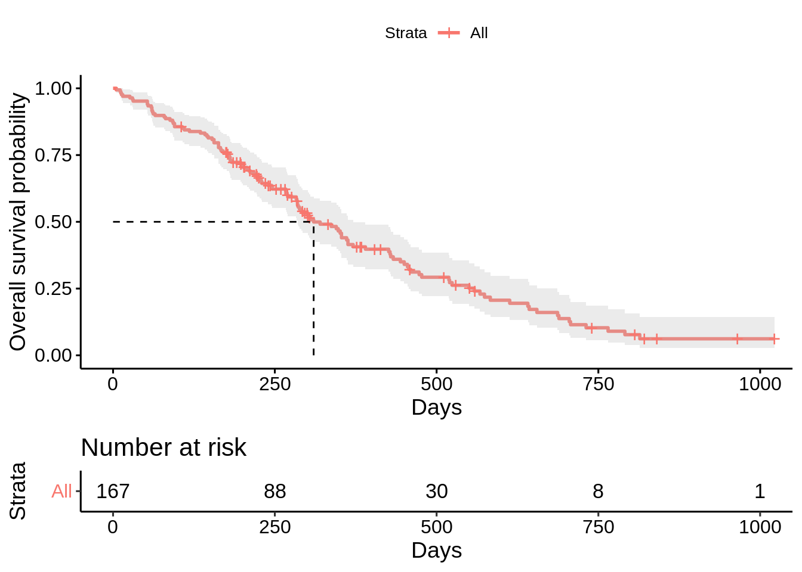
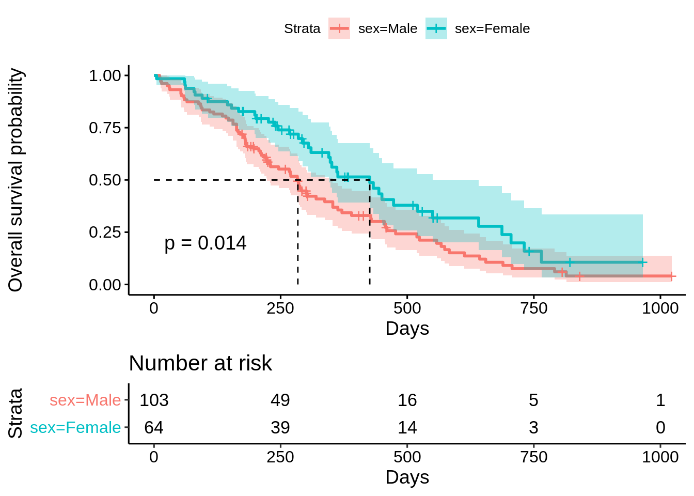
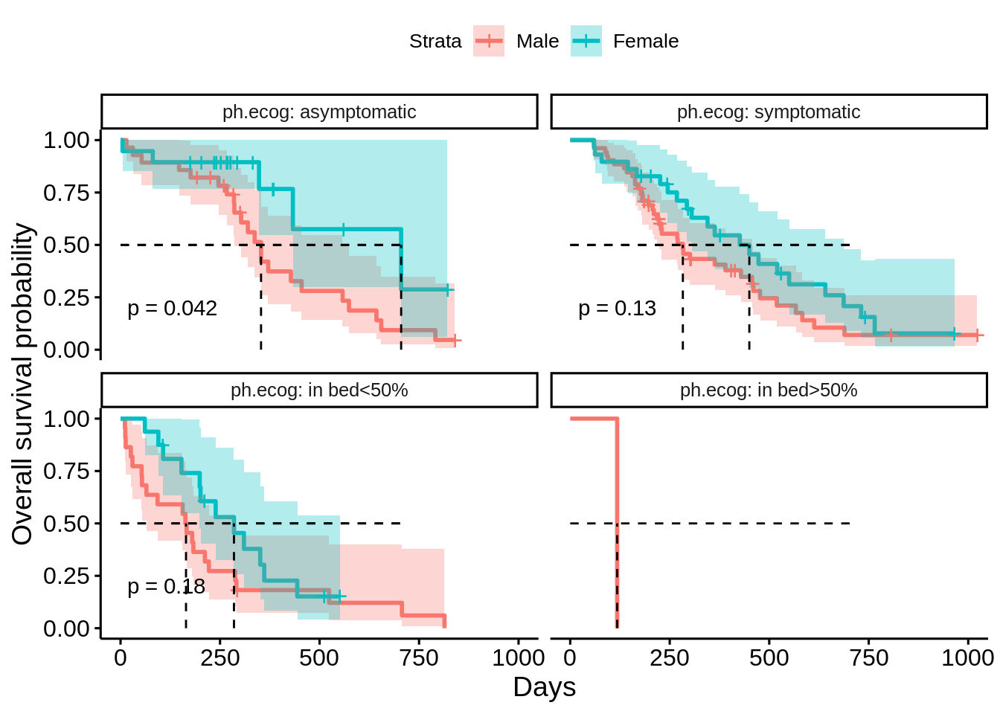
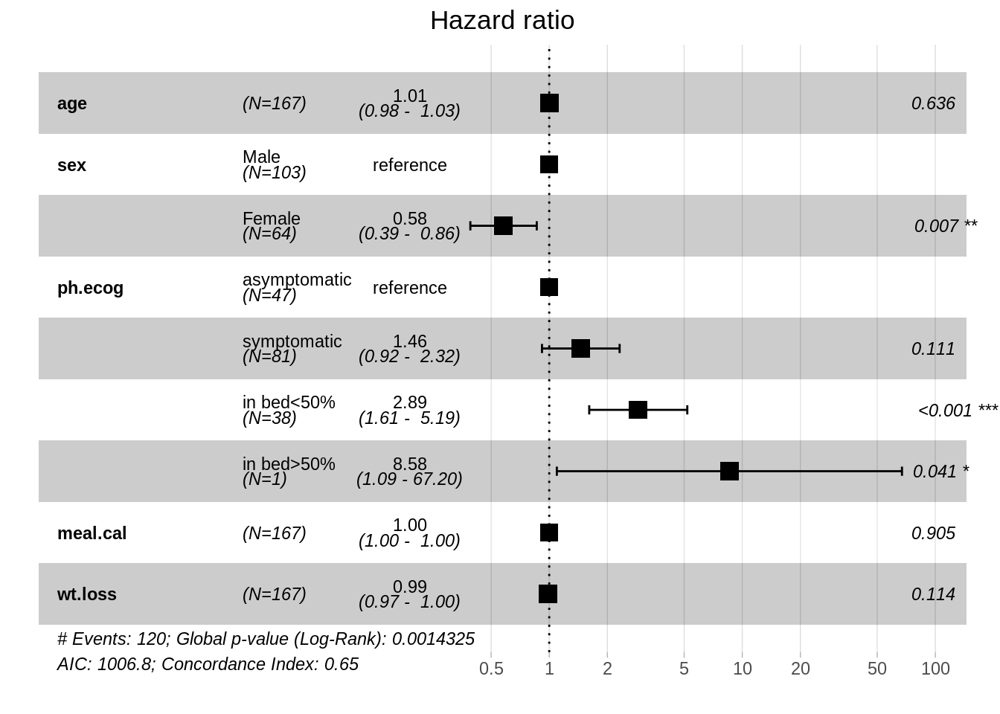

# Survival analysis examples

Haoxiong Su and Tianchun Huang


```r
library(survival)
library(survminer)
library(dplyr)
```

## Introduction

Survival analysis is often used to analyze time-to-event data, such as the time that a patient may survive, or the time from HIV infection to development of AIDS. In other words, with survival analysis, we can predict the probability of certain events to happen at certain time, which can be useful in many fields. The objective of this chapter is to introduce some R packages for performing and visualizing survival analysis.

## Basic Concepts

Before introducing R packages, here are some basic concepts and definition about survival analysis.

**event**: experience of interest, such as death, recovery, and other occurrence.


**time $t$**: the time since the beginning of the observation.

**censoring**: the subject has not experienced the event of interest by the end of data collection, including loss to follow-up, withdrawal from study, or no observation by end.

**survival function $S(t)$**: the probability of still being alive at time $t$; this function is also what we want to estimate in many of the cases.

**Kaplan-Meier estimator**: Kaplan-Meier survival estimator is an estimate of the survival function derived by Kaplan-Meier method. It is calculated as:
$$\hat{S(t_i)} = \prod_{i:t_i\leq t}(1-\frac{d_i}{n_i}),$$
where

* $d_i$: the number of events at $t_i$
* $n_i$: the number of subjects being alive just before $t_i$

The R packages we introduce here actually use this method to estimate and plot survival curves.

## Examples

### Preparation

#### Load example data
We will use $cancer$ dataset in $survival$ package to demonstrate the survival analysis in R:

```r
data <- survival::cancer
data <- na.omit(data) # Delete rows with NA
head(data)
```

```
##   inst time status age sex ph.ecog ph.karno pat.karno meal.cal wt.loss
## 2    3  455      2  68   1       0       90        90     1225      15
## 4    5  210      2  57   1       1       90        60     1150      11
## 6   12 1022      1  74   1       1       50        80      513       0
## 7    7  310      2  68   2       2       70        60      384      10
## 8   11  361      2  71   2       2       60        80      538       1
## 9    1  218      2  53   1       1       70        80      825      16
```

* inst: institution code
* time: survival time
* status: censoring status (1=censored, 2=dead)
* age: age in years
* sex: 1=male, 2=female
* ph.ecog: ECOG performance score (0=good, 5=dead)
* ph.karno: Karnofsky performance score rated by physician (0=bad, 100=good)
* pat.karno: Karnofsky performance score rate by patient
* meal.cal: calories consumed
* wt.loss: weight loss in 6 months

#### Transform the categorical variables

```r
data <- within(data, {
  sex <- factor(sex, labels = c("Male", "Female"))
  ph.ecog <- factor(ph.ecog, labels = c("asymptomatic", "symptomatic", "in bed<50%", "in bed>50%"))
})

head(data)
```

```
##   inst time status age    sex      ph.ecog ph.karno pat.karno meal.cal wt.loss
## 2    3  455      2  68   Male asymptomatic       90        90     1225      15
## 4    5  210      2  57   Male  symptomatic       90        60     1150      11
## 6   12 1022      1  74   Male  symptomatic       50        80      513       0
## 7    7  310      2  68 Female   in bed<50%       70        60      384      10
## 8   11  361      2  71 Female   in bed<50%       60        80      538       1
## 9    1  218      2  53   Male  symptomatic       70        80      825      16
```

### Overall Survival analysis
`survfit()` function fit the Kaplan-Meier curve for the survival data, and `ggsurvplot()` function visualizes the survival curve.


```r
surv_obj <- survfit(Surv(time, status) ~ 1, data = data)

ggsurvplot(
    fit = surv_obj,
    data = data,
    conf.int = TRUE, # plot the confidence interval of the survival probability
    risk.table = TRUE, # draw the risk table below the graph
    surv.median.line = "hv",# draw the survival median line horizontally & vertically
    xlab = "Days", 
    ylab = "Overall survival probability"
    )
```



### Survival analysis between groups

#### Between male and female ECOG performance score

```r
surv_obj <- survfit(Surv(time, status) ~ sex, data = data)
ggsurvplot(
    fit = surv_obj,
    data = data,
    pval = TRUE,  # add the p-value of comparing the differences among groups
    conf.int = TRUE, # plot the confidence interval of the survival probability
    risk.table = TRUE, # draw the risk table below the graph
    surv.median.line = "hv",# draw the survival median line horizontally & vertically
    xlab = "Days", 
    ylab = "Overall survival probability",
    tables.height = 0.3
    )
```



#### Facet by ECOG performance score

```r
surv_obj <- survfit(Surv(time, status) ~ sex, data = data)
ggsurvplot_facet(
    fit = surv_obj,
    data = data,
    facet.by = "ph.ecog",
    pval = TRUE,  # add the p-value of comparing the differences among groups
    conf.int = TRUE, # plot the confidence interval of the survival probability
    surv.median.line = "hv",# draw the survival median line horizontally & vertically
    xlab = "Days", 
    ylab = "Overall survival probability",
    tables.height = 0.3
    )
```



### Log-rank test

Log-rank test is a hypothesis test which is often used to compare two survival curves. In the above example, we can use log-rank test to compare the KM curves for male and female. The results below show that p value is 0.001, which means we can reject the null hypothesis and conclude that the survival curves differ in male and female.


```r
surv_obj <- survdiff(Surv(time, status) ~ sex, data = lung)
surv_obj
```

```
## Call:
## survdiff(formula = Surv(time, status) ~ sex, data = lung)
## 
##         N Observed Expected (O-E)^2/E (O-E)^2/V
## sex=1 138      112     91.6      4.55      10.3
## sex=2  90       53     73.4      5.68      10.3
## 
##  Chisq= 10.3  on 1 degrees of freedom, p= 0.001
```

### Cox model

Cox proportional hazards model is a common approach to analyzing the relationship between the survival of an object and several explanatory variables.

In Cox model, the hazard function is defined as:
$$\lambda(t|X_i)=\lambda_0(t)*exp(\beta_1X_{i1}+ \dots+ \beta_pX_{ip})= \lambda_0(t)*exp(X_i*\beta)$$

In R, we could use function `coxph` to create a survival object. After fitting the model, we could use function `ggforest` to draw the forest plot for Cox model to visualize the effect of each variable.

#### Fit Cox model on only one variable

```r
model.1 <-
   coxph( Surv(time, status) ~ sex, data = data )

summary(model.1)
```

```
## Call:
## coxph(formula = Surv(time, status) ~ sex, data = data)
## 
##   n= 167, number of events= 120 
## 
##              coef exp(coef) se(coef)      z Pr(>|z|)  
## sexFemale -0.4792    0.6193   0.1966 -2.437   0.0148 *
## ---
## Signif. codes:  0 '***' 0.001 '**' 0.01 '*' 0.05 '.' 0.1 ' ' 1
## 
##           exp(coef) exp(-coef) lower .95 upper .95
## sexFemale    0.6193      1.615    0.4212    0.9104
## 
## Concordance= 0.567  (se = 0.025 )
## Likelihood ratio test= 6.25  on 1 df,   p=0.01
## Wald test            = 5.94  on 1 df,   p=0.01
## Score (logrank) test = 6.05  on 1 df,   p=0.01
```

#### Fit Cox model on multiple variables & Draw the forest plot

```r
model.2 <-
   coxph( Surv(time, status) ~ age + sex + ph.ecog + meal.cal + wt.loss, data = data )

ggforest(
  model.2,
  data,
  fontsize = 0.8
)
```


