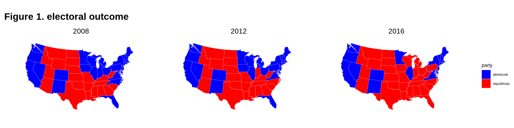
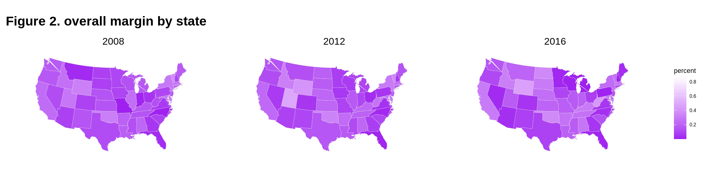
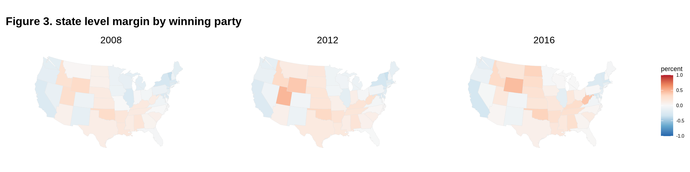
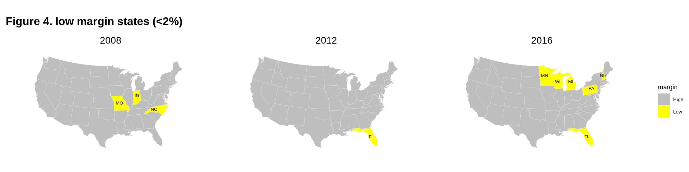
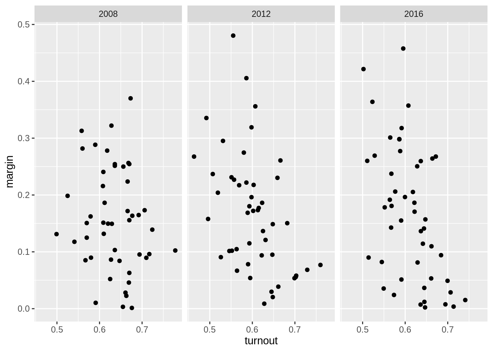

# Visualizing electoral margins in US presidential elections (2008-2016)

Jiyeon Chang and Andus Kong


```r
#install.packages("mapproj")
#install.packages("maps")
library(dplyr)
library(ggplot2)
library(tidyr)
library(maps)
library(mapproj)
library(cowplot)
library(readxl)
library(magrittr)
library(GGally)
library(parcoords)
```

Against the backdrop of the upcoming election, the media has given a lot of attention to races that are expected to be particularly competitive. Given the large share of international students in the class, we thought it would be interesting to provide some background as to what the electoral map for the presidential election looks like, and the level of margins observed in past elections.

The data for the analysis is taken from the MIT Election Lab (https://electionlab.mit.edu/). The data on electoral outcome provide information on the winning candidate/party, as well as the votes received. A separate dataset is available for the turnout. For the purpose of this analysis we look at data from 2000 to 2016, with a focus on the past 3 elections.


```r
# create a dataset with electoral margins
turnout<-turnout %>%
  select(c("year","state","vep_highest_office")) %>%
  filter(state!="United States") %>%
  mutate(state = tolower(state)) %>%
  rename(turnout = vep_highest_office)

elect_data<-elect_pres %>%
  select(c("year","state","state_po","candidate","party","totalvotes","candidatevotes"))

pres_top2<- elect_data %>%
  group_by(state,year) %>%
  arrange(desc(candidatevotes),.by_group = TRUE) %>%
  filter(row_number() %in% c(1,2)) %>%
  mutate(share = candidatevotes/totalvotes) %>%
  mutate(margin = share-dplyr::lead(share))

pres_winner<- pres_top2 %>%
  group_by(state,year) %>%
  filter(row_number() %in% c(1)) %>%
  mutate(margin_cont = ifelse(party=="republican",margin,-(margin)))

pres_winner[pres_winner$party=="democratic-farmer-labor",]$party<-c("democrat","democrat","democrat")

pres_winner$party<-as.factor(pres_winner$party)
pres_winner$state <- tolower(pres_winner$state)
margins<-merge(pres_winner, turnout, by=c("state","year"))
```

To plot state-level data on a map in R, we use the **maps** package. This package has a dataset with information on longitude and latitude which can be merged by state id to transform the dataframe into a mappable version. The snippet from a data frame shown below shows how the information on longitude and latitude is encoded; for Alabama, for instance, we see several rows with slight variations in the longitude and latitude, covering the area corresponding to the state.


```r
# merge the electoral data with data on the latitude and longitude of each US state.
us_states <- map_data("state")
head(us_states)
```

```
##        long      lat group order  region subregion
## 1 -87.46201 30.38968     1     1 alabama      <NA>
## 2 -87.48493 30.37249     1     2 alabama      <NA>
## 3 -87.52503 30.37249     1     3 alabama      <NA>
## 4 -87.53076 30.33239     1     4 alabama      <NA>
## 5 -87.57087 30.32665     1     5 alabama      <NA>
## 6 -87.58806 30.32665     1     6 alabama      <NA>
```

```r
names(us_states)[names(us_states) == "region"] <-"state"
df.margin <- merge(margins, us_states, sort = FALSE, by = "state")
```

As a starter, let's look at how states voted in the 2016 elections.


```r
col_party <- c("blue", "red")
p_all <- ggplot(data = df.margin[df.margin$year %in% c(2008,2012,2016),],
            aes(x = long, y = lat,
                group = state, fill = party))

p_all_map<-p_all + geom_polygon(color = "gray90", size = 0.1) + 
  coord_map(projection = "albers", lat0 = 39, lat1 = 45) +
  scale_fill_manual(values=col_party)+
  labs(title="Figure 1. electoral outcome") +
  theme_map() +
  theme(plot.title = element_text(size = 16, face = "bold"),
        legend.title = element_text(size = 8),
        legend.text = element_text(size = 6),
        # panel.spacing.y=unit(0.1, "cm"),
        # panel.spacing.x=unit(0.1, "cm")
  )+
  facet_wrap(~year)
p_all_map
```



The above map gives us an idea of which party won the state, but not by what margin. To do this, we need to modify the fill parameter from **party** to **margin**.


```r
p_margin <- ggplot(data = df.margin[df.margin$year %in% c(2008,2012,2016),],
            aes(x = long, y = lat,
                group = state, fill = margin)) # here fill = margin

margin_map<-p_margin + geom_polygon(color = "gray90", size = 0.1) + 
  coord_map(projection = "albers", lat0 = 39, lat1 = 45) +
  labs(title="Figure 2. overall margin by state",fill="percent") +
  scale_fill_gradient(low="purple",high="white")+
  theme_map()+
  theme(plot.title = element_text(size = 16, face = "bold"),
        legend.title = element_text(size = 8),
        legend.text = element_text(size = 6))+
  facet_wrap(~year)

margin_map
```



```r
min(df.margin$margin)
```

```
## [1] 9.005368e-05
```

```r
max(df.margin$margin)
```

```
## [1] 0.864135
```

The map above gives us a better of idea of how competitive the presidential race was in each state. The darker the shade of purple, the smaller was the margin. This made shows the magnitude of the margin but not which party won the state. So next we break down the margin by the winning party. Specifically, the margin is redefined as ranging from -1 to 1, with negative values referring to Democratic lead, and positive values Republican.


```r
margin_bin <- ggplot(data = df.margin[df.margin$year %in% c(2008,2012,2016),],
            aes(x = long, y = lat,
                group = state, fill = margin_cont))

margin_bin_map<-margin_bin + geom_polygon(color = "gray90", size = 0.1) + 
  coord_map(projection = "albers", lat0 = 39, lat1 = 45) +
  labs(title="Figure 3. state level margin by winning party",fill="percent") +
  scale_fill_distiller(palette = "RdBu",direction = -1, limits = c(-1, 1))+
  theme_map()+
  theme(plot.title = element_text(size = 14, face = "bold"),
        legend.title = element_text(size = 8),
        legend.text = element_text(size = 6))+
  facet_wrap(~year)

margin_bin_map
```



Now, the diverging color scheme blends the strengths of Figures 1 and 2, making it possible not only to see which parties won the election in each state, but also by what margin. Note, however, that even with this distinction, the range of margins remains quite large, with the smallest ranging from less than 1 percentage point, to the largest where the Democrats won by a 86 percentage point margin. (Note that the 86 percentage pt correspondents to D.C. but we don't observe a dark blue state because it is too small to be visible on the map)

As a result, we can glean from the color scheme the relative competitiveness of each state, but it's be tough to distinguish between a margin of say, 10% vs 2%. So in an alternative approach, we define the threshold for "a small margin" to be 2%, and highlight only the states that had margins at this level or below.


```r
df.margin<-df.margin %>%
  mutate(low_margin = if_else(margin < 0.02,"Low", "High"))
  

p_LH <- ggplot(data = df.margin[df.margin$year %in% c(2008,2012,2016),],
            aes(x = long, y = lat,
                group = state, fill = low_margin))

temp <- df.margin %>% filter(year %in% c(2008, 2012, 2016)) %>%
  filter(low_margin == "Low") %>%
  select(state, year, state_po, low_margin) %>% distinct

temp2 <- df.margin %>% filter(year %in% c(2008, 2012, 2016)) %>%
  filter(low_margin == "Low") %>%
  select(-long, -lat, -group, -order, -subregion) %>% distinct

temp <- temp %>% mutate(long = if_else(state == "florida", 	-81.760254,
                               if_else(state == "indiana",-86.126976,
                                       if_else(state == "michigan", -84.506836,
                                               if_else(state == "minnesota", -94.636230,
                                                       if_else(state == "missouri", -92.603760,
                                                               if_else(state == "new hampshire",-71.500000,
                                                                       if_else(state == "north carolina", -80.793457,
                                                                               if_else(state == "pennsylvania", -77.194527,
                                                                                       if_else(state == "wisconsin", -89.500000, 0))))))))),
                lat = if_else(state == "florida", 	27.994402,
                               if_else(state == "indiana",40.273502	,
                                       if_else(state == "michigan", 44.182205	,
                                               if_else(state == "minnesota", 46.392410,
                                                       if_else(state == "missouri", 38.573936,
                                                               if_else(state == "new hampshire",44.000000,
                                                                       if_else(state == "north carolina", 35.782169,
                                                                               if_else(state == "pennsylvania", 41.203323	,
                                                                                       if_else(state == "wisconsin", 44.500000, 0))))))))))

temp3 <- merge(temp, temp2, by = c("state", "year", "state_po")) %>% rename(low_margin = low_margin.x)


LH<-p_LH + geom_polygon(aes(group=group),color = "gray90", size = 0.1) + 
  coord_map(projection = "albers", lat0 = 39, lat1 = 45) +
  labs(title="Figure 4. low margin states (<2%)",fill="margin") +
  scale_fill_manual(values=c("grey", "yellow"))+
  theme_map()+
  theme(plot.title = element_text(size = 14, face = "bold"),
        legend.title = element_text(size = 8),
        legend.text = element_text(size = 6))+
  geom_text(data= temp3,aes(long,lat,label=state_po),size=2)+
  facet_wrap(~year)
LH
```



Based on this map, we see that different states had competitive races in each election. 2016 stands out for having had more states with a small margin, which are identified as Michigan, Wisconsin, Florida, Pennsylvania, Minnesota and New Hampshire. Many of these states that had close races in 2016 are leaning more Democratic in the 2020 election, but a number of other states, namely, Ohio, Iowa, North Carolina and Arizona, have become competitive in their stead.

One aspect of the election that is talked about a lot at the moment is the increase in the cumulative turnout ahead of the election day. Understandably, a lot is at stake in this election; but is there a relationship between how close the race is, and the turnout? What does previous years' data tell us?


```r
df_scatter<-df.margin %>%
  filter(year %in% c(2008,2012,2016))%>%
  group_by(state,year) %>%
  filter(state!="district of columbia")%>%
  filter(row_number() %in% c(1))

p_scatter<-ggplot(df_scatter, aes(turnout, margin)) +
        geom_point() +
  facet_wrap(~year)
p_scatter
```



Based on a scatterplot of margin against turnout, it seems that there is a pattern of smaller margin being associated with higher turnout. Note that in the charts displayed below, DC was removed as an outlier as the combination of its high margin and high turnout visually crowded out all other observations into a corner. The pattern is quite clear in 2016 and 2012, but slightly less so in 2008.

Lastly, we produce a parallel coordinate plot, which makes it possible to play with range of margins in each election cycle and see whether states have had more consistent margins, or have changed over time. Feel free to play around with the parameters!


```r
temp <- tibble(df.margin) %>% select(state, year, margin) %>% distinct
temp <- temp %>% pivot_wider(names_from = year, values_from = margin) %>% 
  relocate("state", "2000", "2004", "2008", "2012", "2016")
  
parcoords(temp, brushMode = "1d-axes", reorderable = TRUE, rownames = FALSE)
```

<!--html_preserve--><div class="parcoords html-widget" height="480" id="htmlwidget-54bdb87ce578dd578372" style="width:672px;height:480px; position:relative; overflow-x:auto; overflow-y:hidden; max-width:100%;" width="672"></div>
<script type="application/json" data-for="htmlwidget-54bdb87ce578dd578372">{"x":{"data":{"names":["1","2","3","4","5","6","7","8","9","10","11","12","13","14","15","16","17","18","19","20","21","22","23","24","25","26","27","28","29","30","31","32","33","34","35","36","37","38","39","40","41","42","43","44","45","46","47","48","49"],"state":["alabama","arizona","arkansas","california","colorado","connecticut","delaware","district of columbia","florida","georgia","idaho","illinois","indiana","iowa","kansas","kentucky","louisiana","maine","maryland","massachusetts","michigan","minnesota","mississippi","missouri","montana","nebraska","nevada","new hampshire","new jersey","new mexico","new york","north carolina","north dakota","ohio","oklahoma","oregon","pennsylvania","rhode island","south carolina","south dakota","tennessee","texas","utah","vermont","virginia","washington","west virginia","wisconsin","wyoming"],"2000":[0.149172524053696,0.0628655314304811,0.0544294143619797,0.11798240022499,0.0835670576236615,0.17466024905363,0.130614388344238,0.762033542353909,9.00536800428342e-05,0.117485699951378,0.395323106366436,0.120116412363447,0.156347786706873,0.00306277355431028,0.208032709827124,0.151283007772782,0.0767573071991374,0.0511416547896112,0.163035277294426,0.269932230270772,0.0513358413855071,0.0240322140825896,0.169214149493454,0.0333854261127204,0.250743334322824,0.289923230213237,0.0354382648590642,0.0126713068965578,0.15834365056008,0.000611421555115621,0.24189453917731,0.128120851186453,0.276032415630551,0.0354604574480891,0.218809475389089,0.00441018286124056,0.0417003838414067,0.290759009757719,0.159588612488457,0.227325472936013,0.0386425846301455,0.213166413765324,0.404854207697917,0.0993754841866344,0.0803811864219312,0.0557956736925176,0.0632255556035573,0.00219656146543129,0.409243610978543],"2004":[0.256162874353236,0.104726011572182,0.0975832863324629,0.0994786155743259,0.046732531003038,0.103664310611622,0.0759401903035796,0.798441028885784,0.0500640620462272,0.165998107136097,0.381260277818629,0.103445333826793,0.206817903713206,0.00667525821085296,0.253808863099829,0.198624408507909,0.145061566378777,0.0899639825474652,0.129932498349578,0.250282583336038,0.034186481712463,0.0347615089448509,0.188532615561701,0.0719574542243363,0.205031147737515,0.332164803787269,0.0259165102635408,0.013672678379506,0.0668459732574022,0.007917451183651,0.18444051273142,0.124340511172928,0.273625224960282,0.0210733909237597,0.311408033295121,0.0415574629977864,0.0250014299109642,0.207519890925895,0.170801137417321,0.214674858003941,0.142737983825671,0.228615623063202,0.45540306344601,0.201361472131767,0.0820603896520484,0.0718086631942259,0.128655767724453,0.00379845625986192,0.397164778295832],"2008":[0.215764787345957,0.0851999694786296,0.198512447348054,0.240577795146698,0.0895271473135443,0.223673663704949,0.249956354325286,0.859245522901754,0.0281798610468869,0.0521433889686446,0.254261038402008,0.25137191977866,0.0103200446083574,0.0953476071856319,0.149602871494783,0.162309073589471,0.186298075084113,0.173217189600677,0.254448251175332,0.256282398134705,0.164735416455068,0.102373616541408,0.13174634554779,0.00133426546173687,0.0226398617450404,0.149335875928669,0.124925608153346,0.0960546858517238,0.155682032926111,0.151284454284606,0.288397244295825,0.00328867780398812,0.0862956026290107,0.0459369169725052,0.31290162245387,0.163478245646284,0.103184755321229,0.278061581377208,0.0897708396127163,0.0841154525819753,0.150684162201813,0.117692390064368,0.281781240484266,0.370064544710595,0.0629896918292034,0.171765872715335,0.13120592724658,0.139041240295943,0.322042808272918],"2012":[0.221867892310703,0.0906476622417532,0.23687945782389,0.231185806209848,0.0536513491256719,0.173398990119394,0.186281379110392,0.836348225105867,0.00876887306723162,0.0782128251064243,0.319074499366831,0.168693940916602,0.101982294761661,0.0581014802361299,0.217167498152971,0.226918137648758,0.172071121051721,0.150436421536568,0.260764584403731,0.230191860048816,0.0949728818309853,0.0769410204657761,0.114964871995918,0.0938025759042376,0.136533980101147,0.217758777611191,0.0668093382913693,0.055758876580231,0.177187900834932,0.101494338813766,0.295193868466431,0.0204209552507539,0.196183716695775,0.029783067798973,0.335446394860331,0.120894554762557,0.0539599166846625,0.274572972924499,0.104730978484999,0.180231711171887,0.204028997261424,0.157836191842955,0.480408672747287,0.355979150656554,0.0387335389982952,0.148687768675636,0.267565382630459,0.0683781582153483,0.405566790718824],"2016":[0.277251466064354,0.0354559462762784,0.269209780344674,0.301092930661184,0.0490558301141636,0.136393867178951,0.114305124663149,0.864135007598176,0.0119862561078569,0.0513134269741019,0.317694185482177,0.17063613624968,0.191651937616592,0.0940954789918113,0.206022110736051,0.298374502182523,0.196391185550548,0.0286853601281009,0.264164395066451,0.267638623058161,0.00223033269129308,0.0151984085748962,0.178262498170515,0.186371170029249,0.205309730934268,0.250485947499902,0.0241712836051662,0.00367595687737138,0.141026977996647,0.0821313284539138,0.23745540294106,0.0365522852797094,0.357288883726333,0.0812957439906617,0.363911845350835,0.109778168183653,0.00724269639183167,0.15508549070978,0.142659128960303,0.297933222190098,0.260057008955645,0.0899942759832342,0.180795479958314,0.259633597219058,0.0532370581949365,0.157059998751891,0.421536467938478,0.00764343195067457,0.457695101782154]},"options":{"rownames":false,"brushMode":"1D-axes","brushPredicate":"AND","reorderable":true,"margin":{"top":50,"bottom":50,"left":100,"right":50},"mode":false,"bundlingStrength":0.5,"smoothness":0},"autoresize":false,"tasks":null},"evals":[],"jsHooks":[]}</script><!--/html_preserve-->
